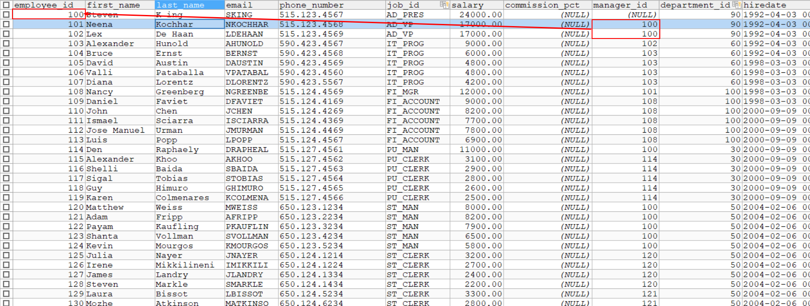

# MySQL

## 总结

删除行用`delete`

删除列和表用`drop`

**对于表中列的修改统统需要加`column`**

##  为什么要学习数据库

可以存储数据的容器：

- 内存中（容易丢失）：数组，集合
- 文件（不太适合查询等操作）——存储没有问题，但是如果存储了大量的文件，查询等操作较为困难

### 数据库的好处

- 持久化存储
- 有专门的管理系统，方便管理

### 数据库的几个相关概念：

- DB——数据库（database），存储数据的仓库，存储了大量有组织的数据，有格式，有组织

- DBMS——数据库管理系统（database manager system），简称数据库软件，例如MySQL

  用于管理数据库——**增（插入）删改（更新）查**

  > 常用数据库管理软件
  >
  > MySQL，Oracle，DB2，SqlServer

- SQL——结构化查询语言，用于和数据库通信

  > 特点：
  >
  > - 不是某个厂商专用的语言，几乎所有数据库软件都支持
  > - 简单易学
  > - 简答灵活强大

### 数据库的特点

现将数据放到表里面，再将表放到数据库里面

> 表：类似于excel，有表头，行列
>
> 一个数据库有多张表，每个表都有一个唯一的名字，用于标识自己
>
> 表具有一些特性，这些特性规定了数据如何在表中存储，类似于类的设计
>
> 表由列组成，也称为字段，每个表都有一个或多个列组成，类似于类的“属性”
>
> 表中的数据是按照行存储，类似于“对象”

## MySQL的安装与使用

### 背景

原属于MySQLAB公司，后被Oracle收购

08被SUN收购

09SUN被Oracle收购

优点

- 成本低，开源，一般免费
- 性能高
- 简单，易于安装和使用

### 安装

DBMS分两大类：

1. 基于文件共享系统的DBMS——Access

2. 基于C/S架构的DBMS——MySQL，Oracle

   一般安装服务端

### MySQL服务的启动与停止

1. 计算机管理——服务

2. 通过管理员身份

   ```bash
   net start mysql
   net stop mysql
   ```

### MySQL服务的登录与退出

登录：

1. 自带客户端（仅限root用户）

2. windows命令行

   ```bash
   mysql -h [主机名] -P [3306] -u [用户名] -p[密码]
   ```

退出：

1. `exit`
2. ctrl+C

### 常用命令

1. **查看当前所有数据库——`show databases;`**

2. **打开指定的库——`use [库名];`**

3. **查看当前库的所有table——`show tables;`**

4. **查看其他库的所有表——`show tables from [库名];`**

5. **创建table**

   ```mysql
   create table [表名](
   	[列名] [列类型]
   	[列名] [列类型]
   	...
   )
   ```

6. ==**查看表结构——`desc [表名]`**==

7. 查看服务器版本

   `select version();`

   `mysql --version`

   `mysql -V`


### MySQL语法规范

1. 不区分大小写

   **但建议关键字大写，表名/列名小写**

2. 命令用`;`结尾（建议）

   也可以用`/g`结尾

3. 每条命令根据需要进行缩进或换行

   不加`;`换行

   **建议关键字占一行**

4. 注释

   单行注释：`# 注释文字`，或`-- 注释文字`

   多行注释：`/* 注释文字 */`

## DQL语言——select查询

Data Query Language

总结：

```mysql
select 列名[, 列名, ...]  # ⑦；
from 表1  # ①
[join type] join 表2  # ②
on 连接条件  # ③
where 筛选条件 # ④
group by 分组列表   # ⑤
having 筛选条件  # ⑥
order by 排序列表  # ⑧
limit 起始索引，条目数  # ⑨

[union 
select ...
]
```

**字段、表都可以起别名**

‘*’和所有字段写全相比，所有字段写全时，查询的效率较高一点

### 1、基础查询

语法：

```mysql
select [查询列表] from [表名]
# 类似于：System.out.println('')
```

特点：

1. 查询表：字段、常量值、表达式、函数
2. 查询出来的的东西是一个虚拟的表格

```mysql
USE myemployees;

# 1. 查询单个字段
SELECT last_name FROM employees;

# 2. 查询多个字段，顺序、个数与与原始的表没有关系
SELECT last_name, salary, email FROM employees;

# 3. 查询表中的所有字段
# 方式1：
 SELECT
  `employee_id`,
  `phone_number`,
  `commission_pct`,
  `first_name`
FROM
  employees;

# 方式2：
SELECT * FROM employees;

# 4. 查询常量值
SELECT 100;
SELECT 'john';  # 不区分'和"

# 5. 查询表达式
SELECT 100%98;  # 取余

# 6. 查询函数：调用函数并返回返回值显示
SELECT VERSION();

# 7. 起别名——AS 或 空格
/*
1. 便于理解
2. 区分重名的字段
*/
# 方式1：使用 AS
SELECT last_name AS 姓, first_name AS 名 FROM employees;
# 方式2：空格
SELECT last_name 姓, first_name 名 FROM employees;
# 有特殊字符时使用双引号
SELECT salary AS "out put" FROM employees;

# 8. 去重——DISTINCT关键字
# 案例：查询员工表中涉及到的部门编号
SELECT DISTINCT department_id FROM employees;

# 9. 拼接————CONCAT
# 返回结果为连接参数产生的字符串。如有任何一个参数为NULL ，则返回值为 NULL。
# 案例：查询员工名和姓并连接成一个字段，并显示为姓名
SELECT CONCAT('a', 'b', 'c') AS 结果
SELECT
  CONCAT (last_name, " ", first_name) AS 姓名
FROM
  employees;

# 10. IFNULL(exp1, exp2)——由于null的拼接会导致CONCAT返回null，因此可以使用IFNULL，若为null，则将其值转换为exp2
SELECT IFNULL(commission_pct, 0) FROM employees;
SELECT 80+NULL;

# 11. 加号“+”的作用
/*
java中加号+的作用：
1. 运算符
2. 连接符，只要有一个操作数作为字符串
而在MySQL中，+只有一个作用————运算符
select 100+90; 两个操作数都为数值型，则作加法运算
select '100'+90; 一个操作数为字符型，则试图将该字符型数值转换为数值型。如果转换成功，则继续做加法运算，如果转换失败，则转换为0进行加法运算
select null+90; 只要其中一方为null，则结果肯定为null
*/
```

> 1. 在最开始先用`USE myemployees;`规范化。
> 2. 着重号 “ ` ”：用于区分关键字和字段——加着重号的是字段
> 3. 执行和格式化（SQLyog）：使用光标选中即可

### 2、条件查询

语法：

```mysql
SELECT
  查询列表
FROM
  表名
WHERE 
  筛选条件;
```

执行顺序：

1. 先执行FROM
2. 再执行WHERE
3. 最后执行SELECT

筛选条件的分类：

#### 按照条件表达式筛选

条件运算符：`> < = != <>（不等于）`

#### 按逻辑表达式查询

逻辑表达式：
		`&&  ||  !`     （java）
		`AND OR NOT` （标准）

#### 模糊查询

1. like——像什么样的

   一般和通配符搭配使用

   > 通配符：
   >
   > `%`：任意多个字符，包含0个字符
   >
   > `_`: 任意单个字符
   >
   > 转义：`/` 或 `escape` 可以随意指定转义字符

2. `between and`   ==   `>= and <=`
   1. 可以提高简洁度
   2. 包含边界值，即闭区间
   3. 不能调换前后顺序
   
3. `in()`

	用于判断某字段的值是否属于`in`列表中的
	
	1. 相比于`or`提高简洁度
	
	2. `in`列表的值类型必须统一或兼容
	
	   > 兼容——可以隐式的转换
	   >
	   > 例如'123'`和`123`
	
	3. 不可以使用通配符（`in`相当于`=`而不是`like`）
	
4. `is [not] null`

> 注意：
>
> - `=` 或者 `<>` 不能判断`null`
> - `<=>` 安全等于
>   			判断是否等于
>         			可以判断 null	
>         			可读性较差 类似于 <> （不等于）
> - `IS` != `=`，不能用来做其他
> - `is null` pk `<=>`
>   1. `is null` 只能用于判断`null``
>   2. ``<=>` 能用于判断`null`和其他

```mysql
USE employees;

# 1. 按照条件表达式筛选
# 案例一：查询工资大于12000的员工
SELECT * FROM employees WHERE salary>12000;

# 案例二：查询部门编号不等于90的员工名和部门编号
SELECT last_name, department_id FROM employees WHERE department_id<>90;
```

```mysql
USE employees;

# 2. 按逻辑表达式查询
# 查询工资在一万到两万之间的员工名、工资以及奖金
SELECT last_name, salary, commission_pct FROM employees WHERE salary>=10000 AND salary<=20000 
# 案例而：查询部门编号不是在90到110之间的，或者工资高于15000的员工信息
SELECT * FROM employees WHERE department_id<=90 OR department_id>=110 OR salary >15000

# 1.like
# 案例1：查询员工名中包含字符a的员工信息
SELECT * FROM employees WHERE last_name LIKE '%a%';  
# %为通配符，# 字符型必须用单引号括起来

# 案例而：查询员工名中第三个字符为n的和第五个字符为l的员工名
SELECT last_name FROM employees WHERE last_name	LIKE '__n_l%';

# 案例三：查询员工名中第二个字符为下划线的员工名
SELECT last_name FROM employees WHERE last_name LIKE '_\_%';
SELECT last_name FROM employees WHERE last_name LIKE '_$_%' ESCAPE '$';

# 2.between and
# 案例一：查询员工编号在100到120 之间的所有的员工信息
SELECT * FROM employees WHERE employee_id BETWEEN 100 AND 120;
# 等价于：
SELECT * FROM employees WHERE employee_id>=100 AND employee_id<=120;

# 3. in()
# 案例一：查询员工的工种编号是it_prog、ad_vp、ad_pres中一个的员工名和工种编号
SELECT last_name, job_id FROM employees WHERE job_id IN ('it_prog','ad_vp','ad_pres');

# 4. is null
# 案例一：没有奖金的员工名和奖金率
SELECT last_name, commission_pct FROM employees WHERE commission_pct IS NOT NULL;
SELECT last_name, commission_pct FROM employees WHERE commission_pct<=>NULL;
# 案例二：工资为12000的员工信息
SELECT * FROM employees WHERE salary <=> 12000;
```

==**面试**==

```mysql
SELECT * FROM employees;
SELECT * FROM employees WHERE commission_pct LIKE '%%' AND last_name LIKE '%%';
```

> 上下不一样
>
> 下面`commission_pct`  和`last_name`必须不能为`null`

### 3、排序查询

引入：一般`SELECT * FROM employees;`是不改变顺序的

语法：

```mysql
SELECT [查询列表] FROM employees [WHERE 筛选条件] ORDER BY 排序列表 [asc/decs];
# 默认升序
```

特点：

1. 默认升序，即`asc`
2. `ORDER BY`支持单个字段、多个字段、表达式、函数、别名
3. **`ORDER BY`一般放在查询语句的最后**（LIMIT子句除外），执行顺序：
   1. FROM
   2. WHERE
   3. SELECT
   4. ORDER BY
4. 按照last_name排名时，会从首字母开始逐个拍

```mysql
USE employees;

# 案例：查询员工信息，要求工资从高到低排序
SELECT * FROM employees ORDER BY salary DESC;
SELECT * FROM employees ORDER BY salary ASC;

# 案例二：查询 部门编号大于等于90的，要求按照入职时间进行排
SELECT * FROM employees WHERE department_id>=90 ORDER BY hiredate ASC;


# 案例三：查询员工信息和年薪，按照年薪高低————按表达式排序
SELECT *, salary*12*(1 + IFNULL(commission_pct, 0)) AS 年薪 FROM employees ORDER BY salary*12*(1 + IFNULL(commission_pct, 0)) DESC;

# 案例四：查询员工信息和年薪，按照（别名）高低————按别名排序
SELECT *, salary*12*(1 + IFNULL(commission_pct, 0)) AS 年薪 FROM employees ORDER BY 年薪 DESC;

# 案例五：按照姓名长度显示员工姓名和工资————按照函数排序
SELECT LENGTH(last_name) AS 字节长度, last_name, salary FROM employees ORDER BY 字节长度 DESC;

# 案例六：查询员工信息，要求先按照工资排序，再按照员工编号排序————按照多个条件字段排序
SELECT * FROM employees ORDER BY salary ASC, employee_id DESC;
```

### 4、常见函数（内部函数）

调用：

```mysql
SELECT 函数名([实参列表]) [FROM 表];
```

特点：

1. 函数名
2. 函数功能

分类：

#### ① 单行函数

如`CONCAT()`、`LENGTH()`、`IFNULL()`

##### 字符函数——处理字符型

`length（字节长度，而非字符串长度）, concat, ifnull, substr, instr, trim（trim('a' from 'aba')）, upper, lower, lpad, rpad, replace`

```mysql
USE employees;

# 1. length————字节长度
SELECT LENGTH('张三丰');  # 9，一个汉字占用三个字节（utf-8）

# 2. CONCAT——拼接字符串
SELECT CONCAT(last_name, '_', first_name) FROM employees;

# 3. upper，lower
SELECT UPPER('john');
# 案例：将姓变大写，名变小写
SELECT CONCAT(UPPER(last_name), ' ', LOWER(first_name)) AS 姓名 FROM employees;

# 4. substr/substring————索引字符串
# sql索引从1开始
SELECT SUBSTR('李莫愁爱上了陆展元', 7) AS output;  # 截取从该位置开始后的字符
SELECT SUBSTR('李莫愁爱上了陆展元', 1, 1) AS output;  # 截取从指定索引处指定字符长度的字符

# 案例：将字符中首字符大写，其他字符小写，然后用_拼接
SELECT CONCAT(UPPER(SUBSTR(last_name, 1, 1)), '_', LOWER(SUBSTR(last_name, 2))) FROM employees;

# 5. instr()————返回起始索引，若不存在，则返回0
SELECT INSTR('杨不悔爱上了殷六侠', '殷六侠') AS output FROM employees;

# 6. trim————去首尾的字符（默认空格）
# 不能去掉中间的
SELECT LENGTH(TRIM('   张翠山   ')) AS output;
SELECT TRIM('a' FROM 'aaaaa张aa翠aa山aaaaaaa') AS output;
SELECT TRIM('aa' FROM 'aaaaa张aa翠aa山aaaaaaa') AS output;

# 7. lpad————用指定的字符实现左填充指定长度
# 若指定长度小于元字符串长度，则截断
SELECT LPAD('殷素素', 10, '*') AS output;
SELECT LPAD('殷素素', 2, '*') AS output;

# 8. rpad
SELECT RPAD('殷素素', 10, '*') AS output;

# 9. replace————替换
SELECT REPLACE('张无忌爱上了周芷若，周芷若爱上了张无忌', '周芷若', '赵敏') AS output;
```

##### 数学函数——处理数字

`round, ceil, floor, truncat, mod, rand（返回0-1之间的随机数）`

```mysql
USE employees;

# 二、数学函数
# 一般第二个参数D都是选取小数点后的位数，默认为0，-1代表小数点左边第1个位置的数值

# 1. round————四舍五入，若有第二个参数，则对该位置参数四舍五入
SELECT ROUND(1.65) AS output;
SELECT ROUND(-1.65) AS output;  # 先对绝对值四舍五入，再添加负号
SELECT ROUND(1.567, 2) AS output;  # 小数点保留两位，四舍五入

# 2. ceil————向上取整，返回>=该参数的最小整数
SELECT CEIL(1.1);
SELECT CEIL(1.0);
SELECT CEIL(-1.1);

# 3. floor————向下取整，返回小于等于该参数的最大整数
SELECT FLOOR(9.99);

# 4. truncate————截断，小数点的位数
SELECT TRUNCATE(1.5777, 1);

# 5. mod————取余
# a-a/b*b————正负和被除数的正负一致
# 若除数为0，则返回null
SELECT MOD(10, 3);
SELECT MOD(-10, 3);
```


##### 日期函数——处理日期

`now, curdate, curtime, year, month, monthname, day, hour, minute, second, str_to_date, date_format, datediff（相差天数）`

```mysql
USE employees;

# 三、日期函数

# 1. now()————返回当前系统日期+时间
SELECT NOW();

# 2. curdate————返回当前系统日期，不包含时间
SELECT CURDATE();

# 3. curtime————返回当前系统时间，不包含日期
SELECT CURTIME();

# 4. 获取指定的部分（年，月，日，时，分，秒）
# YEAR, MONTH(MONTHNAME-月名), DATE, HOUR, MINUTE, SECOND
SELECT YEAR(NOW()) AS 年;
SELECT YEAR('1995-12-26') AS 生年;

SELECT YEAR(hiredate) AS 年 FROM employees; 

# 5. str_to_date: 将日期格式的字符转换成指定格式的日期
SELECT STR_TO_DATE('1995-12-26', '%Y-%c-%d') AS 生日;
# 案例：查询入职日期为1992-4-3的员工信息
SELECT * FROM employees WHERE hiredate = '1992-4-3';
SELECT * FROM employees WHERE hiredate = STR_TO_DATE('4-3-1992', '%c-%d-%Y');

# 6. date_format————将日期按照指定的格式转换为str
SELECT DATE_FORMAT(NOW(), '%Y年%m月%d日');
# 查询有奖金的员工名和入职日期(xx月/xx日 /xx年)
SELECT last_name, DATE_FORMAT(hiredate, '%m月/%d日 /%Y年') AS 入职日期 FROM employees WHERE commission_pct IS NOT NULL;
```


##### 其他函数

`version, database, user, password（自动加密）,MD5（加密） `

```mysql
USE employees;

# 四、其他函数

SELECT VERSION();
SELECT DATABASE();
SELECT USER();
```


##### 流程控制函数——控制流程分支

`if, case`

```mysql
USE employees;

# 五、流程控制函数

# 1. IF————类似于三元运算符
SELECT IF(10>5, '大', '小');

# 案例：查询是否有奖金
SELECT last_name, commission_pct, IF(commission_pct IS NOT NULL, '嘻嘻', '呵呵') FROM employees;

# 2. case
# ①————类似于switch case等值判断
/*
case 要判断的字段或表达式
when 常量1 then [[常量1（值不需要加;）]或[语句1;（语句要加;）]]
when 常量1 then [[常量2]或[语句2;]]
...
else [[常量n]或[语句n;]]
end

注意：搭配select时，当作语句，则when中只能放常量不能放语句

switch(变量或表达式):
	case 常量1: 语句1; break;
	...
	default: 语句; break;
*/

# 案例
/*
查询员工的工资，若部门号=30，则显示为工资的1.1倍
查询员工的工资，若部门号=40，则显示为工资的1.2倍
查询员工的工资，若部门号=50，则显示为工资的1.3倍
其他部门，为原工资
*/
SELECT
  salary AS 原始工资,
  department_id,
  CASE
    department_id
    WHEN 30
    THEN salary * 1.1
    WHEN 40
    THEN salary * 1.2
    WHEN 50
    THEN salary * 1.3
    ELSE salary  # 可以省略 ELSE
  END AS 新工资
FROM
  employees;

# ②————类似于多重if，但不完全一样
 /*
mysql：
case
when 条件1 then 值1[/语句1;]
when 条件2 then 值2[/语句2;]
...
else 值n[语句n]
end

注意：这种情况下，case后面没有表达式或变量

java中：
if (条件1) {
	语句1;
}else if (条件2) {
	语句2;
}
...
else {
	语句n;
}
*/
# 案例：
 /*
查询员工的工资情况，
若>20000显示A级别，
若>15000显示B级别，
若>10000显示C级别，
否则，显示D级别
*/
SELECT
  salary,
  CASE
    WHEN salary > 20000
    THEN 'A'
    WHEN salary > 15000
    THEN 'B'
    WHEN salary > 10000
    THEN 'C'
    ELSE '垃圾'
  END AS 工资级别
FROM
  employees;
```

#### ② 分组函数（统计函数，聚合函数，组函数）

功能：用作统计处理

分类：
`sum、avg、max、min、count`（计数，非空值的个数）

特点：

1. **`sum`、`avg`一般只用于处理数值**

   **max、min、count可以处理任何类型**

2. 所有分组函数都忽略`null`值

3. 搭配 `DISTINCT` 忽略重复运算

4. `count`函数

   **一般`count(*)`用于统计行数**

5. 和分组函数一同查询的字段要求是`gourp by`后的字段

```mysql
# 1、简单使用
SELECT SUM(salary) FROM employees;
SELECT AVG(salary) FROM employees;
SELECT MAX(salary) FROM employees;
SELECT MIN(salary) FROM employees;
SELECT COUNT(salary) FROM employees;

SELECT ROUND(AVG(salary), 2) FROM employees;

# 2、参数类型

SELECT SUM(last_name), AVG(last_name) FROM employees;
SELECT SUM(hiredate), AVG(hiredate) FROM employees;

SELECT MAX(last_name), MIN(last_name) FROM employees;
SELECT MAX(hiredate), MIN(hiredate) FROM employees;

SELECT COUNT(last_name), COUNT(commission_pct) FROM employees;

3、忽略null值
SELECT SUM(commission_pct), AVG(commission_pct), SUM(commission_pct)/35, SUM(commission_pct)/107 FROM employees;

SELECT MAX(commission_pct), MIN(commission_pct) FROM employees;
SELECT COUNT(commission_pct) FROM employees;

4、搭配distinct
SELECT SUM(DISTINCT salary), SUM(salary) FROM employees;
SELECT COUNT(DISTINCT salary), COUNT(salary) FROM employees;

5、count的详细介绍
SELECT COUNT(*) FROM employees;  
# count(*)会统计所有字段，所以不可能有一行字段全部为null，所以一般用意统计表里面的总行数
SELECT COUNT(1) FROM employees;
# 效率
# myisam存储引擎下，有一个内部计数器，所以count(*)效率最高
# innodb存储引擎下，COUNT(*)和count(1)差不多，比count(字段)高（多了一个判断：是否为null）

6、和分组函数一同查询的字段有限制
SELECT AVG(salary), employee_id FROM employees;
# 和分组函数一同查询的字段要求是gourp by后的字段

# 测试
SELECT MAX(salary), MIN(salary), AVG(salary), SUM(salary) FROM employees;
SELECT DATEDIFF(MAX(hiredate), MIN(hiredate)) FROM employees;
SELECT COUNT(*) FROM employees WHERE department_id = 90;
```

### 5、分组查询——`GOURP BY`

```mysql
SELECT  ⑤
  分组后的字段（要求出现在group by的后面）, group_function (字段)
FROM  ①
  表
[WHERE 条件]  ②
[GROUP BY group_by_exp1]  ③
[HAVING 字段筛选条件]  ④
[ORDER BY expresion]  ⑥
```

> - 注意：与分组函数一同查询的字段，要求是group b面y后出现的字段
>
>   **==group by后的字段、having后的分组函数，必须出现在select的后面==**
>
> - 支持按照表达式分组
>
> - 支持按照多个条件分组
>
> - <font color=green>==**见下错误**==</font>

```mysql
# 案例1：查询每个工种的最高工资
SELECT
  MAX(salary) AS 最高工资,
  job_id
FROM
  employees
GROUP BY job_id;

# 案例2：查询每个位置上的部门个数
SELECT COUNT(*), location_id FROM departments GROUP BY location_id;

# 按照表达式分组
# 案例1：按照员工长度分组，查询每一组的员工个数，并筛选员工个数大于5的分组

SELECT
  COUNT(*),
  LENGTH(last_name)
FROM
  employees
GROUP BY LENGTH(last_name)
HAVING LENGTH(last_name) > 5;
 
SELECT
  COUNT(*),
  LENGTH(last_name)
FROM
  employees
GROUP BY LENGTH(last_name)
HAVING COUNT(*) > 5;  # 而count(*)由于不存在*列，所以不会出错

# 按照多个字段分组

# 案例：查询每个部门每个工种的员工的平均工资
SELECT
  AVG(salary),
  department_id,
  job_id
FROM
  employees
GROUP BY 
  department_id, job_id;
  
  
# 添加排序

# 案例：查询每个部门（部门id不为null）每个工种的员工的平均工资，且>10000的显示，并从高到低排序
SELECT
  AVG(salary),
  department_id,
  job_id
FROM
  employees
WHERE department_id IS NOT NULL
GROUP BY 
  department_id, job_id
HAVING AVG(salary) > 12000
ORDER BY AVG(salary) DESC;
```

特点：

1. 根据数据源不同，分为分组前筛选和分组后筛选

   |            | 数据源             | 关键字   | 位置           |
   | ---------- | ------------------ | -------- | -------------- |
   | 分组前筛选 | 原始表             | `WHERE`  | `GROUP BY`前面 |
   | 分组后少选 | 初次筛选后的虚拟表 | `HAVING` | `GROUP BY`后面 |

2. 分组函数（`MIN, MAX, COUNT`等）做条件一定放在`HAVING`字句中

3. GROUP BY字句支持单个字段分组、多个字段分组（，多个字段用逗号隔开，字段之间没有顺序要求）、表达式或函数（用的较少）

4. 也可以添加排序，ORDER BY放在整个分组查询的最后


#### ①分组前筛选

从原始表中筛选，一般把筛选条件放在`where`中

```mysql
# 添加分组前的筛选条件

# 案例1：查询邮箱中包含a字符的，每个部门的平均工资
SELECT
  MAX (salary),
  manager_id
FROM
  employees
WHERE commission_pct IS NOT NULL
GROUP BY manager_id;

# 案例2：查询有奖金的每个领导手下员工的最高工资
SELECT
  MAX(salary),
  manager_id
FROM
  employees
WHERE commission_pct IS NOT NULL
GROUP BY manager_id;
```

#### ②分组后筛选——`HAVING`

二次筛选的条件来自于初次筛选

> ==**从原始表中可以得到的条件放到`where`中，需要从二次表中才能得到的放在having中**==
>
> **能用分组前筛选的条件，优先考虑使用分组前筛选（放到`WHERE`中）**

```mysql
# 添加分组后的筛选条件

# 案例1：查询哪个部门的员工个数大于2
 SELECT
  COUNT (*),
  department_id
FROM
  employees
GROUP BY department_id
HAVING COUNT (*) > 2 

# 案例2：查询每个工种有奖金的员工的最高工资>12000的工种编号和最高工
SELECT
  MAX (salary),
  job_id
FROM
  employees
WHERE 
  commission_pct IS NOT NULL
GROUP BY 
  job_id
HAVING 
  MAX (salary) > 12000;

SELECT
  MAX (salary),
  job_id
FROM
  employees
WHERE MAX (salary) > 12000  # 出错：原始表中并没有max(salary)
 GROUP BY job_id
HAVING commission_pct IS NOT NULL;

# 案例3：查询领导编号>102的每个领导手下的最低工资>5000的领导编号以及最低工资
SELECT
  manager_id,
  MIN (salary)
FROM
  employees
WHERE manager_id > 102
GROUP BY manager_id
HAVING MIN (salary) > 5000;

SELECT
  manager_id,
  MIN (salary)
FROM
  employees
GROUP BY manager_id
HAVING MIN (salary) > 5000
  AND manager_id > 102;  、# 优先放到where中
```

### 6、连接查询（多表查询、多表连接）


当要查询的字段涉及到多个表时，需要连接查询

> 笛卡尔乘积现象：表1：m行，表2：n行，结果：mn行
>
> 原因：没有有效的连接条件
>
> 避免：添加有效的连接条件

分类：

1. 按年代分类：

   1. sql92标准

      1. 内连接，

      2. 一部分外连接（用于Oracle、sqlserver，MySQL不支持）

   2. sql99标准【推荐】

      1. 内连接

      2. 外连接

         左外连接

         右外连接

         全外连接（mysql不支持）

      3. 交叉链接

2. 按功能分类：

   1. 内连接

      1. 等值连接

      2. 非等值连接

      3. 自连接
   2. 外连接
       1. 左外连接
       2. 右外连接
       3. 全外连接
   3. 交叉连接

#### a. SQL92

##### Ⅰ. 等值连接——两个表的条件使用=连接

```mysql
SELECT
  字段（要求出现在group by的后面）, group_function (字段)
FROM
  表
[WHERE 条件1, [条件2]]
[GROUP BY group_by_exp1, group_by_exp2]
[HAVING 字段筛选条件]
[ORDER BY expresion1, expresion2]
```

使用：使用其中一张表匹配另一个表

特点：

1. 多表等值连接的结果为多表的交集部分

2. n表连接，至少需要n-1个连接条件

3. 多表的顺序没有要求

4. 一般需要为表其别名

5. 可以搭配其他语句使用

   例如分组、排序、筛选

案例：

1. 普通等值连接

   ```mysql
   # 案例1：查询女生名和对应的男神名
   SELECT
     NAME,
     boyName
   FROM
     boys,
     beauty
   WHERE beauty.`boyfriend_id` = boys.`id`
   
   # 案例2：查询员工名和对应的部门名
   SELECT 
     last_name, department_name 
   FROM 
     employees, departments
   WHERE employees.department_id = departments.department_id;
   ```

2. 为了防止有歧义的列，一般为表起别名（相当于生成了虚拟视图）

   1. 提高语句简洁
   2. 区分多个重名的字段就不能使用原来的表名限定

   > **注意：如果起了别名，则查询的字段就不能使用原来的表名限定**

   ```mysql
   # 案例：查询员工名、工种名、工种号
   SELECT
     last_name,
     e.job_id,
     job_title
   FROM
     employees AS e,
     jobs AS j
   WHERE e.`job_id` = j.`job_id`;
   ```

3. 两个表的顺序可以调换（使用其中一张表匹配另一个表）

4. 可以加筛选

   ```mysql
   # 案例：查询有奖金的员工名，部门名
    SELECT
     last_name,
     e.`department_id`
   FROM
     employees e,
     departments d
   WHERE e.`department_id` = d.`department_id`
     AND e.`commission_pct` IS NOT NULL;
   
   # 案例2：查询城市名中第二个字符为o的部门名和城市名
    SELECT
     department_name,
     city
   FROM
     departments d,
     locations l
   WHERE d.`location_id` = l.`location_id`
     AND l.`city` LIKE '_o%';
   ```

5. 加分组

   ```mysql
   # 案例1：查询每个城市的部门个数
   SELECT
     COUNT (*) 部门个数,
     city
   FROM
     departments d,
     locations l
   WHERE d.`location_id` = l.`location_id`
   GROUP BY city;
   ```

6. 加排序

   ```mysql
   # 案例：查询每个工种的工种名和员工的个数，并且按照员工个数降序
   SELECT
     job_title,
     COUNT(*)
   FROM
     employees e,
     jobs j
   WHERE e.`job_id` = j.`job_id`
   GROUP BY job_title
   ORDER BY COUNT(*) DESC;
   ```

7. 多表连接

   ```mysql
   # 案例：查询员工名、部门名和所在的城市
   SELECT
     last_name,
     department_name,
     city
   FROM
     employees e,
     departments d,
     locations l
   WHERE e.`department_id` = d.`department_id`
     AND d.`location_id` = l.`location_id`
   ORDER BY department_name DESC;
   ```


##### Ⅱ. 非等值连接——两个表的条件不使用=连接

```mysql
# 非等值连接
/*CREATE TABLE job_grades
(grade_level VARCHAR(3),
 lowest_sal  INT,
 highest_sal INT);

INSERT INTO job_grades
VALUES ('A', 1000, 2999);

INSERT INTO job_grades
VALUES ('B', 3000, 5999);

INSERT INTO job_grades
VALUES('C', 6000, 9999);`stuinfo`

INSERT INTO job_grades
VALUES('D', 10000, 14999);

INSERT INTO job_grades
VALUES('E', 15000, 24999);

INSERT INTO job_grades
VALUES('F', 25000, 40000);
*/

# 案例1：查询员工的工资和工资级别`job_grades`
SELECT salary, employee_id FROM employees;
SELECT
  salary,
  grade_level,
  employee_id
FROM
  employees e,
  job_grades j
WHERE salary BETWEEN j.`lowest_sal`
  AND j.`highest_sal`
ORDER BY employee_id;
```

##### Ⅲ. 自连接——把一张表当成多张表使用

同一张不同字段之间有联系



```mysql
# 案例： 查询员工名以及上级的名称
SELECT e.employee_id, e.last_name, m.employee_id, m.last_name
FROM employees e, employees m
WHERE e.`manager_id`=m.`employee_id`;
```

#### b. SQL99

语法：

```mysql
 select 查询列表
from 表1 别名 
	[连接类型] join 表2 别名 
		on 连接条件
[where 筛选条件]
[group by 分组]
[having 筛选条件]
[order by 排序列表]
```

> **增加了一点顺序感（有一个主表放前面，和其他的表有字段连接）**
>
> 全外连接除外（全外连接不区分主从表）

##### Ⅰ. 内连接（★）——`inner`

```mysql
select 查询列表
from 表1 别名
	inner join 表2 别名 
		on 连接条件
```

特点：

1. 可以添加分组、筛选、排序
2. `inner`可以省略
3. n个表连接至少需要n-1个筛选条件
4. `inner join`连接和sql92中的等值连接一样，都是查询交集部分，相当于筛选条件放在`where`后面，连接条件放在`on`后面，提高分离性，便于阅读

分类：

###### 等值连接

```mysql
# 案例1：查询员工名和对应的部门名
SELECT
  last_name,
  department_name
FROM
  employees e
  INNER JOIN departments d
    ON e.`department_id` = d.`department_id`;

# 案例2：查询名字中包含e的员工名、工种名
SELECT
  last_name,
  job_title
FROM
  employees e
  INNER JOIN jobs j
    ON e.`job_id` = j.`job_id`
WHERE e.`last_name` LIKE '%e%';

# 案例3：查询部门个数>3的城市名和部门个数
 SELECT
  city,
  COUNT (*)
FROM
  departments d
  INNER JOIN locations l
    ON d.`location_id` = l.`location_id`
GROUP BY city
HAVING COUNT (*) > 3;

# 案例4：查询哪个部门的员工个数>3的部门名和员工个数，并按照员工个数降序排序
 SELECT
  department_name,
  COUNT (*)
FROM
  departments d
  INNER JOIN employees e
    ON d.`department_id` = e.`department_id`
GROUP BY department_name
HAVING COUNT (*) > 3
ORDER BY COUNT (*) DESC;

# 案例5：查询员工名、工种名、部门名，并按照部门名降序
 SELECT
  last_name,
  job_title,
  d.department_name
FROM
  employees e
  INNER JOIN jobs j
    ON e.`job_id` = j.`job_id`
  INNER JOIN departments d
    ON e.`department_id` = d.`department_id`
ORDER BY d.department_name DESC;
```

###### 非等值连接

```mysql
# 案例：查询员工的工资级别
 SELECT
  last_name,
  grade_level,
  salary
FROM
  employees e
  JOIN job_grades g
    ON e.`salary` BETWEEN g.`lowest_sal`
    AND g.`highest_sal`;

# 查询每个工资级别的个数>2的，并按照工资级别降序排序
 SELECT
  COUNT(*),
  grade_level
FROM
  employees e
  JOIN job_grades g
    ON e.`salary` BETWEEN g.`lowest_sal`
    AND g.`highest_sal`
GROUP BY grade_level
HAVING COUNT(*) > 20
ORDER BY grade_level DESC;
```

###### 自连接

```mysql
# 案例：查询员工的名字、上级的名字
 SELECT
  e.`last_name` 员工,
  m.`last_name` 上级
FROM
  employees e
  JOIN employees m
    ON e.`manager_id` = m.`employee_id`
```


##### Ⅱ. 外连接

**用于查询一个主表中有，从表表中没有的连接**

> 主表：查询的结果主要来自哪个表，哪个表即为主表

查询方式

1. 查询交集部分
2. 查询主表有但从表没有的部分，为虚拟表中的从表的键填充`null`
3. 两部分相加即为结果

特点：

1. **==外连接的查询结果为主表中的所有记录==**

   > <font color=green>全外连接不区分主从表，还算吗？</font>

   如果从表中有匹配的，则显示匹配的值

   如果从表中没有匹配的，使用null填充

   **外连接的结果 = 内连接结果 + 主表有从表没有的记录**

   **外连接相比于内连接，多考虑了一种没有匹配的情况**

   > 搭配条件查询`WHERE`实现查询主表-从表差集

2. `left join`左边的是主表

   `right join`右边的是主表

3. 左外和右外交换两个表的顺序，可以实现同样的效果

分类：

1. | 左外连接（★） | `left [outer]`  | `left join`左边的是主表  |
   | ------------- | --------------- | ------------------------ |
   | 右外连接（★） | `right [outer]` | `right join`右边的是主表 |

   ```mysql
   # 引入：查询男朋友不在表中的女神名
   USE girls;
   SELECT * FROM beauty;
   
   # 左外连接
   SELECT
     b.`name`
   FROM
     beauty b
     LEFT OUTER JOIN boys bo
       ON b.`boyfriend_id` = bo.`id`
   WHERE bo.`id` IS NULL;
   
   # 右外连接
   SELECT
     b.`name`
   FROM
     boys bo
     RIGHT OUTER JOIN beauty b
       ON b.`boyfriend_id` = bo.`id`
   WHERE bo.`id` IS NULL;
   
   # 案例：查询那个部门没有员工
   USE myemployees;
   
   SELECT
     department_name
   FROM
     departments d
     LEFT OUTER JOIN employees e
       ON d.`department_id` = e.`department_id`
   WHERE e.`employee_id` IS NULL
   GROUP BY d.`department_id`;
   
   
   SELECT
     department_name
   FROM
     employees e
     RIGHT OUTER JOIN departments d
       ON d.`department_id` = e.`department_id`
   WHERE e.`employee_id` IS NULL
   GROUP BY d.`department_id`;
   ```

2. 全外连接——`full [outer]`

   > MySQL不支持

   语法：

   ```sql
   SELECT
     b.*,
     bo.*
   FROM
     beauty b 
     FULL OUTER JOIN boys bo
       ON b.`boyfriend_id` = bo.`id`;
   ```

   > **全外连接 = 左外连接 + 右外连接 = 表1∩表2 + (表1-表2) + (表2-表1)**

##### Ⅲ. 交叉连接——`cross`

计算两个表的笛卡尔乘积

> 相当于没有加有效连接条件的sql92连接查询

```mysql
SELECT
  b.*,
  bo.*
FROM
  beauty b
  CROSS JOIN boys bo;
```

### 7、子查询

> 嵌套查询

**出现在其它语句中的select查询语句，称为子查询或内查询**

外部的查询语句叫做主查询或外查询

分类：

1. 按照子查询出现的位置分类：

   1. <font color=red>`select`</font>

      仅支持标量子查询

   2. `update`

   3. `from`

      支持表子查询

   4. `where`或`having`

      标量子查询（★）

      列子查询（★）

      行子查询（较少）

   5. `exists`——相关子查询

      放什么都行

2. 按照功能或结果集的行列书不同：

   1. 标量子查询/单行子查询——子查询结果集只有一行一列
   2. 列子查询/多行子查询——子查询结果集只有一列多行
   3. 行子查询（多列多行）——子查询结果集有一行多列
   4. 表子查询——子查询结果集一般为多行多列

特点：

1. 子查询放在小括号后面

2. 子查询一般放在条件右侧

3. 搭配操作符使用

   |            | 搭配（一般） |                            |
   | ---------- | ------------ | -------------------------- |
   | 标量子查询 | 单行操作符   | `<、 >、 <=、 >=、 =、 <>` |
   | 列子查询   | 多行操作符   | `in、any/some、all`        |

4. 主查询在子查询的基础上进行

#### `where`或`having`后面

##### 标量子查询

```mysql
# 案例1：谁的工资比Abel高

SELECT
  last_name,
  salary
FROM
  employees
WHERE salary >
  (SELECT
    salary
  FROM
    employees
  WHERE last_name = 'abel');

# 案例2：返回job_id与141号员工相同，salary比141员工多的员工姓名，job_id和工资
SELECT
  last_name,
  job_id,
  salary
FROM
  employees
WHERE salary >
  (SELECT
    salary
  FROM
    employees
  WHERE employee_id = 143)
  AND job_id =
  (SELECT
    job_id
  FROM
    employees
  WHERE employee_id = 141)
ORDER BY salary;

# 案例3：返回公司工资最少的员工的last_name,job_id,salary
SELECT
  last_name,
  job_id,
  salary
FROM
  employees
WHERE salary =
  (SELECT
    MIN(salary)
  FROM
    employees);

# 案例4：查询最低工资大于50号部门最低工资的部门id和其最低工资
SELECT
  MIN(salary),
  department_id
FROM
  employees
GROUP BY department_id
HAVING MIN(salary) >
  (SELECT
    MIN(salary)
  FROM
    employees
  WHERE department_id = 50);
```

> 分组函数一定是放在having后面而不是where后面

**非法使用标量子查询：**子查询结果不是一行一列

##### 列子查询（多行子查询——一列多行）

> 多行比较操作符
>
> >  一般搭配DISTINCT使用
>
> | 操作符                | 含义                           | 替换                     |
> | --------------------- | ------------------------------ | ------------------------ |
> | `IN`/`NOT IN`（较多） | 等于列表中的任意一个           | = ANY()<br />/ != ALL    |
> | `ANY`/`SOME`（较少）  | 和子查询返回的某一个值进行比较 | `> MIN()`<br />`< MAX()` |
> | `ALL`                 | 和子查询返回的所有值进行比较   | `> MAX()`<br />`< MIN()` |
>

```mysql
# 案例1：返回location_id是1400或1700的部门中所有员工姓名
SELECT
  last_name,
  department_id
FROM
  employees
WHERE department_id IN
  (SELECT
    department_id
  FROM
    departments
  WHERE location_id IN (1400, 1700));
# 用内连接更简单
SELECT
  last_name,
  d.department_id, 
  location_id
FROM
  employees e
  INNER JOIN departments d
    ON e.`department_id` = d.`department_id`
WHERE location_id IN (1400, 1700);

# 案例2：返回其他工种中比job_id为'IT_PROG'部门任一工资低的员工的员工号，job_id以及salary
SELECT
  employee_id,
  job_id,
  salary,
  department_id
FROM
  employees e
WHERE job_id != 'IT_PROG'
  AND salary < ANY
  (SELECT DISTINCT
    salary
  FROM
    employees
  WHERE job_id = 'IT_PROG');


# 案例3：返回其他工种中比job_id为'IT_PROG'部门任一工资低的员工的员工号，job_id以及salary

SELECT
  employee_id,
  job_id,
  salary,
  department_id
FROM
  employees e
WHERE job_id != 'IT_PROG'
  AND salary < ALL
  (SELECT DISTINCT
    salary
  FROM
    employees
  WHERE job_id = 'IT_PROG');
```

##### 行子查询（结果为一行对列或者多行多列）（较少）（了解）

**多个判断条件使用类似的条件**

```mysql
# 案例：查询员工编号最小的并且工资最高的员工信息
 SELECT
  *
FROM
  employees
WHERE (employee_id, salary) =
  (SELECT
    MIN (employee_id),
    MAX (salary)
  FROM
    employees)
  SELECT
    *
  
FROM
  employees
WHERE salary >= ALL
  (SELECT
    salary
  FROM
    employees)
  AND employee_id <= ALL
  (SELECT
    employee_id
  FROM
    employees)
```

#### 放在`select`后面的子查询

**仅支持用标量子查询**

```mysql
# 案例1：查询每个部门的员工个数，及部门信息

# ~不能用group by，因为select要查询涉及到两个表，而不是只查询一个表~
# 错误：group by无法统计员工数为null的部门;
SELECT
  d.*,
  COUNT(*) 员工个数
FROM
  employees e
  RIGHT OUTER JOIN departments d
    ON e.`department_id` = d.`department_id`
GROUP BY e.`department_id`;

   
SELECT
  d.*,
  (SELECT
    COUNT(*)
  FROM
    employees AS e
  WHERE e.`department_id` = d.`department_id`) 员工个数
FROM
  departments AS d;

#案例2：查询员工号=102的部门名
SELECT
  (SELECT
    department_name
  FROM
    departments d
    INNER JOIN employees e
      ON d.department_id = e.department_id
  WHERE e.employee_id = 102) 部门名称;

# 用连接查询
SELECT
  department_name
FROM
  departments d
  INNER JOIN employees e
    ON d.`department_id` = e.`department_id`
WHERE employee_id = 102;

# 用标量子查询
SELECT
  department_name
FROM
  departments d
WHERE department_id =
  (SELECT
    department_id
  FROM
    employees e
  WHERE e.`employee_id` = 102);
```

#### 放在`from`后面

**将子查询结果充当一张表，要求必须起别名**

```mysql
# 案例：查询每个部门的平均工资的工资等级
 ①查询每个部门的平均工资
SELECT
  AVG (salary),
  department_id
FROM
  employees e
GROUP BY department_id;

②查询不同的工资等级
SELECT
  job_grades
FROM
  jobs;

③将①的虚拟表和job_grades连接
SELECT
  a.*,
  j.`grade_level`
FROM
  (SELECT
    AVG(salary) 平均工资,
    department_id
  FROM
    employees e
  GROUP BY department_id) a
  INNER JOIN job_grades j
    ON a.平均工资 BETWEEN j.`lowest_sal`
    AND j.`highest_sal`;

```

#### 放在`exists`后面的子查询——相关子查询

`exists`查询子查询结果有没有值

- 存在——返回0
- 不存在——返回1

#### 测试

```mysql
# 测试
#1：查询和Zlotkey相同部门的员工姓和工资
SELECT
  last_name,
  salary
FROM
  employees
WHERE department_id =
  (SELECT
    department_id
  FROM
    employees
  WHERE last_name = 'Zlotkey')
  AND last_name != 'Zlotkey';

# 2：查询工资比公司平均工资高的员工的员工号、姓名、工资
SELECT
  employee_id,
  last_name,
  salary
FROM
  employees
WHERE salary >
  (SELECT
    AVG (salary)
  FROM
    employees);

# 3：查询各部门工资中比本部门平均工资的员工的员工号、姓名、工资
SELECT
  employee_id,
  last_name,
  salary,
  tab2.`department_id`,
  tab1.部门平均工资
FROM
  (SELECT
    AVG (salary) 部门平均工资,
    department_id d_id
  FROM
    employees
  GROUP BY department_id) tab1
  INNER JOIN employees tab2
    ON tab1.d_id = tab2.department_id
WHERE tab2.`salary` > tab1.部门平均工资;

# 4：查询和姓名中包含字母u的员工在相同部门的员工的员工号和姓名
SELECT
  employee_id,
  last_name
FROM
  employees
WHERE department_id IN
  (SELECT
    DISTINCT department_id
  FROM
    employees
  WHERE last_name LIKE '%u%');


# 5：查询在部门的location_id为1700的部门工作员工的员工号
# 使用内连接
SELECT
  employee_id,
  location_id
FROM
  employees e
  INNER JOIN departments d
    ON e.`department_id` = d.`department_id`
WHERE d.`location_id` = 1700;

# 使用子查询
SELECT
  employee_id
FROM employees
WHERE department_id IN 
(SELECT department_id
FROM departments
WHERE location_id=1700);


# 6：查询管理者是K_ing的员工姓名和工资
# 先查询K_ing员工，再查哪个员工的manager_id=K_ing的id
SELECT
  last_name,
  salary
FROM
  employees
WHERE manager_id IN
  (SELECT
    employee_id
  FROM
    employees
  WHERE last_name = 'K_ing');


# 7、查询工资最高的员工的姓名，要求first_name和last_name 显示为一列，列名为姓名
SELECT
  CONCAT(first_name, ' ', last_name) AS '姓.名'
FROM
  employees
WHERE salary =
  (SELECT
    MAX(salary)
  FROM
    employees)
```

```mysql
# 测试2

# 1. 查询工资最低的员工信息: last_name, salary
SELECT
  last_name,
  salary
FROM
  employees
WHERE salary =
  (SELECT
    MIN (salary)
  FROM
    employees);

# 2. 查询平均工资最低的部门信息
 SELECT
  *
FROM
  departments
WHERE department_id =
  (SELECT
    department_id
  FROM
    employees
  GROUP BY department_id
  ORDER BY AVG (salary)
  LIMIT 1);

SELECT
  *
FROM
  departments
WHERE department_id =
  (SELECT
    tab1.department_id
  FROM
    (SELECT
      MIN (tab0.平均工资),
      tab0.department_id  # 错误：和分组函数一同出现的字段必须是group by后的字段
    FROM
      (SELECT
        department_id,
        AVG (salary) 平均工资
      FROM
        employees
      GROUP BY department_id) tab0) tab1;
# 套娃子查询：查最低平均工资 -> 查最低工资的部门id -> 查该部门的信息
SELECT
  *
FROM
  departments
WHERE department_id =
  (SELECT
    tab1.department_id
  FROM
    (
    # 查最低平均工资的编号    
    SELECT
      department_id,
      AVG(salary)
    FROM
      employees
    GROUP BY department_id
    HAVING AVG(salary) =
      (
      # 查最低平均工资      
      SELECT
        MIN(tab0.平均工资)
      FROM
        (SELECT
          department_id,
          AVG (salary) 平均工资
        FROM
          employees
        GROUP BY department_id) tab0)) tab1);

# 3. 查询平均工资最低的部门信息和该部门的平均工资
# 使用from表子查询
SELECT
  d.*,
  tab1.平均工资
FROM
  (SELECT
    department_id d_id,
    AVG (salary) 平均工资
  FROM
    employees
  GROUP BY department_id) tab1
  INNER JOIN departments d
    ON tab1.d_id = d.`department_id`
ORDER BY tab1.平均工资
LIMIT 1;

# 4. 查询平均工资最高的 job 信息
SELECT
  *
FROM
  jobs
WHERE jobs.`job_id` =
  (SELECT
    job_id
  FROM
    employees
  GROUP BY job_id
  ORDER BY AVG (salary) DESC
  LIMIT 1);


# 5. 查询平均工资高于公司平均工资的部门有哪些?
SELECT
  department_id,
  AVG (salary) 部门平均工资
FROM
  employees
GROUP BY department_id
HAVING 部门平均工资 >
  (SELECT
    AVG (salary)
  FROM
    employees);


SELECT
  department_id
FROM
  (SELECT
    department_id,
    AVG (salary) 部门平均工资,
    公司平均工资
  FROM
    employees
    INNER JOIN
      (SELECT
        AVG (salary) 公司平均工资
      FROM
        employees) tab1
  GROUP BY department_id) tab2
WHERE tab2.部门平均工资 > tab2.公司平均工资;

# 6. 查询出公司中所有 manager 的详细信息.
SELECT
  *
FROM
  employees
WHERE employee_id IN
  (SELECT DISTINCT
    manager_id
  FROM
    employees);

# 7. 各个部门中 最高工资中最低的那个部门 的 最低工资是多少
SELECT
  MIN(salary),
  department_id
FROM
  employees
WHERE department_id =
  (SELECT
    department_id
  FROM
    employees
  GROUP BY department_id
  ORDER BY MAX(salary)
  LIMIT 1);

# 8. 查询平均工资最高的部门的 manager 的详细信息: last_name, department_id, email, salary
SELECT
  last_name,
  department_id,
  email,
  salary
FROM
  employees e
WHERE e.`employee_id` IN
  (SELECT
    DISTINCT manager_id
  FROM
    employees
  WHERE department_id =
    (SELECT
      department_id
    FROM
      employees
    GROUP BY department_id
    ORDER BY AVG (salary) DESC
    LIMIT 1));
```


### 8、分页查询 ★

应用场景：要显示的数据一页显示不全，需要分页提交sql请求

语法：

```mysql
select 查询列表  ⑦
from 表1  ①
	[[连接类型] join 表2  ②
		on 连接条件]  ③
[where 筛选条件]  ④
[group by分组条件]  ⑤
[having 分组后筛选条件]  ⑥
[order by 排序字段]  ⑧
limit [offset,] size;  ⑨
# offset：要显示条目的起始索引，从0开始 | 若从0开始，可以省略
# size：显示的条目数
```

特点：

1. limit 字句放在最后，执行顺序也在最后

2. 由于请求一般用变量表示，所以一般需要公式

   要显示的页数——page，每页的条目数——size

   ```mysql
   limit size*(page-1), size
   ```

   

```mysql
# 案例1：显示前5条员工信息
SELECT * FROM employees LIMIT 0, 5;

# 案例2：查询第11条——25条
SELECT * FROM employees LIMIT 10, 15;

# 案例3：查询有奖金的员工的信息，并且工资较高的前10位显示出来
SELECT
  *
FROM
  employees
WHERE commission_pct IS NOT NULL
ORDER BY salary DESC
LIMIT 10;
```

### 9、union联合查询

union——将多条查询语句的结果合并成一个结果

语法：

```mysql
查询语句1
union
查询语句2
union
...
```

应用场景——要查询的结果来自于多个表，且多个表没有直接的连接关系，但查询的信息一致时。

注意事项：

1. **多条查询语句的查询列数是一致的**

2. 要求多条查询语句查询的每列的顺序和类型一致

   多条查询语句联合查询的结果的列名以第一个为准

3. `union` 默认去重

   `union [all]` 不会去重

```mysql
# 引入案例：查询部门编号>90或邮箱中包含a的员工信息

SELECT * FROM employees WHERE email LIKE '%a%' OR department_id > 90;

SELECT
  *
FROM
  employees
WHERE email LIKE '%a%'
UNION
SELECT
  *
FROM
  employees
WHERE department_id > 90;
```

## DML语言——数据操作语言

- `insert`——插入
- `update`——修改
- `delete`——删除

### `insert into 表名() value();`

|                | 方式1 | 方式2  |
| -------------- | ----- | ------ |
| 插入多行       | 支持  | 不支持 |
| 是否支持子查询 | 支持  | 不支持 |

#### 方式1（经典）

语法：

```mysql
insert into 表名(字段[, 字段, ...])
value(值[, 值, ...])
```

要求

1. 列名和value列表必须匹配

   1. 插入的值的类型要与列的类型一致或者兼容

   2. 数量要一致

   3. 顺序要一致

2. 不可以为null的列必须插入值

   可以为null的值如何插入值？

   1. 方式1：列名非空，value列表中插入`null`值
   2. 方式2：列名空缺

3. 列的顺序可以调换，但要与value列表对应

4. 可以省略列名，默认所有列，而且列的顺序与表的顺序要一致

5. **字符型和日期型要加单引号，数字不用**

功能：

1. 支持同时插入多行

   ```mysql
   insert into 表 (列, 列, ...)
   value (值1a, 值1b, ...), 
   value (值2a, 值2b, ...), 
   ... ;
   
   # 或者
   insert into 表名 values (), ();
   ```

2. ==**支持子查询——将查询结果集插入到表中**==

   ```mysql
   insert into 表1(列, 列, ...)
   select 字段, 字段, ...
   from 表2;
   ```

```mysql
INSERT INTO beauty(id, NAME, sex, borndate, phone, photo, boyfriend_id)
VALUE(13, '唐艺昕', '女', '1990-4-23', '1898888888', NULL, 2);

INSERT INTO boys (boyName, userCP)
VALUE('刘备', 100), ('关羽', 100), ('张飞', 100);
```

#### 方式2

语法：

```mysql
insert into  表名
set 列名=值, 列名=值, ... ;
```

```mysql
INSERT INTO beauty
SET id=19, NAME='刘涛', phone='999';
```

### `update 表名 set 列=值;`

#### 修改单表的记录

语法：

```mysql
update 表名  ①
set 列1=值1[, 列2=值2, ...]  ③
where 筛选条件;   ② # 没有筛选条件则所有条目都会更改
```

```mysql
# 单表修改
# 案例1：修改beauty表中姓唐的女神电话为13899888899
UPDATE
  beauty
SET
  phone = '13899888899'
WHERE NAME LIKE '唐%';

# 案例2：修改2号鹿晗为公孙衍，魅力值改为10
UPDATE 
	boys 
SET 
	boyName = '张飞', 
	userCP = 10
WHERE id = 2;
```

#### 修改多表的记录——级联更新（补充）

1. 92sql

   语法（只支持内连接）：

   ```mysql
   update 表1 别名, 表2 别名
   set 列=值, 列=值, ...
   where 连接条件
   and 筛选条件;
   ```

2. 99sql

   语法：

   ```mysql
   update 表1 别名
   [join type] join 表2 别名
   on 连接条件
   set 列=值, 列=值, ...
   where 筛选条件;
   ```

```mysql
# 多表修改

# 案例1：修改张无忌的女朋收的手机号为114
UPDATE
  boys bo
  INNER JOIN beauty b
    ON b.`boyfriend_id` = bo.`id` 
  SET b.`phone` = '114'
WHERE bo.`boyName` = '张无忌';
SELECT * FROM  beauty;

# 案例2：修改没有男朋友的女神的男朋友为id
UPDATE
  beauty b
  LEFT JOIN boys bo
    ON b.`boyfriend_id` = bo.`id` 
  SET b.`boyfriend_id` =
    (SELECT
      id
    FROM
      boys
    WHERE boyName = '张飞')
WHERE bo.`id` IS NULL;
```

### 删除语句

:cat:★

|                                          |                            delete                            |                 truncate                 |
| :--------------------------------------- | :----------------------------------------------------------: | :--------------------------------------: |
|                                          | 整行删除<br />（`delete from table` 删除表的所有数据）<br />**==没有`*`==** |      清空整个表（删除表的所有数据）      |
|                                          |                       可以加where条件                        |                                          |
|                                          |                                                              |                效率高一点                |
| 要删除的表中有自增长列，删除后再插入数据 |                    自增长列的值从断点开始                    |                 从1开始                  |
|                                          |            有返回值<br />（可以返回受影响的行数）            | 没有返回值<br />（无法返回受影响的行数） |
|                                          |                           可以回滚                           |                 无法回滚                 |
|                                          |                                                              |                                          |

> 自增长——例如id等编号

#### `delete from 表名 where`

**==每次删除都是整行==**

语法：

1. 单表删除

   ==单表删除`delete`关键字后没有字段==

   ```mysql
   delete 
   from 表名 
   where 筛选条件
   [limit 条目数];
   
   # 删除表中的所有数据
   delete 
   from 表名; 
   ```

2. 多表删除

   1. sql92

      ```mysql
      delete 表1的别名[, 表2的表名]    # 删哪个表，放那个表
      from 表1 别名, 表2 别名
      where 连接条件
      and 筛选条件
      ```

      > ==**`delete`后面要有表名**==

   2. sql99

      ```mysql
      delete 表1的别名[, 表2的表名]
      from 表1 表1的别名
      [join type] join 表2 别名 on 连接条件
      where 筛选条件
      ```

   

```mysql
# 1. 单表的删除
# 案例1：删除手机编号以9结尾的女神信息
DELETE FROM beauty WHERE phone LIKE '%9';
SELECT * FROM beauty;

# 2. 多表的删除
# 案例1：删除张无忌的女朋友的信息
DELETE
  b
FROM
  beauty b
  INNER JOIN boys bo
    ON b.`boyfriend_id` = bo.`id`
WHERE bo.`boyName` = '张无忌';

# 案例2：删除黄晓明的信息以及他女朋友的信息
DELETE
  bo,
  b
FROM
  beauty b
  INNER JOIN boys bo
    ON b.`boyfriend_id` = bo.`id`
WHERE bo.`boyName` = '黄晓明';
```


#### `truncate`（清空）

1. **==删除整个表==**
2. 不能回滚

语法：

```mysql
truncate tabel 表名;
```

```mysql
TRUNCATE TABLE boys;
```

## DDL语言

data define language——数据定义语言

- 创建——create
- 修改——alter
- 删除——drop

> 表和库的创建和删除可以用`if [not] exists`。
>
> 通用写法： 先删除，再创建
>
> ```mysql
> # 创建新库
> drop database IF exists 旧库名;
> create database 库名;
> 
> # 创建新表
> drop table IF exists 旧表名;
> create table 表名;
> ```

### 一、库的管理

- 创建
- 修改
- 删除

#### 1、库的创建

语法：

```mysql
create database 库名 [character set 字符集名称];

# 如果库已经存在则不创建
create database if not exists 库名;
```

> 重复创建相同的库会报错。

默认存储在安装MySQL server的data文件夹下

#### 2、库的修改——字符集

> 一般不修改，当库已经存储有数据时，容易出错。
>
> 没有单独的修改库名的语句，只能修改文件夹下的文件，再重新启动。

修改库的字符集：

```mysql
alter database 库名 character set utf8;
```

#### 3、库的删除

```mysql
drop database 库名;
# 防止库不存在报错
drop database if exists 库名;
```

> 重复执行会报错。

### 二、表的管理

- 创建
- 修改
- 删除

#### 1、表的创建★

语法：

```mysql
create table [if not exists] 表名(
	列名 列的类型[(长度) 列的约束],
	列名 列的类型[(长度) 列的约束],
	...
	列名 列的类型[(长度) 列的约束]
);
```

```mysql
# 案例：再books下创建一个表book
CREATE TABLE book(
id INT,  # 编号
book_name VARCHAR(20),  # 图书名，20指的是书名的最大长度
author_id INT,  # 使用作者id而非作者name，防止冗余
price DOUBLE,  # 价格
publish_date DATETIME  # 出版日期
);

DESC book;

# 案例：创建作者表

CREATE TABLE author(
id INT,
author_name VARCHAR(20),
nation VARCHAR(20)
);

DESC author;
```

#### 2、表的修改

**对于表中列的修改统统需要加`column`**

- `change`——修改列名

  `rename to` ——修改表名

- `modify`——修改列的约束

语法：

```mysql
alter table 表名 add|drop|modify|change column 列名 [列的类型 约束];

# change——修改列名
# modify——修改列的约束
```

```mysql
# ① 修改列名
ALTER TABLE book CHANGE COLUMN 旧列名 新列名 类型;
ALTER TABLE book CHANGE COLUMN publish_date pub_date DATETIME;

# ② 修改列的类型
ALTER TABLE book MODIFY COLUMN pub_date TIMESTAMP;
DESC book;

# ③ 添加新列
ALTER TABLE author ADD COLUMN annual DOUBLE [first|after 列名];
DESC author;

# ④ 删除列
# 重复删除会报错，不能使用 if exists
ALTER TABLE author DROP COLUMN category;


# ⑤ 修改表名
ALTER TABLE author RENAME TO book_author;
```

#### 3、表的删除

```mysql
DROP TABLE book_author;
DROP TABLE if exists book_author;

SHOW TABLES;  # 查看当前库的所有表
```

#### 4、表的复制——在create时进行复制

> ```mysql
> # 先插入一些
> INSERT INTO author 
> VALUE (1, '村上春树', '日本'),
> (2, '莫言', '中国');
> SELECT * FROM author;
> ```

语法：

1. 仅复制表的结构

   **只有复制全部结构可以用立`like`。**

   ```mysql
   1.复制全部结构
   CREATE TABLE copy1 LIKE author;
   DESC copy1;
   # SELECT * FROM copy_author;
   
   2. 复制部分结构，即部分字段
   CREATE TABLE copy2 LIKE  # 错误，这种情况下不能使用like
   SELECT author_name, nation
   FROM author;
   
   CREATE TABLE copy2 
   SELECT author_name, nation
   FROM author
   WHERE 0;  # 0代表false，则此时不会复制数据
   # SELECT * FROM copy4;
   ```

2. 复制表的结构+数据

   ```mysql
   1. 复制表的结构+数据
   CREATE TABLE copy2_author 
   SELECT * FROM author;
   # SELECT * FROM copy2_author;
   
   2. 只复制部分数据（行或列），一切由select字句决定
   CREATE TABLE copy2
   SELECT author_name, nation
   FROM author
   WHERE nation='中国';
   # SELECT * FROM copy2;
   ```

### 常见的数据类型

> 原则——所选择的类型越简单越好

1. 数值型

   1. 整型
   2. 小数
      1. 定点数
      2. 浮点数

2. 字符型

   1. 较短的文本

      `char`, `varchar`

   2. 较长的文本

      `text`, `blob`（较长的二进制数据）

3. 日期型

#### 1、整型

| 整数类型     | 字节 | 范围                                       |
| ------------ | ---- | ------------------------------------------ |
| Tinyint      | 1    | 有符号：-2^7~2^7-1<br />无符号：0~2^8-1    |
| Smallint     | 2    | 有符号：-2^15~2^15-1<br />无符号：0~2^16-1 |
| Mediumint    | 3    | 依次类推                                   |
| Int, integer | 4    | 依次类推                                   |
| Bigint       | 8    | 依次类推                                   |

> 有符号整数的最小值是 10000000：-2^7
>
> 即有符号整数的范围不是对称的

1. 设置有符号和无符号

   `int`——默认有符号

   `int unsigned`——设置无符号

2. 插入数值超出范围会报错 `out of range`

3. **==int(11) 中的11代表列的显示宽度，而非字符长度==**

   如果不设置长度会有默认显示长度

   `int` —— 默认`int(11)`

   `int unsigned` —— 默认`int(10)`

4. 可以使用`zerofill`进行0填充

#### 2、小数

1. 浮点型

   | 浮点数类型   | 字节 | 范围       |
   | :----------- | :--- | :--------- |
   | float(M, D)  | 4    | 很大不用记 |
   | double(M, D) | 8    | 很大不用记 |

2. 定点型

   | 定点型                       | 字节 | 范围                                                         |
   | ---------------------------- | ---- | ------------------------------------------------------------ |
   | DEC(M, D)<br />DECIMAL(M, D) | M+2  | 最大取值范围与double相同，给定decimal的有效取值范围由M, D决定 |

特点:

1. M和D

   M——整数部分+小数部分数值的位数

   > 总位数超出M报错

   D——小数部分数值的位数

   > 小数位数超出D会自动自舍五入至D位
   >
   > 小于D自动补充0

2. M和D可以省略

   `decimal`——`DEC(10, 0)`

   float、double不超出范围即可

3. 定点型相对精度较高

   如货币运算等要求高精度的操作，则优先考虑定点型

#### 3、字符型

1. 较短的文本——`char`, `varchar`

   | 字符串类型   | 最多字符数 | 特点                              | 空间节省 | 效率     |
   | ------------ | ---------- | --------------------------------- | -------- | -------- |
   | `char(M)`    | M          | 固定长度的字符，可以省略，默认为1 |          | 相对较高 |
   | `varchar(M)` | M          | 可变长度字符，不可省略            | 比较节省 |          |

   > 存储固定长度用`char(M)`，非固定长度用`varchar(M)`

2. 较短的二进制

   `binary， varbinary`

3. 枚举型——`enum(字符列表)`

   **每次只能选择列表中的一个字符插入**

   ```mysql
   CREATE TABLE tab_char(
   c1 ENUM('a', 'b', 'c')
   );
   ```

   > 只能插入'a', 'b', 'c'其中之一，而其它字符则会报错
   >
   > **不区分大小写**

4. `set(字符列表)`

   集合，和enum类似，可以保存0~64个成员。

   set类型一次可以选取多个元素，使用','隔开

   > 不要随便在''里面加空格

   ```mysql
   CREATE TABLE tab_set(
   s1 SET('a', 'b', 'c'));
   INSERT INTO tab_set VALUES ('a');
   INSERT INTO tab_set VALUES ('a,b');
   
   SELECT * FROM tab_set;
   ```

5. 较长的文本——`text`, `blog`（较大的二进制数据）

   

#### 4、日期型

| 日期和时间了类型  | 字节 | 描述       | 时区         | 最小值       | 最大值         |
| ----------------- | ---- | ---------- | ------------ | ------------ | -------------- |
| date              | 4    | 只保存日期 |              |              |                |
| datetime          | 8    | 日期+时间  | 不受时区影响 | 1000         | 9999           |
| timestamp：时间戳 | 4    | 日期+时间  | 受时区影响   | 1970某个时间 | 2038年某个时间 |
| time              | 3    | 时间       |              |              |                |
| year              | 1    | 年         |              |              |                |

`datetime`：只和插入时的时区有关

`timestamp`：和实际时区有关，更能反应实际的时间，修改时区会同步修改数据库中的时间

| 格式 | 描述                                           |
| :--: | :--------------------------------------------- |
|  %a  | 缩写星期名                                     |
|  %b  | 缩写月名                                       |
|  %c  | 月，数值                                       |
|  %D  | 带有英文前缀的月中的天                         |
|  %d  | 月的天，数值(00-31)                            |
|  %e  | 月的天，数值(0-31)                             |
|  %f  | 微秒                                           |
|  %H  | 小时 (00-23)                                   |
|  %h  | 小时 (01-12)                                   |
|  %I  | 小时 (01-12)                                   |
|  %i  | 分钟，数值(00-59)                              |
|  %j  | 年的天 (001-366)                               |
|  %k  | 小时 (0-23)                                    |
|  %l  | 小时 (1-12)                                    |
|  %M  | 月名                                           |
|  %m  | 月，数值(00-12)                                |
|  %p  | AM 或 PM                                       |
|  %r  | 时间，12-小时（hh:mm:ss AM 或 PM）             |
|  %S  | 秒(00-59)                                      |
|  %s  | 秒(00-59)                                      |
|  %T  | 时间, 24-小时 (hh:mm:ss)                       |
|  %U  | 周 (00-53) 星期日是一周的第一天                |
|  %u  | 周 (00-53) 星期一是一周的第一天                |
|  %V  | 周 (01-53) 星期日是一周的第一天，与 %X 使用    |
|  %v  | 周 (01-53) 星期一是一周的第一天，与 %x 使用    |
|  %W  | 星期名                                         |
|  %w  | 周的天 （0=星期日, 6=星期六）                  |
|  %X  | 年，其中的星期日是周的第一天，4 位，与 %V 使用 |
|  %x  | 年，其中的星期一是周的第一天，4 位，与 %v 使用 |
|  %Y  | 年，4 位                                       |
|  %y  | 年，2 位                                       |

### 常见约束

约束：一种限制，为了保证表中的数据的准确和可靠性

```mysql
# 一般在创建表的时候添加
create table 表名(
字段名 字段类型 列级约束1 列级约束2,  # 列级约束在列的后面写，多个约束用空格隔开
字段名 字段类型 列级约束1 列级约束2,
...
[constraint 约束名（自己起或者不起）] 约束类型(字段名)  # 表级约束可以起约束名，放在最后面
);

# 通用
create table if exists stuinfo(
  # 列级约束不支持起名字
	id int primary key,
  stu_name varchar(20) not null,
  age int default 18,
  seat int unique,
  major_id int,
  # 表级约束
  [constraint fk_stuinfo_major] foreign key(major_id) references major(id) [on delete cascade|set null]
  # 在创建外键时后面追加语句[on delete cascade]实现级联删除，在删除主表中的记录时会自动删除从表中引用该记录的行。
  # 在创建外键时后面追加语句[on delete cascade]实现级联删除，在删除主表中的记录时会自动删除从表中引用该记录的行。
);

SHOW INDEX FROM stuinfo;
# 外键、主键、唯一会自动生成索引，可以通过上述命令查看索引。
```

> 约束名唯一。
>
> 主键的约束名为PRIMARY，MySQL中无法改名。

|         约束         | 描述 |                             特点                             | 举例                             | 表级/列级 |
| :------------------: | :--: | :----------------------------------------------------------: | -------------------------------- | :-------: |
|      [not] null      | 非空 |                                                              |                                  |   列级    |
|       default        | 默认 |                                                              |                                  |   列级    |
|     primary key      | 主键 | **保证该字段的值具有唯一性，且非空**<br />**可以将多个字段组合成主键** |                                  | 列级/表级 |
|        unique        | 唯一 |                       唯一，但可以为空                       |                                  | 列级/表级 |
| check（mysql不支持） | 检查 |                                                              | 例如年龄、性别等                 |           |
|     foreign key      | 外键 | 限制两个表的关系，用于限制该列的值必须来自于主表关联列的值<br />在从表添加外键约束，用于引用主表中某列的值。<br /> | 例如员工表的部门编号、工种编号。 | **表级**  |

> 组合主键只有多个字段同时重复才会出错。

primary key和unique对比：

|                    | primary key | unique |
| ------------------ | :---------: | :----: |
| 唯一性             |      ✔      |   ✔    |
| 能否为空           |      ✖      |   ✔    |
| 一个表中最多多少个 |  最多一个   |  多个  |
| 组合性             |      ✔      |   ✔    |

> `null`不受唯一性约束

外键：

1. 语法：`[constraint fk_stuinfo_major] foreign key(从表字段名) references 主表名(主表字段名)`

2. 要求在从表中设置外键

3. 从表和主表的关联列类型要求一致或兼容。

4. **主表的关联列必须是一个key（主键、unique）**

5. **==插入数据时必须先插入主表，再插入从表==**

6. **删除主表的被引用的记录**

   1. 级联删除

      **==在创建外键时后面追加语句`[on delete cascade]`实现级联删除，在删除主表中的记录时会自动删除从表中引用该记录的行。==**

   2. 级联置空

      **==在创建外键时后面追加语句[on delete cascade]实现级联删除，在删除主表中的记录时会自动删除从表中引用该记录的行。==**

   3. 先删除从表，再删除主表

列级约束和表级约束：

|                  | 列级约束                        | 表级约束           |
| ---------------- | ------------------------------- | ------------------ |
| 位置             | 列的后面                        | 所有列的最后       |
| 支持的约束类型   | 主键、unique、not null、default | 主键、unique、外键 |
| 是否可以起约束名 | ✖                               | ✔，primary除外     |

#### **添加/修改约束**：

1. 创建表时添加

2. 修改表时修改或添加（没有数据）——`alter table 表名 add column 字段 字段类型 约束;`

   数据添加之前

   ```mysql
   # 1. 添加/修改
   # 列级约束
   ALTER TABLE stuinfo MODIFY COLUMN 字段名 字段类型（不能越少） 新约束类型;
   ALTER TABLE stuinfo MODIFY COLUMN stu_name VARCHAR(20) NOT NULL;
   # 表级约束
   ALTER TABLE ADD [constraint 约束名] 约束类型(新约束);
   ```

#### **删除约束**

删除约束的两种方法：`ALTER table 表名 [modify|drop] 约束类型 [约束名];`
1. 直接修改 `modify` 
   - 非空——null
   
     ```mysql
     alter table 表名 modify column 字段 字段类型 null;
     ```
   
   - 默认——去掉default
   
     ```mysql
     alter table 表名 modify column 字段 字段类型;
     ```
2. 直接删除 `alter table 表名 drop 约束类型 [约束名（主键除外）];` 
   - `primary key [约束名]`
   
     ```mysql
     ALTER TABLE emp5 DROP PRIMARY KEY;
     ```
   
   - `index`(唯一键) 约束名
   
     ```mysql
     ALTER TABLE emp5 DROP index 约束名;
     ```
   
   - `foreign key` 约束名
   
     ```mysql
     ALTER TABLE 表名 DROP FOREIGN KEY 约束名;
     ```
   
     

```mysql
# test
USE test;

# 向emp5的employee_id 添加主键约束
DESC emp5;
SHOW INDEX FROM emp5;
ALTER TABLE emp5 DROP PRIMARY KEY;
ALTER TABLE emp5 MODIFY COLUMN employee_id INT PRIMARY KEY;

# 向dept2的department_id列添加主键约束(my_dept_id_pk)
DESC dept2;
ALTER TABLE dept2 ADD CONSTRAINT my_dept_id_pk PRIMARY KEY(department_id);

# 向emp2中添加列dept_id，并在其中定义外键约束，与之相关联的是dept2中的department_id列
SHOW INDEX FROM emp5;
# 先添加列再修改约束
ALTER TABLE emp5 ADD COLUMN dept_id INT;
ALTER TABLE emp5 ADD CONSTRAINT fk_emp2_dept2 FOREIGN KEY(dept_id) REFERENCES dept2(depatment_id);
```

### 标识列/自增长列——`KEY AUTO_INCREMENT`

可以不用手动输入值，系统提供默认的序列值，**==默认从1开始，步长也为1==**。

设置标识列

1. 创建表时设置——在约束的位置添加`KEY AUTO_INCREMENT`，即可设置为自增长列。

   ```mysql
   CREATE TABLE tab_indentify(
   	id INT [约束类型] AUTO_INCREMENT,
   );
   ```

2. 修改表时设置——同修改列的约束一样

   ```mysql
   alter table 表名 modify column 字段名 字段类型 约束类型 auto_increment;
   ```

3. 删除自增长设置——重新修改

   ```mysql
   alter table 表名 modify column 字段名 字段类型 约束类型 ~auto_increment~;
   ```

   

特点：

1. 只能为一个key，例如primary、unique、外键限制的列

   MySQL限制，其他sql无此限制

2. **==一个表至多一个自增长列==**

3. **==自增长列的类型只能是数值型：int, float, double==**

与自增长有关的变量：`show variables like '%auto_increment%';`

- `auto_increment_increment`——自增长的步长

  设置：`set auto_increment_increment=2;`

- `auto_incerment_offset`——自增长的偏移

  设置：

  无法自主设置

  **==但是可以在插入第一个数值时设置自增长列的值，达到修改起始值的目的==**


```mysql
DROP TABLE tab_indentify;
CREATE TABLE tab_indentify(
	id INT PRIMARY KEY AUTO_INCREMENT,
	NAME VARCHAR(20)
);

SELECT * FROM tab_indentify;
TRUNCATE TABLE tab_indentify;

# 为了保证和字段列表一致，插入null
INSERT INTO tab_indentify VALUES(NULL, 'john');  

# 相关变量
SHOW VARIABLES LIKE '%auto_increment%';
SET auto_increment_increment=1;
SET auto_increment_offset=1;
INSERT INTO tab_indentify VALUES(NULL, 'mike');
```

## TCL语言

transaction control language——事务控制语言

事务：一个或一组sql语句自称的一个执行单元。每个sql语句是相互依赖的。这个执行单元要么全部执行，要么全部失败。

> 如果执行失败，则会全部回滚
>
> 如果执行成功，则事务被顺利执行

```mysql
# 案例：转账

# 张三丰  1000
# 郭襄    1000
update 表 set 张三丰的余额=500 where name='张三丰';
意外;
update 表 set 郭襄的余额=1500 where name='郭襄'; 
```

> 存储引擎——`SHOW ENGINES;`
>
> 在MySQL中的数据用各种不同的技术存储在文件或内存中。
>
> mysql中用的最多的存储引擎是innodb，myisam，memory。其中innodb支持事务

事务的acid属性：★

1. 原子性（atomicity）

   原子性是指事务是一个不可分割的工作单位，事务中的操作要么都发生，要么都不发生。

2. 一致性（consistency）

   事务必须使数据库从一个一致性状态转换到另一个一致性状态

   > 例如，转账前后，张三丰和郭襄的余额只和是一致的

3. 隔离型（isolation）

   各个事务之间互不干扰，即一个事务内部的操作及使用的数据对其他并发的事务是隔离的。

4. 持久性（durability）

   一旦一个事务被提交，它对数据库中数据的改变是永久性的。

分类：

1. 隐式的事务：事务没有明显的开始和结束的标记

   比如insert、update、delete语句

   ```mysql
   show variables like 'autocommit';
   ```

2. 显示事务：具有明显的开始和结束的标记

   前提：先关闭自动提交功能

   > ```mysql
   > # 只针对当前的事务有效
   > set autocimmit=0;
   > ```


### 1、事务的开启和关闭

步骤：

1. 开启事务

   ```mysql
   set autocommit=0;
   start transaction;  # 可选
   ```

2. 编写事务中的sal语句

   ```mysql
   select
   insert
   update
   delete
   
   # 不支持create，alter，drop
   ```

   > DDL语言没有事务之说

3. 结束事务

   ```mysql
   commit;  # 提交事务
   rollback;  # 回滚事务 
   
   
   提前设置保存点——`savepoint 保存点名称;`
   rollback to 保存点名称;  # 也能结束事务
   ```

### 2、delete和truncate在事务使用中的区别

   **`delete`支持回滚，`truncate`不支持回滚。**

### 3、事务的隔离

当同时运行多个事务，当这些事务访问数据库中相同的数据时，如果没有采取必要的隔离机制，就会导致并发问题。

1. **脏读：读取到的是另一个事务已更改但尚未提交的临时数据**

   对于两个事务T1、T2，T1读取了已经被T2更新但没有提交的数据之后，若T2回滚，T1读取的内容就是临时且无效的数据

   侧重于临时数据

2. **不可重复读：读取的是另一个事务已提交之前尚未修改的过期数据**

   对于两个事务T1、T2，T1读取了一个字段，然后T2更新了该字段，T1再次读取同一个字段，值就不同了。

   侧重于过期数据

3. 幻读：**某一次的 select 操作得到的结果所表征的数据状态无法支撑后续的业务操作。**

   |      | T1                | T2             | 效果                                                         |
   | ---- | ----------------- | -------------- | ------------------------------------------------------------ |
   | 1    | `begin;`          |                |                                                              |
   | 2    |                   | 插入/删除 行x; |                                                              |
   | 3    |                   | 提交;          |                                                              |
   | 4.1  | 隐式的对 行x 读取 |                | 当前select的结果并不能支撑4.2步的操作                        |
   | 4.2  | （增、删、改）    |                | 插后插——错误<br />删后删——错误<br />插/删 后更改——影响的行数与实际看到的行数有区别——出现了幻觉 |

   T1从一个表中读取了一个字段时，然后T2在该表中插入了几行新行，如果T1再次读取同一个表，就会多出几行

   侧重于insert和delete

解决：设置隔离级别

> 一个事务与其他事务隔离的程度称为隔离级别，级别越高，数据一致性就越好，但并发性就越弱。


| 隔离级别                     | 脏读（Dirty Read） | 不可重复读（NonRepeatable Read） | 幻读（Phantom Read） |
| :--------------------------- | :----------------- | :------------------------------- | :------------------- |
| 未提交读（Read uncommitted） | ✔                  | ✔                                | ✔                    |
| 已提交读（Read committed）   | ✖                  | ✔                                | ✔                    |
| 可重复读（Repeatable read）  | ✖                  | ✖                                | ✔                    |
| 可串行化（Serializable ）    | ✖                  | ✖                                | ✖                    |

- 读未提交(Read Uncommitted)：允许脏读取，但不允许更新丢失。**写事务禁止其他事务再次写入，但允许其他事务读此行数据。**该隔离级别可以通过“排他写锁”实现。

  > 写事务允许读，但屏蔽写

  > 写事务允许读 -> 脏读
  >
  > 读事务允许写 -> 不可重复读

  可能发生脏读、不可重复读和幻读问题，一般很少使用此隔离级别。

- 读提交(Read Committed)：允许不可重复读取，但不允许脏读取。这可以通过“瞬间共享读锁”和“排他写锁”实现。读事务允许其他事务继续访问该行数据，但是**未提交的写事务将会禁止其他事务访问该行**。

  > 写事务屏蔽读和写。

  > 写事务屏蔽读 -> 解决了脏读
  >
  > 读事务允许写 -> 不可重复读

  > Oracle默认

- 可重复读(Repeated Read)：禁止不可重复读和脏读，但是有时可能出现幻读数据。这可以通过“共享读锁”和“排他写锁”实现。读取数据的事务将会禁止写事务（但允许读事务），写事务则禁止任何其他事务。

  > 读事务屏蔽写事务，写事务则禁止其他事务。
  >
  > > <font color=green>不能屏蔽insert、delete操作？</font>

  > 写事务屏蔽读 -> 解决了脏读
  >
  > 读事务屏蔽写（读事务期间，不能读取读事务过程中写事务提交后的结果） -> 解决了不可重复读
  >
  > > **在可重复读隔离级别下，事务B只能在事务A修改过数据并提交后，自己也提交事务后，才能读取到事务B修改的数据**

  > MySQL默认

  > 提问：为什么上了写锁（写操作），别的事务还可以读操作？
  >
  > 因为InnoDB有MVCC机制（多版本并发控制），可以使用快照读，而不会被阻塞。

- 序列化(Serializable)：完全串行化的读，它要求事务序列化执行，事务只能一个接着一个地执行，不能并发执行。仅仅通过“行级锁”是无法实现事务序列化的，必须通过其他机制保证新插入的数据不会被刚执行查询操作的事务访问到。

  > 通过加锁实现

查看隔离级别：`select @@tx_isolation;`

设置隔离级别：`set session|global transaction isolation level read uncommitted;`


## 视图 

  视图——虚拟表，行和列的数据来自于定视图的查询中使用的表，使用方法和普通的表一样。

MySQL5.1的新特性

好处：

1. 重用MySQL语句

2. 简化复杂的sql操作

3. 保护数据，提高安全性

   将一些不敏感的数据封装成视图，与原始的基表分离。

应用场景：

- 多个地方用到相同的查询结果

|                  | 表       | 视图            |
| ---------------- | -------- | --------------- |
| 关键字           | view     | table           |
| 实际占用物理空间 | ✔        | 只保存了sql逻辑 |
| 使用             | 增删改查 | 一般只能查      |


### 创建视图：

```mysql
create view 视图名
as select语句（一般比较复杂）;
```

### 使用视图

同table的使用

查看视图的结构：

```mysql
desc 视图名;
show create view 视图名;  # 较为复杂
```

### 视图的修改：

> 对视图结构的修改

方式一：

```mysql
create or replace view 视图名
as select语句;
```

方式二：

```mysql
alter view 视图名 
as 查询语句;
```

### 删除视图

```mysql
drop view 视图1, 视图2, 视图3;
```

### 视图的更新——更新视图中的数据

**视图中数据的更新也会同步更新基表的数据**

视图能不能更新，与其创建时使用的select语句有关系，一下类型的视图是不能更新的

1. 包含以下关键字的sql语句：

   分组函数、distinct、group by、having、union或union all

2. select中包含子查询

3. 常量视图

4. join

   可以update但不能insert

5. from一个不可更新的视图

6. where字句的子查询引用了from字句中的表

## 变量

### 系统变量

1. 全局变量

   由系统提供，不是用户定义，属于服务器层面

   作用域：服务器层面，服务器每次启动，将为所有的全局变量赋初始值。**==但是不能跨重启（重启将初始化所有全局变量）==**

2. 会话session变量——**只针对一次连接**

   作用域：仅仅针对与当前的会话（连接）有效。

使用语法：

1. 查看所有的系统|会话变量

   ```mysql
   show global|[session] variables;
   ```

2. 查看满足条件的部分系统|会话变量

   ```mysql
   show global|[session] variables like '%char%';
   ```

3. 查看指定的某个系统|会话变量

   一般来讲，查看某个具体的值用`select`命令

   ```mysql
   select @@global|[session].系统变量名;
   ```

4. 为某个系统|会话变量赋值

   ```mysql
   # 方式1
   set global|[session] 系统变量名=值;
   # 方式2
   set @@global|[session].系统变量名=值;
   ```

### 自定义变量

1. 用户变量
2. 局部变量

使用步骤：

1. 声明
2. 赋值
3. 使用（查看、比较、计算等）

#### 用户变量

**作用域：针对当前的会话（连接）有效**

应用：应用在任何地方，`begin eng`里面或外面

使用：

**赋值操作符：= 或 :=**

> `set`支持两种
>
> `select`只支持`:=`
>
> 否则赋值=会和比较=混淆

1. 声明并初始化

   声明的同时必须初始化

   ```mysql
   set @用户变量名=值;
   set @用户变量名:= 值;
   select @用户变量名:=值;
   ```

2. 赋值

   1. 方式1：使用`set` 或 `select`重新设置
   2. 方式2：`select 字段名 into 变量名 from 表名;`

3. 使用——查看用户变量的值

   ```mysql
   select @用户变量名;
   ```

#### 局部变量

作用域：只在定义的`begin end`内部有效

应用在`begin end`中的第一句话

使用：

1. 声明

   ```mysql
   declare 变量名 类型;
   # 声明并初始化
   declare 变量名 类型 default 值;
   ```

2. 赋值

   同用户变量

   1. set 或 select 变量名

      ```mysql
      set 局部变量名 =|:= 值;
      select @局部变量名 := 值;
      ```

   2. `select 字段 into 局部变量名 from 表名;`

3. 使用

   ```mysql
   select 局部变量名;
   ```

|                  | 用户变量                      | 局部变量                                    |
| ---------------- | ----------------------------- | ------------------------------------------- |
| 作用域           | 当前会话                      | `begin end`中                               |
| 定义和使用的位置 | 会话中的任何位置              | 只能在`begin end`中，且必须是第一句话       |
| 语法             | 需要加@符号<br />不用限定类型 | set不用加@，select必须加@<br />必须添加类型 |

## 存储过程和函数

### 存储过程

类似于Java中的方法

1. 提高代码的重用性
2. 简化代码的操作

存储过程：一组预先编译好的sql语句的集合，可以理解成批处理语句

好处：

1. 预先编译，减少编译次数，运行效率高
2. 减少和数据库服务器的通信次数

语法：

#### 创建

语法：

```mysql
create procedure 存储过程名(参数列表)
begin
	存储过程体：一组有效合法的sql语句;
end
```

参数列表：包含三部分

1. 参数模式
2. 参数名
3. 参数类型

举例：`in stuname varchar(20)`

注意：

1. 参数模式

   1. `IN`：该参数可以作为输入，也就是说需要调用方传入值

   2. `OUT`：作为输出，该参数可以作为返回值

      存储体里面不用写return语句

   3. `INOUT`：该参数既可以作为输入，也可以作为输出

      既需要传入值，也可以返回值

2. 如果存储过程体已有一个语句，`begin end`可以省略

3. 存储过程体中的每条sql语句要求必须加分号

4. 存储过程的结尾可以使用 delimiter 重新设置

   ```mysql
   delimiter 结束标记
   delimiter $
   ```

#### 调用

```mysql
call 存储过程名(实参列表);
```

1. `in`参数——传入变量或者常量都可以

2. `out`——传入用户变量

   ```mysql
   # 通过用户变量来接收返回值
   # 方法一：外部定义一个用户变量，让其接收out参数
   SET @boy_name=1/  # 可选，用户变量定义的同时必须赋初值
   CALL myp5('柳岩', @boy_name)/
   
   # 方法二：直接在调用时的实参列表中定义用户变量
   CALL myp5('柳岩', @boy_name)/
   #  最后select
   SELECT @boy_name/
   ```

3. `inout`——传入带有初值的用户变量

   **==在这种模式下，调用时该参数必须传入已经有值的变量，因为既要携带参数，又要接收返回值。==**

   ```mysql
   # 案例1：闯入a和b两个值，最终a和b都返回double
   CREATE PROCEDURE myp8(INOUT a INT, INOUT b INT)
   BEGIN 
   	SET a=a*2;
   	SET b=b*2;
   END /
   
   # 调用
   # 先定义两个用户变量
   SET @m=10;
   SELECT @n:=20;
   CALL myp8(@m, @n);
   SELECT @m, @n/
   ```

#### 删除、查看存储过程


```mysql
# 删除：同视图，但是一次只能删除一个
drop procedure 存储过程名;

# 查看
show create procedure 存过·存储过程名;
```


```mysql
# 测试
# 案例：创建存储过程或函数实现传入一个日期，格式化成xx年xx月xx日并返回

CREATE PROCEDURE myp7(IN 日期 DATE, OUT xx VARCHAR(20))
BEGIN 
	SELECT DATE_FORMAT(日期, '%Y年%m月%d日') INTO xx;
END /

CALL myp7('1995-12-26', @日期)/
SELECT @日期/
```

### 函数

|        | 存储过程                     | 函数                                       |
| ------ | ---------------------------- | ------------------------------------------ |
| 返回值 | 0个或多个                    | 有且只有1个                                |
| 场景   | 批量插入、批量更新（增删改） | 处理数据后返回一个结果，适合用于查询一个值 |

#### 创建

```mysql
create function 函数名(参数名 参数类型[, ...]) returns 返回类型
begin 
	函数体;
end /
```

注意：

1. 参数列表：包含两部分

   1. 参数名
   2. 参数类型

2. 肯定有`return`语句，如果没有也不会报错，但不建议

3. 函数体中只有一句话时，`begin end`可以省略

4. 使用`delimiter`设置结束标记

   ```mysql
   delimiter /
   ```

   结束标记不能跨会话使用

#### 调用

```mysql
select 函数名(参数列表);  # 执行函数中所有的语句
```

#### 查看函数

```mysql
show create function myf3;
```

####  删除函数

```mysql
drop function 函数名;
```

```mysql
# 案例

DELIMITER /
# ------------------案例--------------------------
# 1.无参有返回
# 案例：返回公司的员工个数
CREATE FUNCTION myf1() RETURNS INT
BEGIN
	DECLARE c INT DEFAULT 0;
	SELECT COUNT(*) INTO c FROM employees;
	RETURN c;
END /

# 调用
SELECT myf1()/

# 有参又返回
# 案例1：根据员工名返回工资
CREATE FUNCTION myf2(员工名 VARCHAR(20)) RETURNS DOUBLE
BEGIN
	SET @sal=0;  # 定义用户变量
	SELECT salary INTO @sal FROM employees WHERE last_name=员工名;
	RETURN @sal;
END /

SELECT myf2('Ernst')/

# 案例2：根据部门名返回该部门的平均工资
CREATE FUNCTION myf3(部门名 VARCHAR(20)) RETURNS DOUBLE
BEGIN
	DECLARE sal DOUBLE;
	SELECT AVG(salary) INTO sal
	FROM employees e
	INNER JOIN departments d ON e.`department_id`=d.`department_id`
	WHERE 部门名=d.`department_name`;
	# group by department_id; 不需要分组，因为在where里面已经选出了该部门
	RETURN sal;
END /

SELECT myf3('IT')/
```

## 流程控制结构

1. 顺序结构
2. 分支结构
3. 循环结构

必须有end

### 分支结构

#### `IF`函数

```mysql
select if(exp1, exp2, exp3);
```

类似于三元运算符，实现简单的双分支

可以应用在任何地方

#### `case`结构

特点：

1. **既可以作为表达式嵌套在其他语句中使用，可以放在任何地方发**

   **也可以作为独立的语句去使用，只能放在`begin end`中**

2. 执行时，如果when中的值满足或条件成立，则执行对应的then后面的语句

   若都不满足，则实行else中的语句或值

   >  **可以没有else，当前面的when语句都不执行时，返回`null`。**

语法：

1. 类似于`switch`语句，一般用于等值判断

   ```mysql
   select
   case 变量|表达式|字段
   when 要判断的值1 then 返回的值1
   when 要判断的值2 then 返回的值2
   ...
   [else 要返回的值n]  # 省略则前面的语句都不执行时返回null
   end
   
   # 语句要+分号
   select
   case 变量|表达式|字段
   when 要判断的值1 then 语句1;
   when 要判断的值2 then 语句2;
   ...
   [else 语句n;]
   end case; # 结尾是end case;
   ```

2. 类似于多重`IF`语句，一般用于实现区间判断

   ```mysql
   case
   when 条件1 then 返回值1或语句1
   when 条件2 then 返回值2或语句2
   ...
   [else 返回值n]
   end
   
   
   case
   when 条件1 then 语句1;
   when 条件2 then 语句2;
   ...
   [else 语句n;]
   end case;
   
   ```

```mysql
# 案例
# 创建存储过程，根据传入的成绩，显示等级，例如：成绩在90-100，显示A，80-89，显示B，60-79，显示C，否则显示D
CREATE PROCEDURE test_case(IN grade INT)
BEGIN
	DECLARE class CHAR;
	CASE
	WHEN grade>=90 THEN SET class='A';
	WHEN grade>=80 THEN SET class='B';
	WHEN grade>=60 THEN SET class='C';
	ELSE SET class='D';
	END CASE;
	SELECT class;
END /

CALL test_case(94) /
```

#### IF结构

实现多重分支

应用场合：只能放在`begin end`中

语法：

```mysql
if 条件1 then 语句1;
elseif 条件2 then 语句2;
elseif 条件3 then 语句3;
...
[else 语句n];
end if;
```

案例：

```mysql
# 案例1：根据传入的成绩，显示等级，例如：成绩在90-100，返回A，80-89，返回B，60-79，返回C，否则返回D
DELIMITER /
CREATE FUNCTION test_if(score INT) RETURNS CHAR
BEGIN
	IF score BETWEEN 90 AND 100 THEN RETURN 'A';
	ELSEIF score BETWEEN 80 AND 89 THEN RETURN 'B';
	ELSEIF score BETWEEN 60 AND 79 THEN RETURN 'C';
	ELSE RETURN 'D';
	END IF;
END /
SELECT test_if(86)/
```

### 循环结构

1. `while`
2. `loop`
3. `repeat`

循环控制（跳转语句）：

1. `iterate`

   类似于`continue`

2. `leave`

   类似于`break`

#### `while`

```mysql
[标签名: ]while 循环条件 do
	循环体;
end while [标签名]
```

有可能执行0次

```mysql
# 案例：插入到admin表中多条记录，要求其尾值最大为20，且只能是偶数

CREATE PROCEDURE pro_while3(IN insertcount INT)
BEGIN
	DECLARE i INT DEFAULT 0;  # 循环标志的处置需要结合其在循环中的自增位置设置
	a: WHILE i<=insertcount DO
		SET i=i+1;  # 由于有iterate，只能把循环标志 的自增放在开头
		IF i%2=1 THEN ITERATE a;
		END IF;
		INSERT INTO admin(`username`, `password`) VALUES(CONCAT('mike', i), '666');
		IF i>20 THEN LEAVE a;
		END IF;
	END WHILE a;
END /
```

#### `loop`

```mysql
[标签名: ]loop
	循环体;
end loop [标签]

# 可以用来模拟简单的死循环，否则必须搭配leave
```

#### `repeat`

```mysql
[标签:] repeat
	循环体;
until 结束循环的条件
end repeat [标签];
```

最少执行一次


```mysql
# 测试：
/*
已知表stringcontent
其中字段：
id 自增长
content varchar(20)
向该表插入指定个数的，随机的字符串
*/

CREATE TABLE stringcontent(
	id INT PRIMARY KEY AUTO_INCREMENT,
	content VARCHAR(20)
);

CREATE PROCEDURE random_str(IN times INT)
BEGIN
	DECLARE i INT DEFAULT 1;
	DECLARE j INT DEFAULT 1;
	DECLARE str VARCHAR(26) DEFAULT 'abcdefghigklmnopqrstuvwxyz';
	DECLARE startindex INT DEFAULT 1;  # 起始索引
	DECLARE str_length INT DEFAULT 1;  # 字符串的长度
	DECLARE single_str CHAR;
	DECLARE mid_str VARCHAR(20);
	a: WHILE i<=times DO
		# 获取一个随机的字符串
		SET str_length=CEIL(RAND()*20);  # content VARCHAR(20)所以最长20个字符
		b: WHILE j<=str_length DO
			# 产生一个随机的字符
			SET startindex=CEIL(RAND()*26);
			SET single_str=SUBSTR(str, startindex, 1);
			IF j=1 THEN 
				# mid_str 的初始化
				SET mid_str=single_str;
			ELSE
				SET mid_str=CONCAT(mid_str, single_str);
			END IF;
			SET j=j+1;
		END WHILE b;
		INSERT INTO stringcontent(`content`) VALUES(mid_str);
		SET i=i+1;
	END WHILE a;
END/


# DROP PROCEDURE random_str;
CALL random_str(1)/
SELECT *FROM stringcontent/
```

