# 操作系统

## 概论

计算机系统的层次结构：

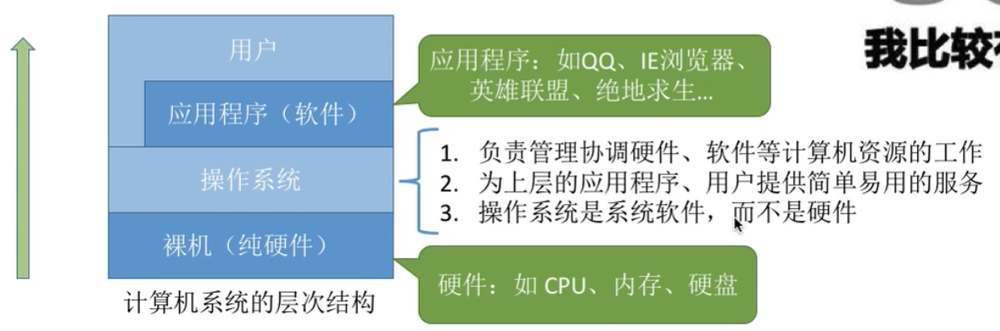

概念：操作系统（Operating System,OS)是指**控制和管理整个计算机系统的硬件和软件资源**，并合理地组织调度计算机的工作和资源的分配，以**提供给用户和其他软件方便的接口和环境**，它是计算机系统中最基本的**系统软件**。

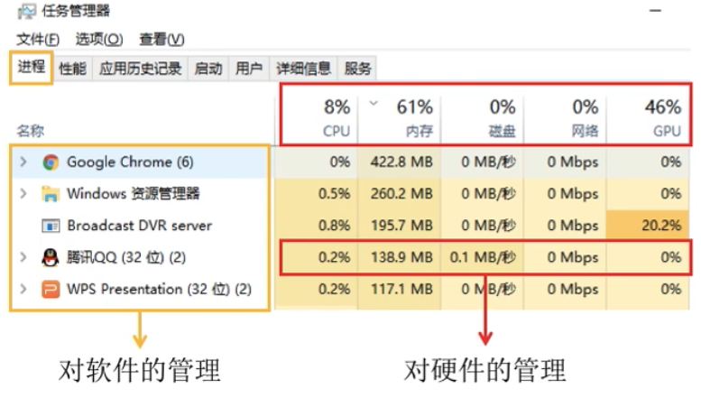

### 功能

1. 作为系统资源（硬件和软件）的管理者

   1. 文件管理
   2. 内存管理
   3. 处理机（进程）管理
   4. 设备管理——硬件资源

2. 提供用户接口，方便用户使用

   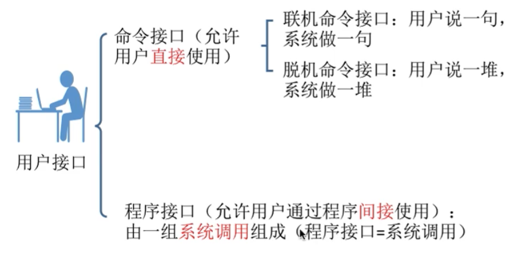

   1. 命令接口

      1. 联机命令接口——交互式命令接口，例如命令行指令
      2. 脱机命令接口——批处理命令接口，例如`.bat`脚本

   2. 程序接口

      只能通过程序间接使用，该过程即为系统调用，例如各种程序的`.dll`文件。
      程序接口=**==系统调用==**

   3. GUI

3. 实现对硬件机器功能的拓展

### 特征

1. **==并发==**

2. **==共享==**

   **并发和共享互为存在条件**，没有了并发执行，就不可能共享，没有了共享（“同时”访问某一资源），也就无法并发了。例如不能同时使用内存，那哪来的并发呢

3. 虚拟

4. 异步

**并发和共享是两个最基本的特征**

#### 1、并发

**操作系统的并发性**指计算机系统中同时存在着多个运行着的程序。

并发：指两个或多个事件在同一时间间隔内发生。这些事件**宏观上是同时发生**的，但**微观上是交替发生**的。

>  并行：同时发生

#### 2、共享

共享即资源共享，是指系统中的资源可供内存中多个并发执行的进程共同使用。

1. 互斥共享

2. 同时共享

   同一时间段内同时访问某资源。同时包括分时共享（微观上交替）和同时共享

#### 3、虚拟

**虚拟是指把一个物理上的实体变为若干个逻辑上的对应物。**物理实体（前者）是实际存在的，而逻辑上对应物（后者）是用户感受到的。

虚拟技术：

1. 空分复用

   虚拟存储器

2. 时分复用

   虚拟处理器

**没有并发性，谈不上虚拟性**

#### 4、异步

异步是指，在多道程序环境下，允许多个程序并发执行，但由于资源有限，进程的执行是异步执行的。

**只有有了并发性，才可能出现异步**

### 发展和分类

1. 手工操作阶段

   处理速度快，输入输出慢，用户独占全机，人机速度矛盾，导致资源利用率低

2. 批处理阶段

   1. 单道批处理系统
   
      引入脱机输入输出技术（磁带），监督程序负责控制作业输入输出
   
      缓解了一定程度的人机速度矛盾
   
      内存中仅能有一道程序运行
   
   2. 多道批处理系统
   
      每次往内存中输入多道程序，操作系统正式诞生，并引入了**中断**技术，**各个程序之间并发执行**
   
      优点：多个程序**并发**执行，**共享**资源，资源利用率大幅提升
   
      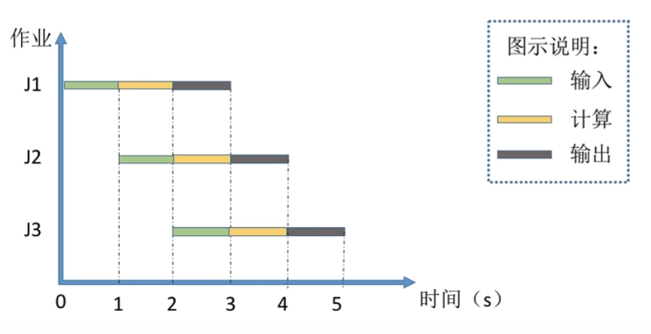
   
      缺点：没有人机交互功能，用户响应时间长
   
3. 分时操作系统

   计算机以**时间片**为单位**轮流为各个用户/作业服务**，各个用户可通过终端与计算机进行交互。

   优点：解决了人机交互问题

   缺点：不区分任务的紧急型

4. 实时操作系统

   特点：及时性、可靠性

   优点：能够优先相应一些紧急任务

   分类：

   1. 硬实时操作系统：必须绝对严格在规定时间内完成
   2. 软实时操作系统：可以偶尔延迟

5. 网络操作系统

6. 分布式操作系统

7. 个人计算机操作系统

### 操作系统的运行机制和体系结构

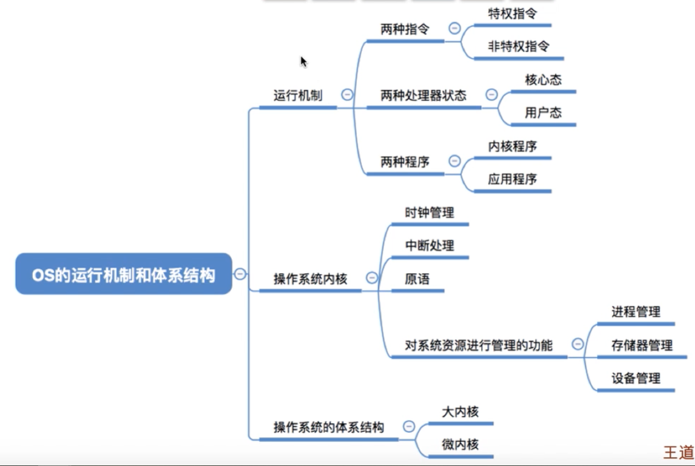

#### 运行机制

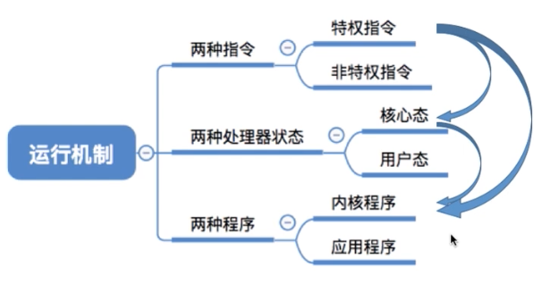

两种指令：

1. 特权指令：不允许用户程序使用，如内存清0指令
2. 非特权指令

两种处理器状态——判断当前是否可以执行特权指令：

> 程序状态字寄存器PSW中的某个标志位来标识，如0为用户态，1为核心态

1. 用户态（目态）——只能执行非特权指令
2. 核心态（管态）

两种程序：

1. 操作系统的内核程序：运行在核心态
2. 应用程序：运行在用户态

#### 哪些程序应该由内核程序实现——操作系统的内核

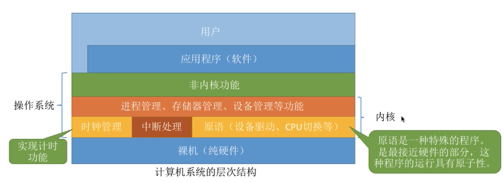

内核——底层软件，时最核心/最基本的部分

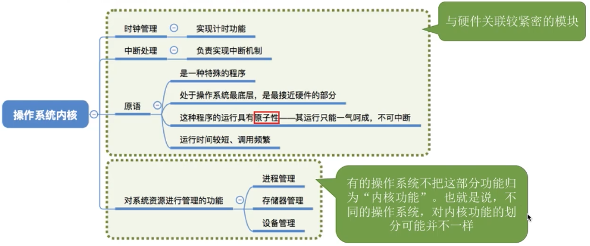

#### 操作系统的体系结构

1. 大内核
2. 微内核

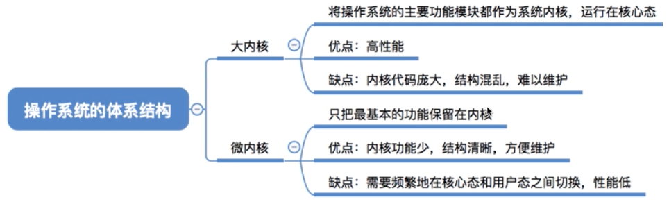

### 中断和异常

#### 中断的概念和作用

**多道批处理系统为了程序的并发执行，引入了中断。**

1. **当中断发生时，CPU立即进入核心态**
2. 当中断发生后，当前运行的进程暂停运行，并由操作系统内核对中断进行处理
3. 对于不同的中断信号，会进行不同的处理

发生了中断，就意味着需要操作系统介入，开展管理工作。由于操作系统的管理工作（比如进程切换、分配I/O设备等）需要使用特权指令，因此CPU要从用户态转为核心态。**中断可以使CPU从用户态切换为核心态**，使操作系统获得计算机的控制权。**有了中断，才能实现多道程序并发执行。**

> **用户态->核心态是通过中断实现的，且是唯一的切换途径**
>
> 核心态 -> 用户态的切换是通过执行一个特权指令，修改PSW的标志位实现的

#### 中断的分类

区别在于中断信号的来源是CPU内部还是CPU外部

1. 内中断（异常）

   1. 自愿中断——指令中断

      例如系统调用时使用的访管指令

   2. 强迫中断

      1. 硬件故障（故障）

         缺页

      2. 软件中断（终止）

         整数除0

2. 外中断（中断）

   1. 外设请求

      例如I/O操作完成的中断信号

   2. 人工干预

#### 外中断的处理过程

1. 每个指令执行完成后，在中断周期检查是否有外部中断信号
2. 若检测到外中断信号，则需要保护被中断进程的CPU环境
3. 根据中断信号的类型转入中断处理程序
4. 恢复原进程的CUP环境状态，推出中断，返回原进程

### 系统调用

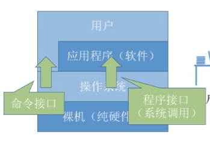

#### 概念

**“系统调用”是操作系统提供给应用程序（程序员/编程人员）使用的接口**，可以理解为一种可供应用程序调用的特殊函数，应用程序可以发出系统调用请求来获得操作系统的服务。

**应用程序通过系统调用请求操作系统的服务。**系统中的各种共享资源都由操作系统统一掌管，因此在用户程序中，凡是与资源有关的操作（如存储分配、I/O操作、文件管理等）,都必须通过系统调用的方式向操作系统提出服务请求，由操作系统代为完成。这样可以**保证系统的稳定性和安全性**，防止用户进行非法操作。

分类：

1. 设备管理
2. 文件管理
3. 进程控制
4. 进程通信
5. 内存管理

> 系统调用和库函数的区别：
>
> 系统调用由操作系统提供，以供应用程序使用
>
> 编程语言向上提供库函数，有时会将系统调用封装成库函数，隐藏一些细节，使得上层进行系统调用更加方便
>
> 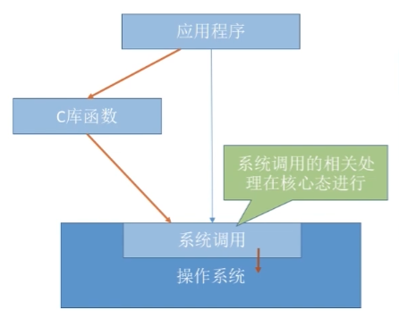

#### 系统调用的后台逻辑

1. 传递系统调用参数
2. 执行中断指令int，产生内中断
3. 执行系统调用相应的服务程序
4. 返回用户程序

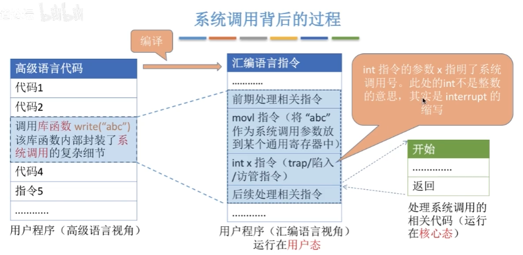

> ==**`int x`：中断指令，interrupt，该指令实际上是运行在用户态下的，执行完之后引发内中断，CPU进入核心态，处理后续的工作**==
>
> **==陷入指令是唯一一个只能在用户态下执行，而不能在核心态下执行的指令==**

## 进程

### 进程和进程实体

为了方便操作系统管理，完成各程序并发执行，引入了**进程**、**进程实体**的概念。

> 进程：进程实体的运行过程，是资源分配和调度的一个独立单位。动态
>
> 进程实体：静态

**PCB**、**程序段**、**数据段**三部分构成了进程实体（进程映像）

> PCB：系统为每个运行的程序配置一个数据结构，称为进程控制块（PCB)，用来描述进程的各种信息（如程序代码存放位置。
>
> **==PCB是进程存在的唯一标志==**

- 创建进程——创建进程实体的PCB
- 撤销进程——撤销该进程实体的PCB

### 进程的组成

1. 程序段——程序代码存放的位置

2. 数据段

3. PCB：进程管理的各种信息

   1. 进程描述信息

      1. 进程标识符PID
      2. 用户标识符UID

   2. 进程控制和管理信息

      1. 进程当前状态
      2. 进程优先级
   
3. 资源分配清单
   
   1. 程序段指针
      2. 数据段指针
      3. 硬件等
      
   4. 处理器相关信息——各种寄存器的值
   
      进程切换时保存当前进程的运行情况，相当于存档
   

### 进程的组织

多个进程之间的组织方式

1. 链接方式

   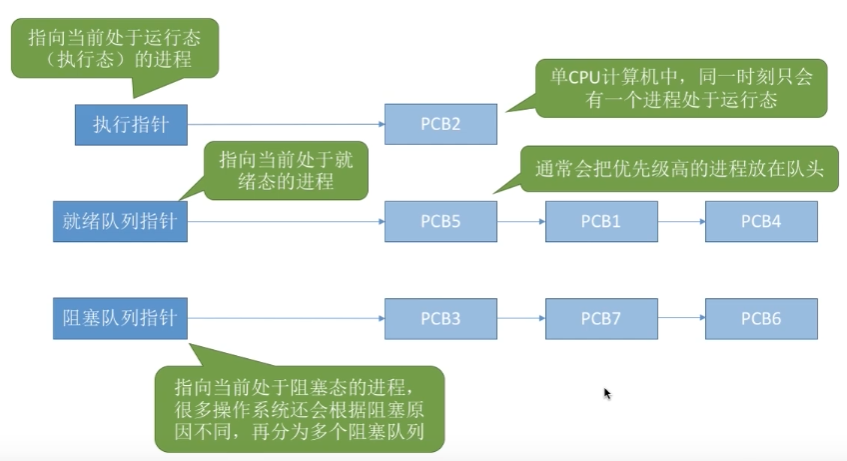

   1. 按照进程状态将PCB分为多个队列
   2. 操作系统持有各个队列的指针

2. 索引方式

   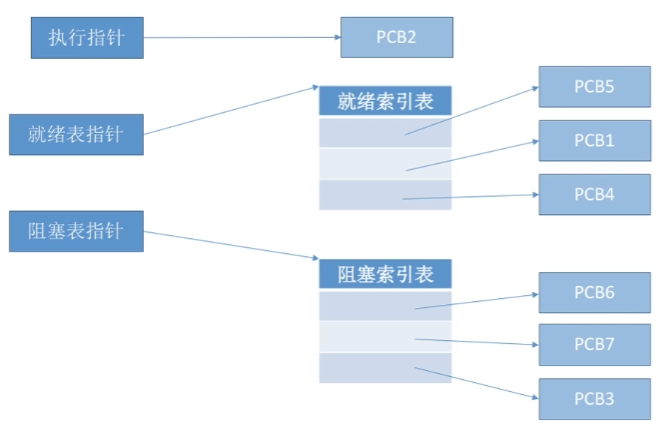

   1. 根据进程状态的不同，建立几张索引表
   2. 操作系统持有各个索引表的指针

### 进程的特征

1. 动态性——进程最基本的特征

   进程时程序的一次执行过程，是动态产生/变化/消亡的

2. 并发性

   内存中有多个进程实体，并发执行

3. 独立性

   **进程是能够独立运行、独立分配资源、独立接收调度的基本单位**

4. 异步性

   有可能导致进程运行结果的不确定性

   操作系统需要提供进程同步机制来解决异步问题

5. 结构性

   由三部分组成，每个进程都有一个PCB

### 进程的状态

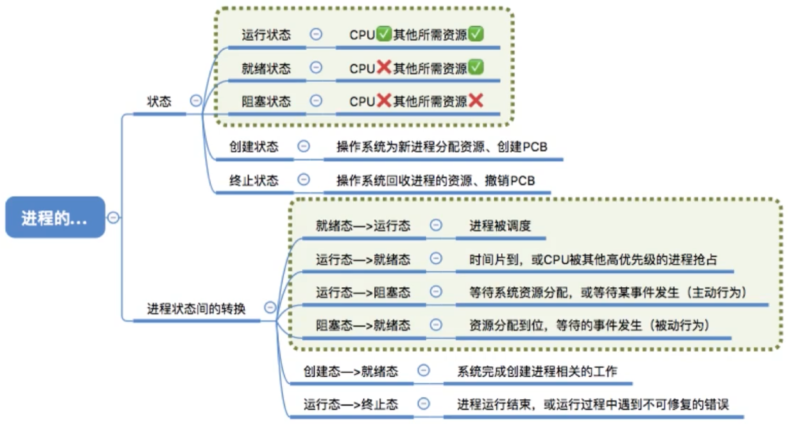

状态：

1. 运行态Running——占有CPU，正在执行

   单核CPU只能最多同时有一个进程处于运行态

2. 就绪态Ready

   具备运行条件，但没有运行

   具有了除CPU之外的所有资源

3. 阻塞态Waiting/Blocking

   因等待某一事件而暂时不能运行

4. 创建态——创建进程时的状态，分配资源、初始化PCB等

5. 终止态——正在撤销，回收资源、撤销PCB等

   由于bug而无法继续运行

进程状态的转换：

 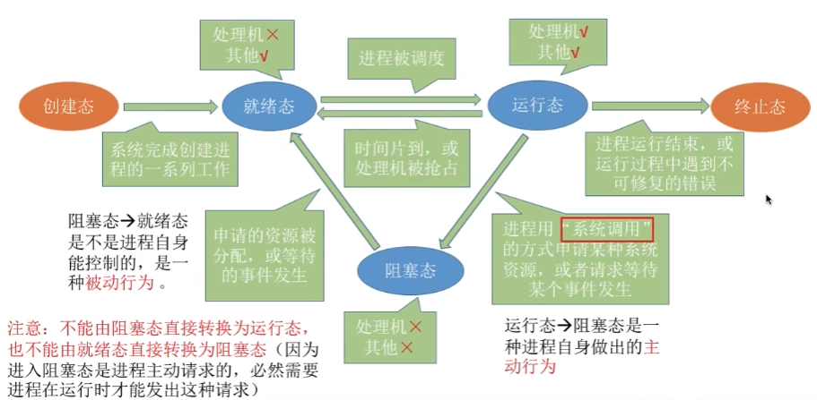

### 进程控制——原语

实现进程转换

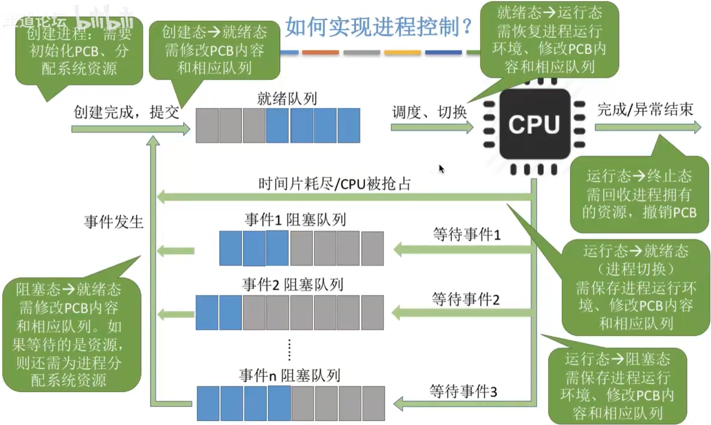

使用原语（一种特殊程序）进行进程控制。

> 原语：不允许中断，原子操作
>
> 采用“关中断”指令、“开中断”指令实现
>
> “关中断”指令、“开中断”指令只能在核心态下执行的特权指令

相关工作：

1. 更新PCB信息
   1. 进程状态标志位
   2. 保存运行环境
   3. 恢复运行环境
2. 将PCB插入到合适的队列
3. 分配/回收资源

原语的分类：

1. 创建原语

   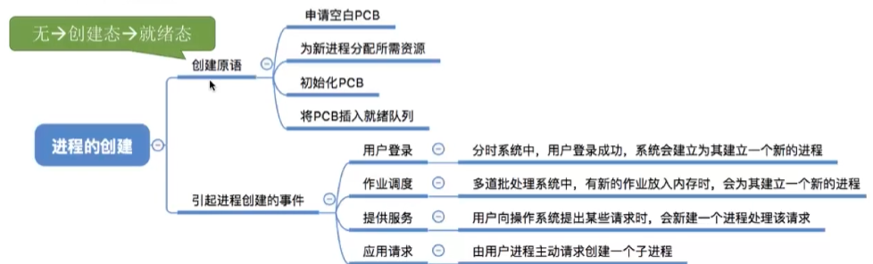

2. 撤销原语

   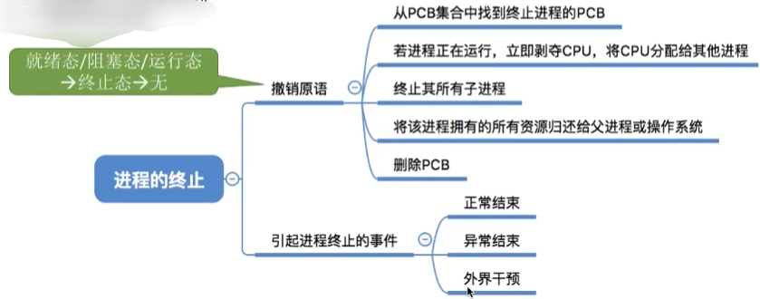

3. 阻塞原语和唤醒原语——成对使用

   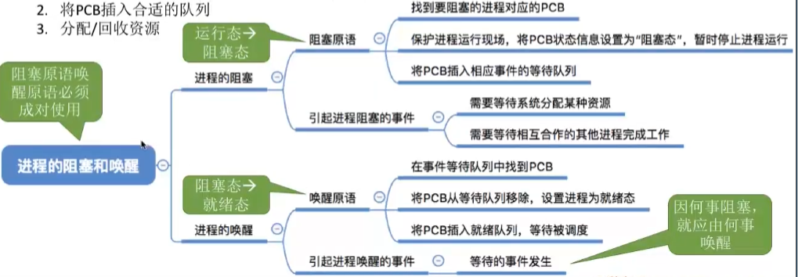

4. 切换原语

   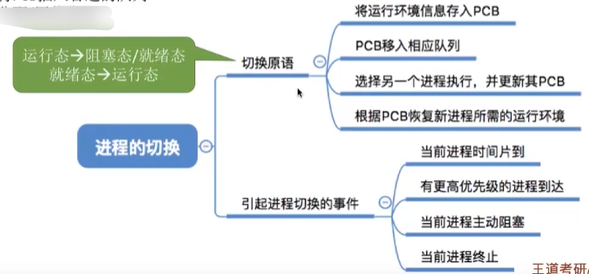
   
   

### 进程通信

进程时是分配系统资源的单位，因此各个进程所拥有的内存空间相互独立。

为了保证安全，进程之间不能直接访问其他进程的内存空间

1. 共享存储

   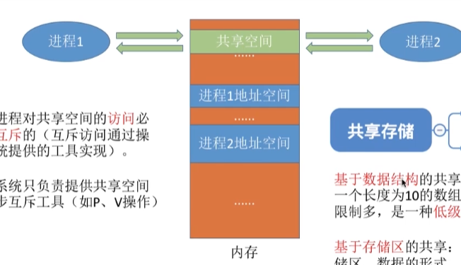

   创建共享空间，但是**==对这个共享空间的访问必须是互斥的==**

   > 使用操纵系统提供的同步互斥工具实现，如P、V操作

   1. 基于数据结构的共享

      例如只能放长度为10 的数组

      低级通信方式，速度慢，限制多

   2. 基于存储区的共享

      一种高级通信方式，该存储区的使用由进程控制，而不是操作系统

2. 管道通信

   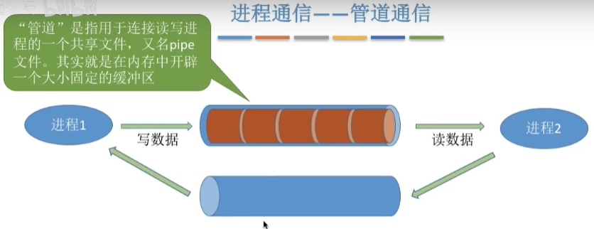

   管道：用户连接读写进程的共享文件，实际上就是一段固定大小的缓冲区

   > 1. 只能采用**半双工**（同一时间段只能实现单向传输）。实现双向同时通信，只能设置双管道
   >
   > 2. 各进程之间**互斥的访问管道**
   >
   > 3. 数据以字符流的形式写入管道。写满时，写进程被阻塞；数据全部被取走后，管道变空，读进程被阻塞
   >
   > 4. **==没有写满，不允许读；没有读空，不允许写==**
   >
   > 5. 数据一旦被读出，就从管道中抛弃
   >
   >    因此读进程最多只有一个

3. 消息传递

   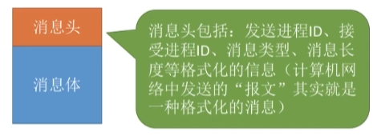

   以格式化的消息为单位，通过操作系统提供的“发送/接收消息”两个原语进行数据交换

   > 

   1. 直接通信方式

      > 消息队列
      >
      > 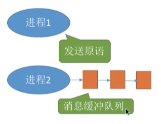

      直接把消息挂到进程的消息缓冲队列上（队尾）

   2. 间接通信方式（信箱通信方式）

      

### 线程

进程方便了程序的并发执行控制

