# 操作系统

## 概论

计算机系统的层次结构：

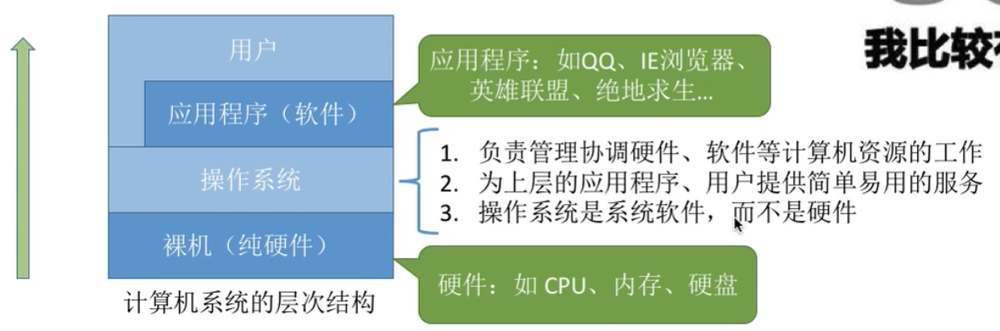

概念：操作系统（Operating System,OS)是指**控制和管理整个计算机系统的硬件和软件资源**，并合理地组织调度计算机的工作和资源的分配，以**提供给用户和其他软件方便的接口和环境**，它是计算机系统中最基本的**系统软件**。

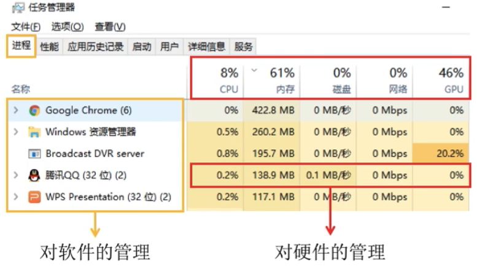

### 功能

1. 作为系统资源（硬件和软件）的管理者

   1. 文件管理
   2. 内存管理
   3. 处理机（进程）管理
   4. 设备管理——硬件资源

2. 提供用户接口，方便用户使用

   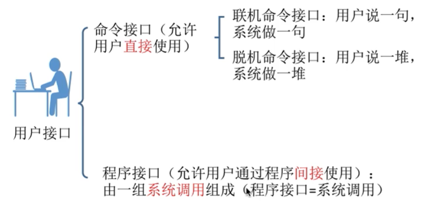

   1. 命令接口

      1. 联机命令接口——交互式命令接口，例如命令行指令
      2. 脱机命令接口——批处理命令接口，例如`.bat`脚本

   2. 程序接口

      只能通过程序间接使用，该过程即为系统调用，例如各种程序的`.dll`文件。
      程序接口=**==系统调用==**

   3. GUI

3. 实现对硬件机器功能的拓展

### 特征

1. **==并发==**

2. **==共享==**

   **并发和共享互为存在条件**，没有了并发执行，就不可能共享，没有了共享（“同时”访问某一资源），也就无法并发了。例如不能同时使用内存，那哪来的并发呢

3. 虚拟

4. 异步

**并发和共享是两个最基本的特征**

#### 1、并发

**操作系统的并发性**指计算机系统中同时存在着多个运行着的程序。

并发：指两个或多个事件在同一时间间隔内发生。这些事件**宏观上是同时发生**的，但**微观上是交替发生**的。

>  并行：同时发生

#### 2、共享

共享即资源共享，是指系统中的资源可供内存中多个并发执行的进程共同使用。

1. 互斥共享

2. 同时共享

   同一时间段内同时访问某资源。同时包括分时共享（微观上交替）和同时共享

#### 3、虚拟

**虚拟是指把一个物理上的实体变为若干个逻辑上的对应物。**物理实体（前者）是实际存在的，而逻辑上对应物（后者）是用户感受到的。

虚拟技术：

1. 空分复用

   虚拟存储器

2. 时分复用

   虚拟处理器

**没有并发性，谈不上虚拟性**

#### 4、异步

异步是指，在多道程序环境下，允许多个程序并发执行，但由于资源有限，进程的执行是异步执行的。

**只有有了并发性，才可能出现异步**

### 发展和分类

1. 手工操作阶段

   处理速度快，输入输出慢，用户独占全机，人机速度矛盾，导致资源利用率低

2. 批处理阶段

   1. 单道批处理系统
   
      引入脱机输入输出技术（磁带），监督程序负责控制作业输入输出
   
      缓解了一定程度的人机速度矛盾
   
      内存中仅能有一道程序运行
   
   2. 多道批处理系统
   
      每次往内存中输入多道程序，操作系统正式诞生，并引入了**中断**技术，**各个程序之间并发执行**
   
      优点：多个程序**并发**执行，**共享**资源，资源利用率大幅提升
   
      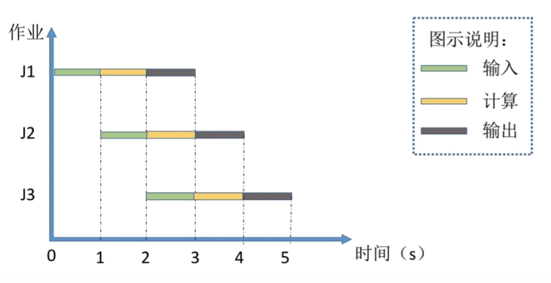
   
      缺点：没有人机交互功能，用户响应时间长
   
3. 分时操作系统

   计算机以**时间片**为单位**轮流为各个用户/作业服务**，各个用户可通过终端与计算机进行交互。

   优点：解决了人机交互问题

   缺点：不区分任务的紧急型

4. 实时操作系统

   特点：及时性、可靠性

   优点：能够优先相应一些紧急任务

   分类：

   1. 硬实时操作系统：必须绝对严格在规定时间内完成
   2. 软实时操作系统：可以偶尔延迟

5. 网络操作系统

6. 分布式操作系统

7. 个人计算机操作系统

### 操作系统的运行机制和体系结构

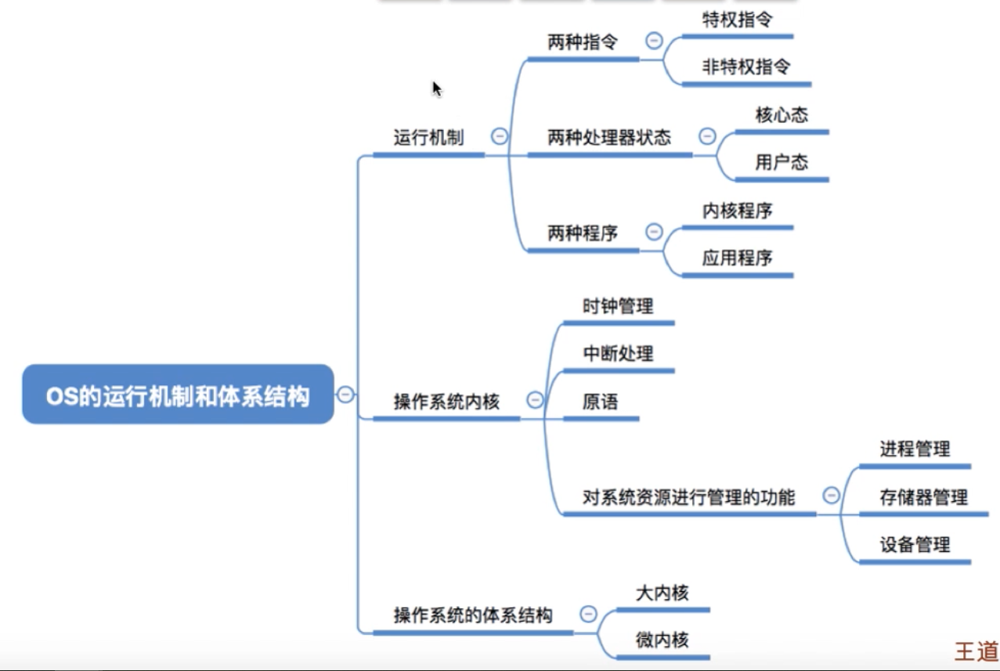

#### 运行机制

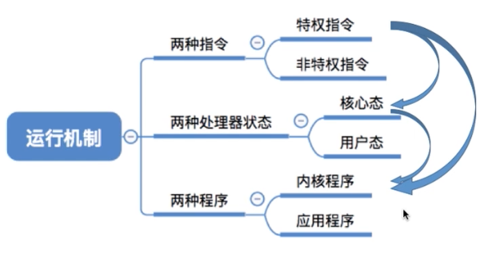

两种指令：

1. 特权指令：不允许用户程序使用，如内存清0指令
2. 非特权指令

两种处理器状态——判断当前是否可以执行特权指令：

> 程序状态字寄存器PSW中的某个标志位来标识，如0为用户态，1为核心态

1. 用户态（目态）——只能执行非特权指令
2. 核心态（管态）

两种程序：

1. 操作系统的内核程序：运行在核心态
2. 应用程序：运行在用户态

#### 操作系统的体系结构

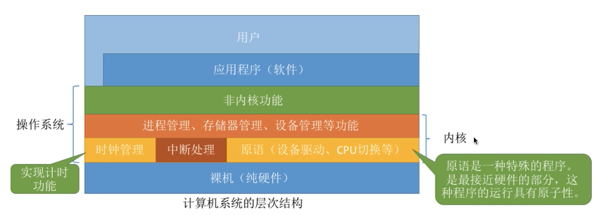

内核——底层软件，是最核心/最基本的部分

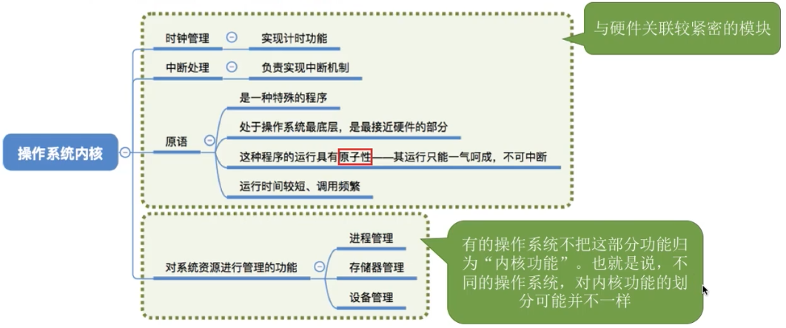

分类：

1. 大内核
2. 微内核


### 中断和异常

#### 中断的概念和作用

**多道批处理系统为了程序的并发执行，引入了中断。**

1. **当中断发生时，CPU立即进入核心态**
2. 当中断发生后，当前运行的进程暂停运行，并由操作系统内核对中断进行处理
3. 对于不同的中断信号，会进行不同的处理

发生了中断，就意味着需要操作系统介入，开展管理工作。由于操作系统的管理工作（比如进程切换、分配I/O设备等）需要使用特权指令，因此CPU要从用户态转为核心态。==**通过中断，使CPU从用户态切换为核心态，进而进行进程切换，实现并发**==，使操作系统获得计算机的控制权。**有了中断，才能实现多道程序并发执行。**

> **用户态->核心态是通过中断实现的，且是唯一的切换途径**
>
> 核心态 -> 用户态的切换是通过执行一个特权指令，修改PSW的标志位实现的

#### 中断的分类

区别在于中断信号的来源是CPU内部还是CPU外部

1. 内中断（异常）

   1. 自愿中断——指令中断

      例如系统调用时使用的访管指令

   2. 强迫中断

      1. 硬件故障（故障）

         缺页

      2. 软件中断（终止）

         整数除0

2. 外中断（中断）

   1. 外设请求

      例如I/O操作完成的中断信号

   2. 人工干预

#### 外中断的处理过程

1. 每个指令执行完成后，在中断周期检查是否有外部中断信号
2. 若检测到外中断信号，则需要保护被中断进程的CPU环境
3. 根据中断信号的类型转入中断处理程序
4. 恢复原进程的CUP环境状态，推出中断，返回原进程

### 系统调用

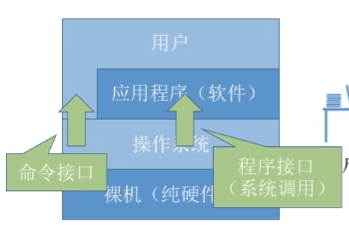

#### 概念

**“系统调用”是操作系统提供给应用程序（程序员/编程人员）使用的接口**，可以理解为一种可供应用程序调用的特殊函数，应用程序可以发出系统调用请求来获得操作系统的服务。

**应用程序通过系统调用请求操作系统的服务。**系统中的各种共享资源都由操作系统统一掌管，因此在用户程序中，凡是与资源有关的操作（如存储分配、I/O操作、文件管理等），都必须通过系统调用的方式向操作系统提出服务请求，由操作系统代为完成。这样可以**保证系统的稳定性和安全性**，防止用户进行非法操作。

分类：

1. 设备管理
2. 文件管理
3. 进程控制
4. 进程通信
5. 内存管理

> 系统调用和库函数的区别：
>
> 系统调用由操作系统提供，以供应用程序使用
>
> 编程语言向上提供库函数，有时会将系统调用封装成库函数，隐藏一些细节，使得上层进行系统调用更加方便
>
> 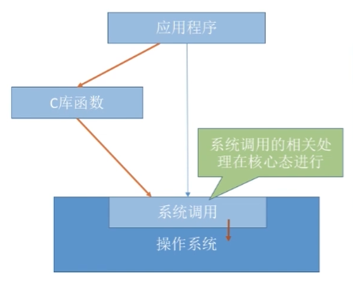

#### 系统调用的后台逻辑

1. 传递系统调用参数
2. 执行中断指令int，产生内中断
3. 执行系统调用相应的服务程序
4. 返回用户程序

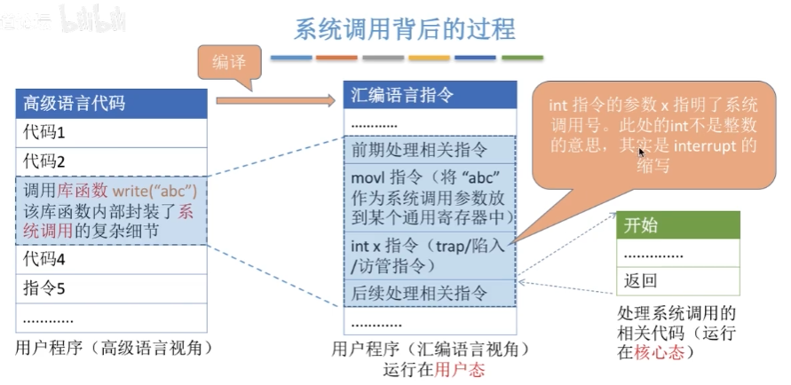

> ==**`int x`：中断指令，interrupt，该指令实际上是运行在用户态下的，执行完之后引发内中断，CPU进入核心态，处理后续的工作**==
>
> **==陷入指令是唯一一个只能在用户态下执行，而不能在核心态下执行的指令==**

## 进程

### 进程的描述

#### 进程和进程实体

为了方便操作系统管理，完成各程序并发执行，引入了**进程**、**进程实体**的概念。

> 进程：进程实体的运行过程，是资源分配和调度的一个独立单位。动态
>
> 进程实体：静态

**进程实体（进程映像） =  PCB + 程序段 + 数据段**

> PCB：系统为每个运行的程序配置一个数据结构，称为进程控制块（PCB)，用来描述进程的各种信息，如程序代码存放位置。
>
> **==PCB是进程存在的唯一标志==**

- 创建进程——创建进程实体的PCB
- 撤销进程——撤销该进程实体的PCB

#### 进程的组成

1. 程序段——程序代码存放的位置

2. 数据段

3. PCB：进程管理的各种信息

   1. **进程描述信息**

      1. 进程标识符PID
      2. 用户标识符UID

   2. **进程控制和管理信息**

      1. 进程**当前状态**
      
      2. 进程**优先级**
      
   3. **资源分配清单**

      1. **程序段指针**

      2. **数据段指针**

      3. **硬件等**

      4. 处理器相关信息——各种寄存器的值

         进程切换时保存当前进程的运行情况，相当于**存档**


#### 进程的组织

多个进程之间的组织方式

1. 链接方式

   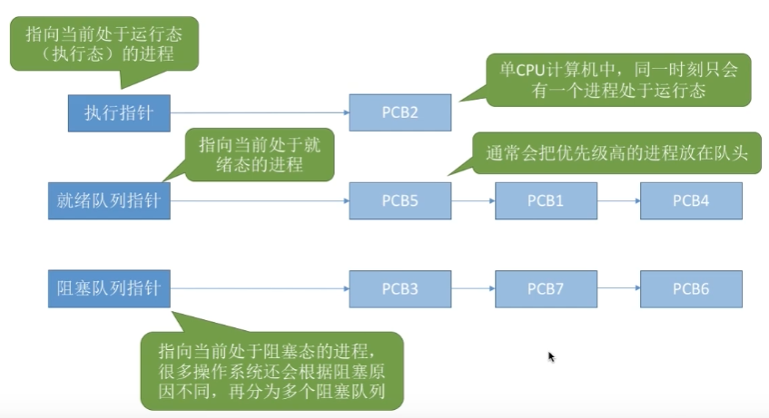

   1. 按照进程状态将PCB分为多个队列
   2. 操作系统持有各个队列的指针

2. 索引方式

   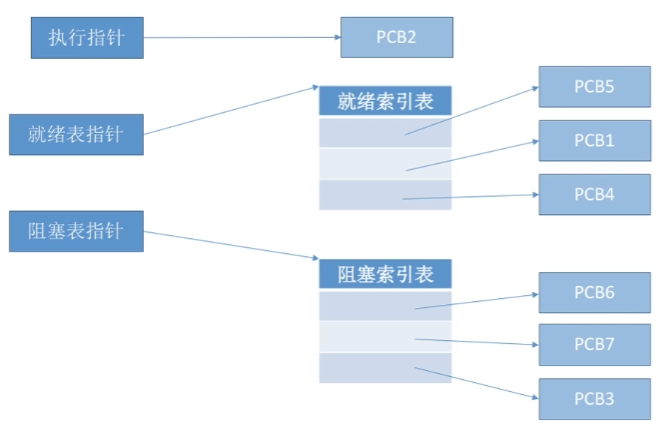

   1. 根据进程状态的不同，建立几张索引表
   2. 操作系统持有各个索引表的指针

#### 进程的特征

1. **动态性——进程最基本的特征**

   进程时程序的一次执行过程，是动态产生/变化/消亡的

2. 并发性

   内存中有多个进程实体，并发执行

3. 独立性

   **==进程是能够独立运行、独立分配资源、独立接收调度的基本单位==**

4. 异步性

   有可能导致进程运行结果的不确定性

   操作系统需要提供进程同步机制来解决异步问题

5. 结构性

   由三部分数据结构组成，每个进程都有一个PCB

### 进程控制

#### 进程的状态

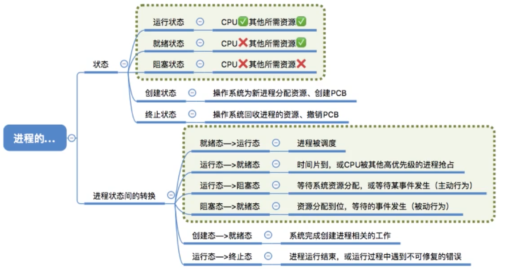

状态：

1. **运行态Running**——占有CPU，正在执行

   单核CPU只能最多同时有一个进程处于运行态

2. **就绪态Ready**

   具备运行条件，但没有运行

   具有了除CPU之外的所有资源

   ==**阻塞态 -> 就绪态是一种被动行为，不是进程主动控制的**==

3. **阻塞态Waiting/Blocking**

   **==只能由进程主动请求，因此只能由运行态转为阻塞态==**

   **因申请资源（通过系统调用）或等待某一事件而暂时不能运行**

4. 创建态——创建进程时的状态，分配资源、初始化PCB等

5. 终止态——正在撤销，回收资源、撤销PCB等

   例如由于bug而无法继续运行

6. 挂起态suspend

   将进程映像调到外存中

   1. 就绪挂起——将一个就绪态的进程转移到外存中，挂起
   2. 阻塞挂起——将一个阻塞态的进程挂起

   **运行态可以直接转为挂起态**

（五）进程状态的转换：

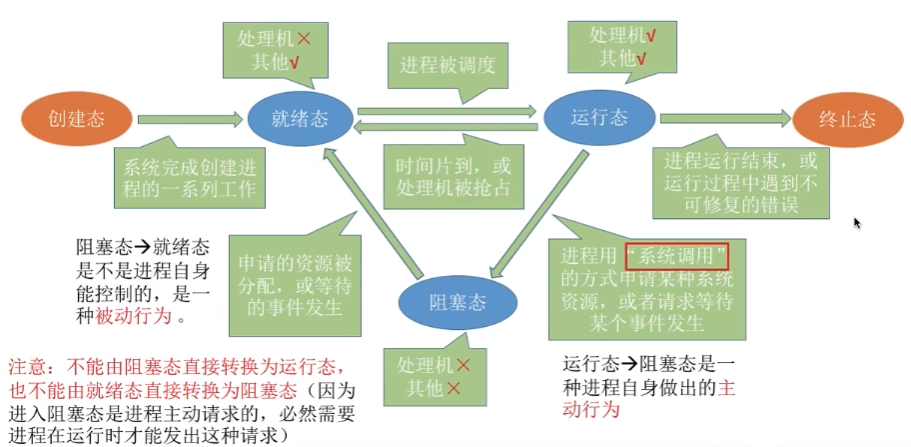

七状态转换：

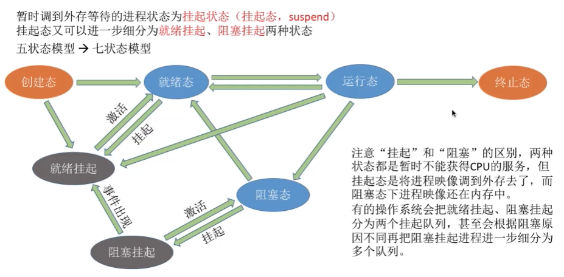

#### 进程控制——原语

实现进程转换

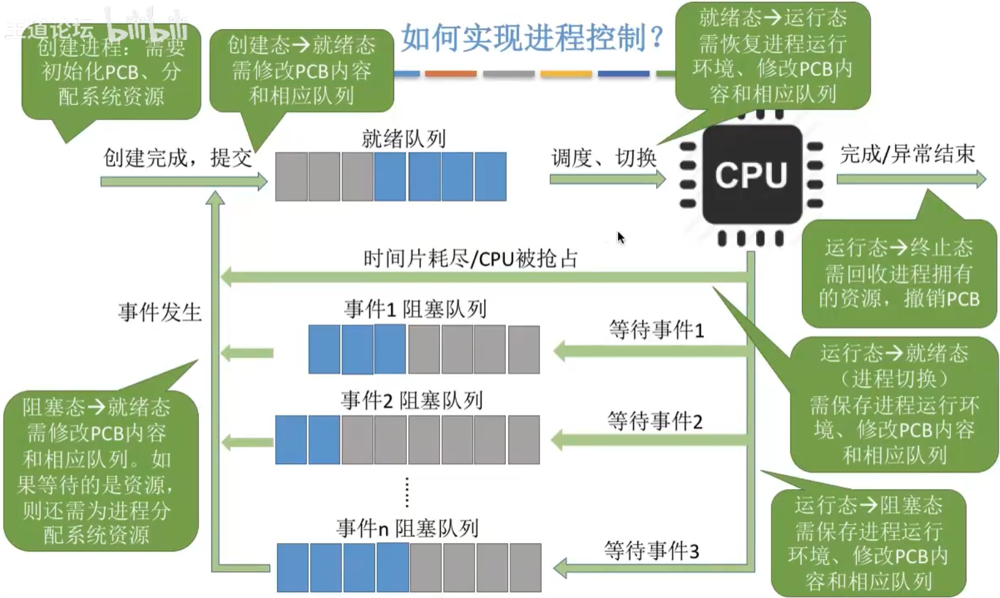

使用原语（一种特殊程序）进行进程控制。

> 原语：不允许中断，原子操作
>
> **采用“关中断”指令、“开中断”指令实现**
>
> **“关中断”指令、“开中断”指令只能在核心态下执行的特权指令**

相关工作：

1. **更新PCB信息**
   1. **进程状态标志位——进程状态控制**
   2. 保存运行环境——**PCB中保存了当前进程的寄存器消息**
   3. 恢复运行环境
2. **将PCB插入到合适的队列**
3. **分配/回收资源**

原语的分类：

1. **创建原语**

   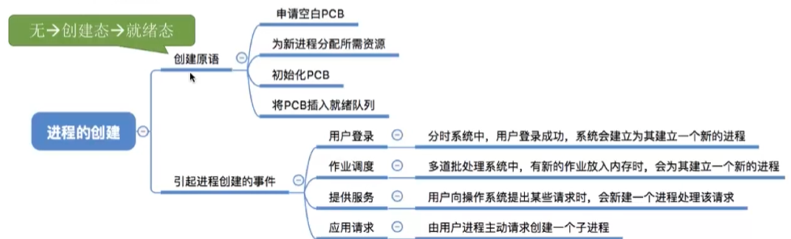

2. **撤销原语**

   1. **找到PCB**
   2. **终止进程（包括子进程）**
   3. **回收资源**
   4. **删除PCB**

   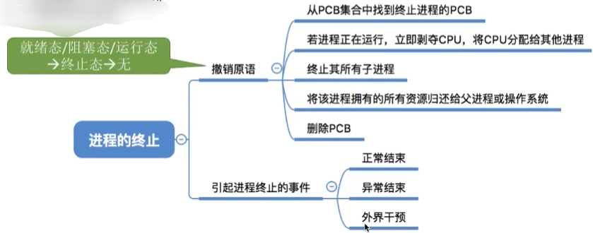

3. 阻塞原语和唤醒原语——成对使用

   1. **找到PCB**
   2. **[保护现场（阻塞原语）]，修改状态标志位**
   3. **修改队列**

   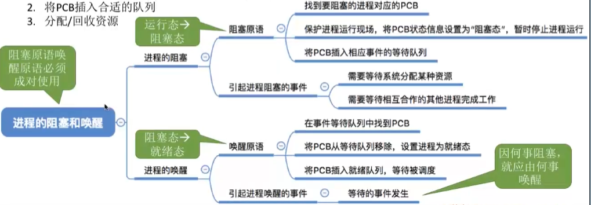

4. ==**切换原语——用于调度**==

   1. **保护现场**
   2. **修改进程（两个队列）**
   3. **恢复新进程的现场**

   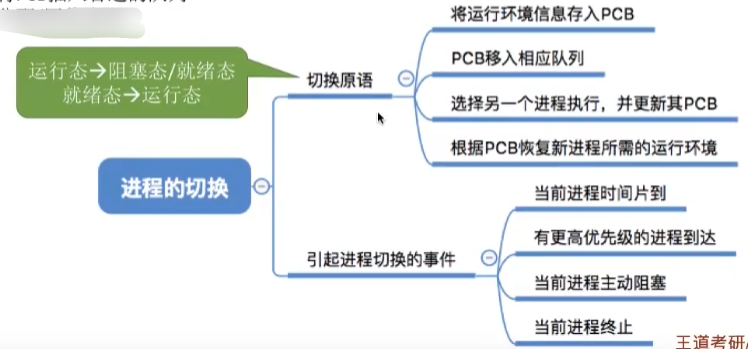

   

### 进程通信

**进程时是分配系统资源的单位，因此各个进程所拥有的内存空间相互独立。**

为了保证安全，进程之间不能直接访问其他进程的内存空间

1. 共享存储

   

   创建共享空间，但是**==对这个共享空间的访问必须是互斥的==**

   > 使用操纵系统提供的同步互斥工具实现，如P、V操作

   1. 基于数据结构的共享

      共享某一个创建的数据结构，有限制

      例如只能放长度为10 的数组

      低级通信方式，速度慢，限制多00

   2. 基于存储区的共享

      一种高级通信方式，**该存储区的使用由进程控制，而不是操作系统**

2. 管道通信

   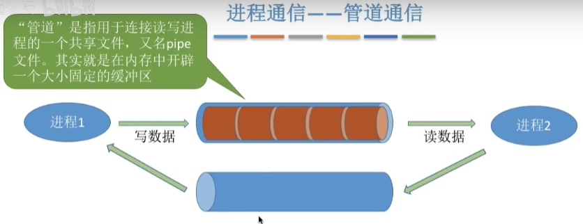

   管道：用户连接读写进程的共享文件，实际上就是**一段固定大小的缓冲区**

   > 1. 只能采用**半双工**（同一时间段只能实现单向传输）。实现双向同时通信，只能设置双管道
   >
   > 2. 各进程之间**互斥的访问管道**
   >
   > 3. 数据以字符流的形式写入管道。写满时，写进程被阻塞；数据全部被取走后，管道变空，读进程被阻塞
   >
   > 4. **==没有写满，不允许读；没有读空，不允许写==**
   >
   > 5. 数据一旦被读出，就从管道中抛弃
   >
   >    **==因此读进程最多只有一个==**

3. 消息传递

   

   以格式化的消息为单位，通过操作系统提供的“发送/接收消息”两个原语进行数据交换

   1. 直接通信方式

      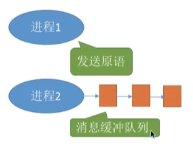
      
      > 消息队列

      直接把消息挂到进程的消息缓冲队列上（队尾）
      
   2. 间接通信方式（信箱通信方式）
   
      
   

### 线程

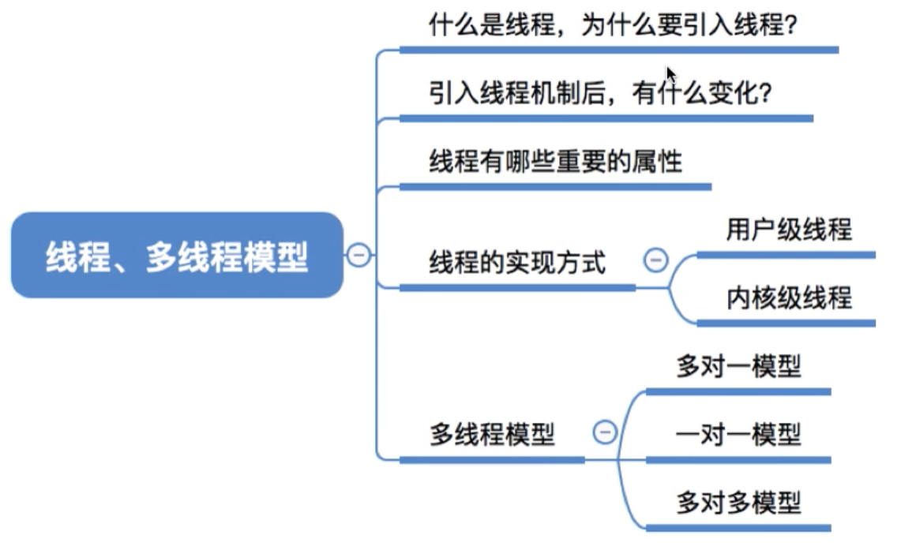


可以把线程理解为“轻量级进程”。**==线程是一个基本的CPU执行单元，也是程序执行流的最小单位。==**引入线程之后，**不仅是进程之间可以并发，进程内的各线程之间也可以并发，从而==进一步提升了系统的并发度==**，使得一个进程内也可以并发处理各种任务（如QQ视频、文字聊天、传文件）。

**==引入线程后，进程只作为除CPU之外的系统资源的分配单元==**（如打印机、内存地址空间等都是分配给进程的）。

- **==调度的基本单位==**
- **==分配处理机资源的基本单位==**

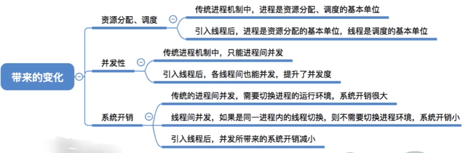

####  线程的属性

1. ==**线程是处理机调度的单位**==
2. 多CPU计算机中，各个线程可占用不同的CPU
3. 每个线程都有一个**线程ID**、**线程控制块（TCB)**
4. 线程也有**就绪**、**阻塞**、**运行**三种基本状态
5. ==**线程几乎不拥有系统资源（资源是分配给线程的）**==
6. **同一进程的不同线程间共享进程的资源**
7. ==**由于共享内存地址空间，同一进程中的线程间通信甚至无需系统干预**==
8. ==**同一进程中的线程切换，不会引起进程切换**==——开销小

#### 线程的实现方式

1. 用户级线程（User-Level Thread，ULT）

   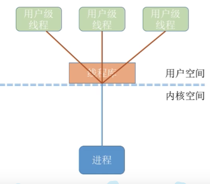

   用户级线程通过**线程库**实现，**所有的线程管理工作由应用程序负责**

   用户级线程在**用户态**下即可完成，**对操作系统透明，对用户不透明**

2. 内核级线程

   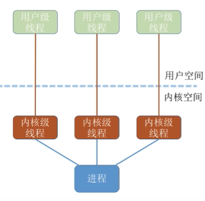

   **内核级线程由操作系统内核管理，其切换在核心态下进行。**

   内核级线程就是操作系统能看到的线程。

3. 二者组合：将n个用户级线程分配到m个内核级线程，**n≥m**

   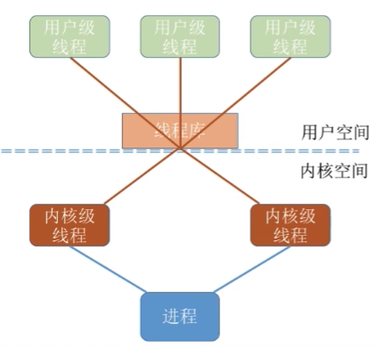

   用户级线程对操作系统是透明的，因此**==内核级线程才是分配CPU资源的单位==**。

#### 多线程模型

用户级线程和内核级线程的映射

1. 多对一

   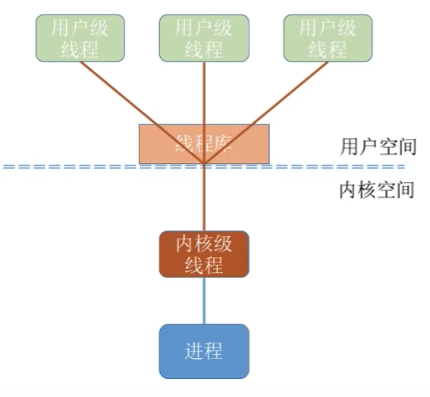

   优点：**用户态下即可实现线程的切换，不需要切换到核心态，系统开销小，效率高**

   缺点：由于内核级线程才是分配资源的最小单位，因此一个用户级线程被阻塞会导致整个进程阻塞，**并发度不高**。多个线程不能在多核处理机上运行

2. 一对一模型——纯粹的内核级线程

   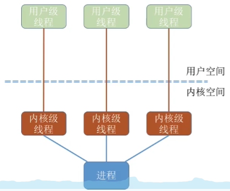

   优点：**并发能力强，单个线程阻塞不会导致其他线程阻塞。**多线程可以在多核处理机下完成

   缺点：线程切换在核心态下进行，线程切换由操作系统内核完成，**开销较大**

3. 多对多

   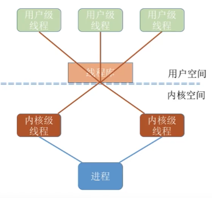

   **既实现了较高的并发性，又减少了系统开销**

   

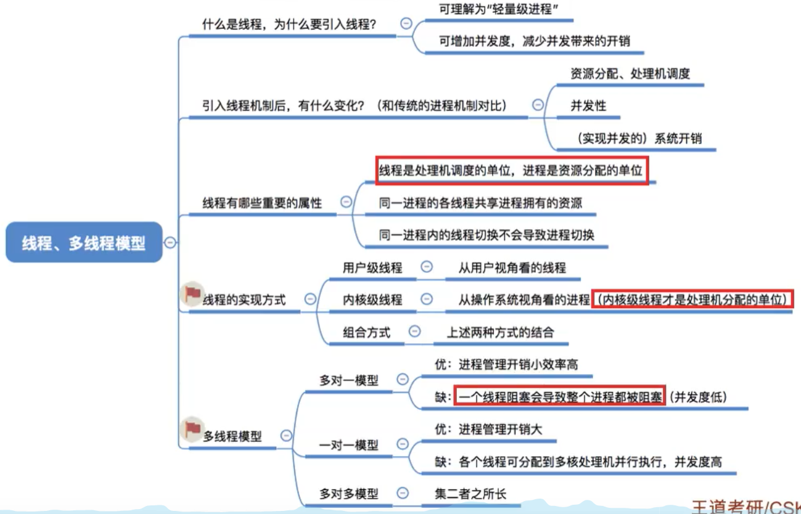

## 处理机调度


### 调度的三个层次

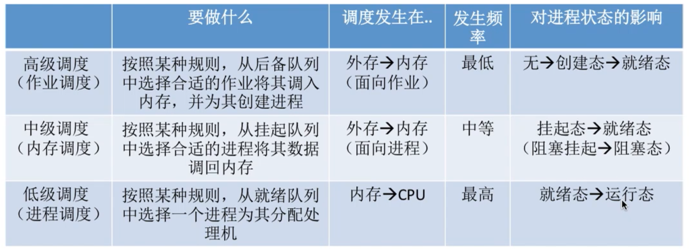

#### 1、作业调度（高级调度）

高级调度主要是按照一定的调度算法**把作业从外存调入内存并为作业分配相应的资源建立相应的进程**。


由于内存空间有限，有时无法将用户提交的作业全部放入内存，因此就需要确定某种规则来决定将作业调入内存的顺序。

按一定的原则从外存上处于后备队列的作业中挑选一个（或多个）作业，给他们分配内存等必要资源，并建立相应的进程（建立PCB)，以使它（们）获得竞争处理机的权利。

**==高级调度是辅存（外存）与内存之间的调度。==每个作业只调入一次，调出一次。作业调入时会建立相应的PCB，作业调出时才撤销PCB。**高级调度主要是指调入的问题，因为只有调入的时机需要操作系统来确定，但调出的时机必然是作业运行结束才调出。

#### 2、内存调度（中级调度）

**中级调度主要是为了对内存空间进行逻辑扩充。**


引入了**虚拟存储**技术之后，可将暂时不能运行的进程调至外存等待。等它重新具备了运行条件且内存又稍有空闲时，再重新调入内存。

这么做的目的是为了**提高内存利用率和系统吞吐量**。

**暂时调到外存等待的进程状态为挂起状态。**值得注意的是，**==PCB并不会一起调到外存，而是会常驻内存==**。PCB中会记录进程数据在外存中的存放位置，进程状态等信息，操作系统通过内存中的PCB来保持对各个进程的监控、管理。被挂起的进程PCB会被放到的挂起队列中。

中级调度（内存调度），就是要决定将哪个处于挂起状态的进程重新调入内存。

一个进程可能会被多次调出、调入内存，因此**中级调度发生的频率要比高级调度更高**。

#### 3、进程调度（低级调度）

进程调度（低级调度），其**主要任务是按照某种方法和策略从==就绪队列==中选取一个进程，将处理机分配给它**。

**进程调度是操作系统中最基本的一种调度，在一般的操作系统中都必须配置进程调度。**

**进程调度的频率很高**，一般几十毫秒一次。

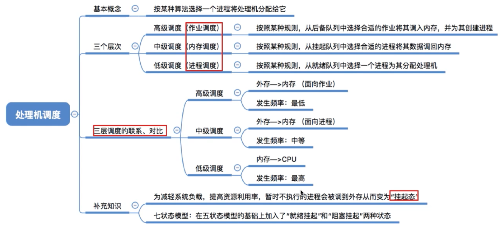

### 进程调度的时机、切换与过程、调度方式

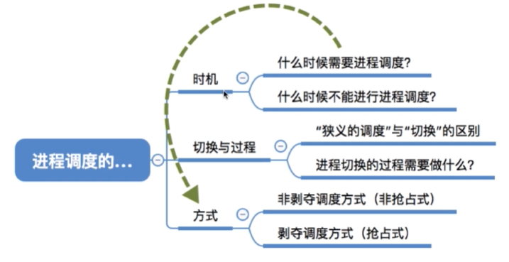

#### 进程调度的时机

需要进程调度和切换的时机

1. :slightly_smiling_face: 进程主动放弃处理机——非剥夺式
   1. 进程正常终止
   2. 进程发生异常而终止
   3. 进程主动请求阻塞
2. :angry: 被动放弃——剥夺式
   1. 时间片用完
   2. <font color=green>有更紧急的事需要处理，例如I/O中断</font>
   3. 有更高优先级的进程进入就绪队列

不能进行进程调度和切换的情况：

1. **中断处理过程中**

2. **进程在操作系统内核程序临界区中**

   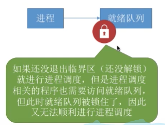

   > **内核程序临界区**一般是用来访问**某种内核数据结构**的，比如进程的就绪队列（由各就绪进程的PCB组成），在访问的过程调度会影响到当前进程，因此不允许进程调度。
   >
   > 普通临界区可以进行进程调度。
   >
   > > 临界资源：一个时间段内只允许一个进程使用的资源。各个进程需要互斥的访问临界资源
   > >
   > > 临界区：访问临界资源的那段代码

3. **原子操作过程中**（“关中断”指令）

   原语执行过程中

#### 进程调度的方式

1. 非剥夺调度方式（非抢占式）

   **只允许进程主动放弃处理机**。在运行过程中即便有更紧迫的任务到达，当前进程依然会继续使用处理机，直到该进程终止或主动要求进入阻塞态。

   实现简单，系统开销小，但是无法优先处理紧急任务（早期的批处理系统）

2. 剥夺调度方式（抢占式）

   当一个进程正在处理机上执行时，如果有一个更重要或更紧迫的进程需要使用处理机，则立即暂停正在执行的进程，将处理机分配给更重要紧迫的那个进程。

   可以优先处理更紧急的任务，也可以按照时间片轮转（通过时钟中断），适合于实时操作系统、分时操作系统

#### 进程的切换与过程

> “狭义的进程调度”——选中
>
> “进程切换”——切换进程
>
> **狭义的进程调度指的是从就绪队列中选中一个要运行的进程。**（这个进程可以是刚刚被暂停执行的进程，也可能是另一个进程，后一种情况就需要进程切换）
>
> 进程切换是指一个进程让出处理机，由另一个进程占用处理机的过程。
>
> **广义的进程调度包含了选择一个进程和进程切换两个步骤。**

进程切换的过程：

1. **对原来的正在运行的进程的各种数据进行保存**

2. **对新的进程的各种数据进行恢复**

   程序计数器、程序状态字、各种数据寄存器等处理机现场信息，这些信息一般保存在PCB中

**==进程的调度、切换是有代价的==**：如果过于频繁的进行进程调度、切换，必然会使整个系统的效率降低使系统大部分时间都花在了进程切换上，而真正用于执行进程的时间减少。

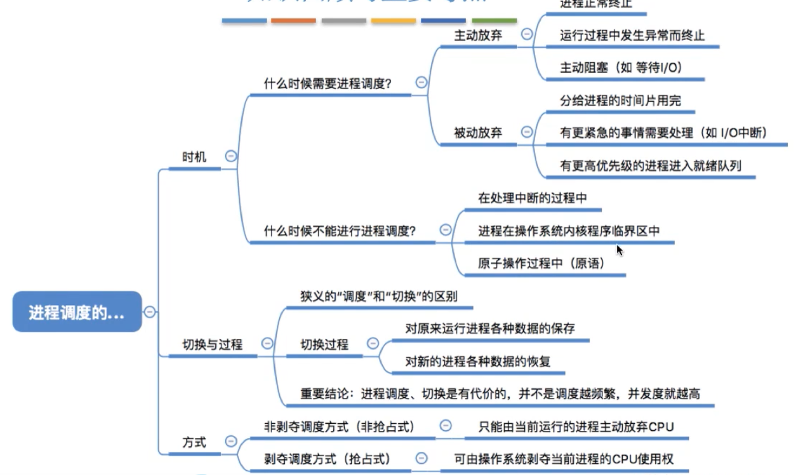

### 调度算法的评价指标

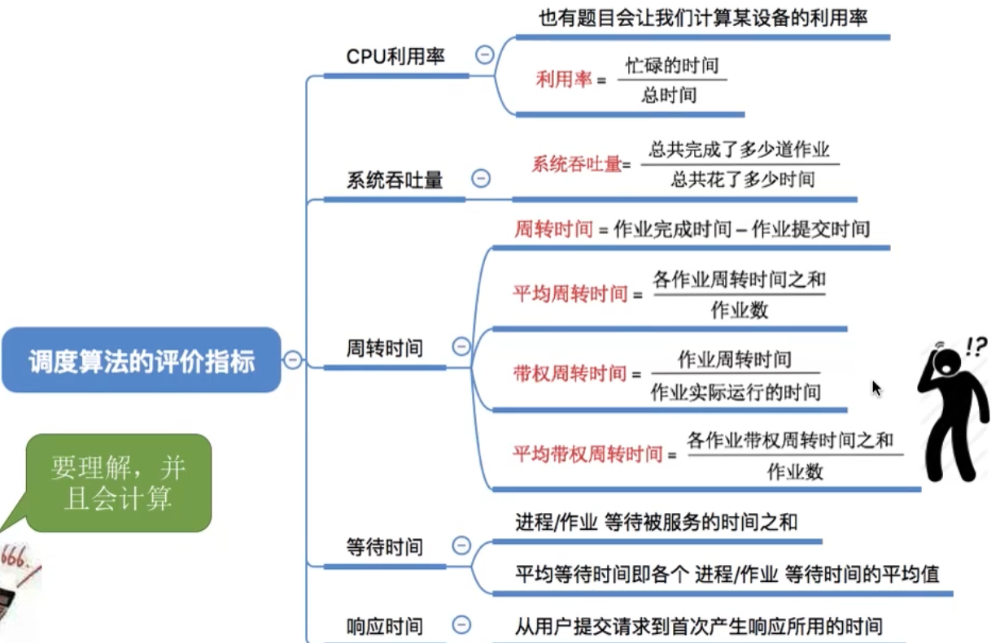

$$
利用率 = \frac {忙碌时间} {空闲时间}
$$


$$
周转时间 = 提交作业至作业完成的时间 \\
\ \ \ \ \ \ \ \ \ \ \ \ \ \ = 在外存上等待作业调度的时间 + 进程在就绪队列上的时间 \\
\ \ \ \ \ \ + 进程在执行的时间 + 进程等待\mathrm{I/O}完成的时间 \\
\ \ \ \ \ \ \ = 在外存上等待作业调度的时间 + 进程在就绪态的时间 \\
\ \ \ \ \ \ + 进程在执行态的时间 + 进程在阻塞态的时间
$$


$$
平均周转时间 = \frac {各个作业周转时间之和} {作业数}
$$


$$
带权周转时间 = \frac {作业周转时间} {作业实际运行的时间} = \frac {作业提交时间 - 作业完成时间} {作业实际运行的时间} \ge 1
$$


$$
平均带权周转时间 = \frac {各个作业带权周转时间之和} {作业数}
$$


$$
等待时间 = 进程/作业处于等待处理机状态时间之和 \\
\ \ \ \ \ \ \ \ \ \ \ = 周转时间 - 运行时间 - \mathrm{I/O}服务时间
$$

> **对于进程，I/O实际上也是被服务的，不算在等待时间里面**
>
> 对于作业，不仅要考虑进程建立后的等待时间，还要加上**作业在外存后备队列中的等待时间**


$$
平均等待时间
$$


$$
响应时间 = 用户首次请求至首次相应的时间
$$


### 调度算法

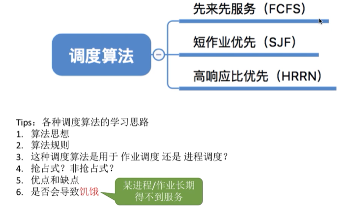

#### 早期批处理系统

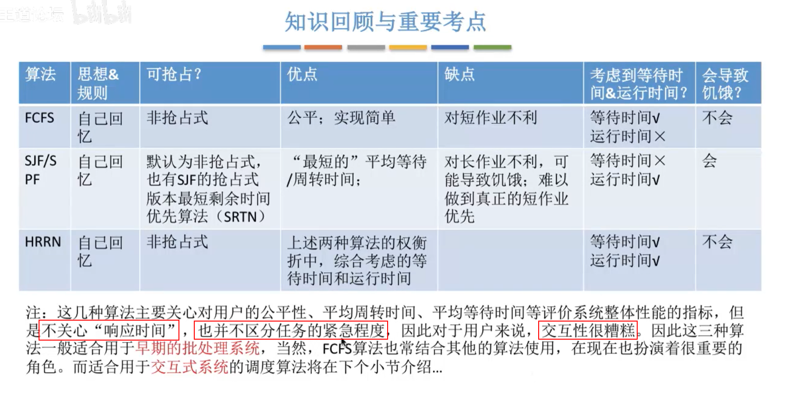

##### 先来先服务FCFS

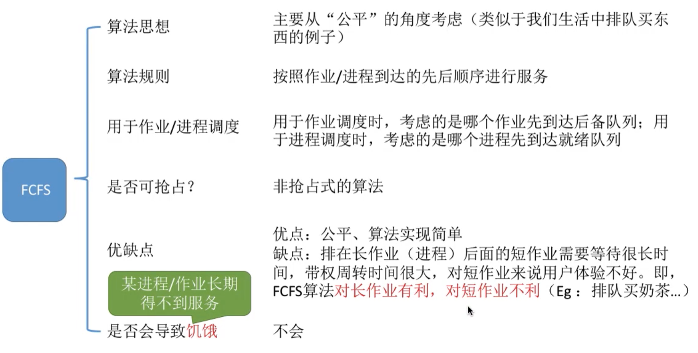

优点：简单

缺点：带权周转时间大，对长作业有利，对短作业不利

> 等待时间最长：
>
> 不考虑运行时间，因此对长作业有利，对短作业不利

##### 短作业优先SJF/SPF

> Shortest Job/Process First

“最短的”平均等待时间、平均周转时间

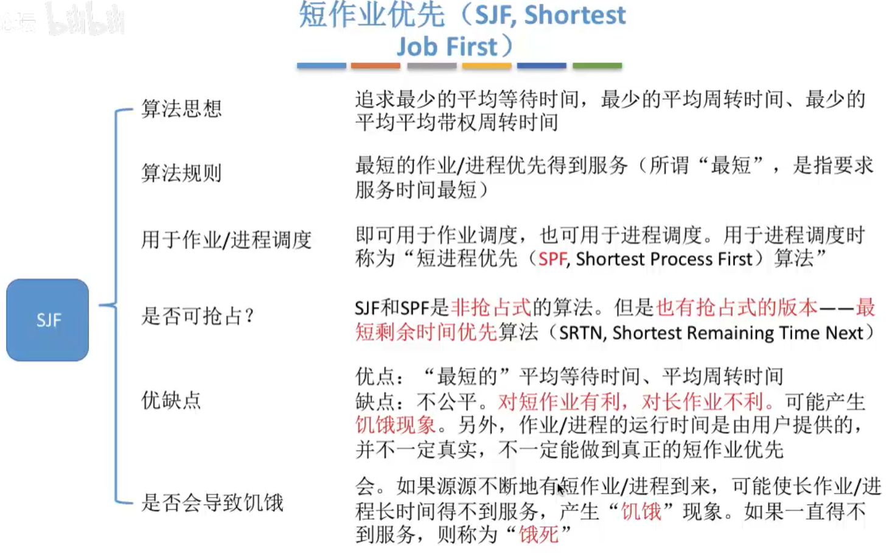

> 运行时间最短：
>
> 不考虑等待时间，因此对短作业有利，对长作业不利

###### 非抢占式

> <u>在所有进程几乎同时到达时</u>，SJF/SPF 的平均等待时间、平均周转时间最短

每次调度时选择当前已到达且运行时间最短的作业/进程

###### 抢占式SRTN（Shortest Remaining Time First）

> ==**平均等待时间、平均周转时间最短**==
>
> **对短作业有利，长作业不利**
>
> **有饥饿现象**

**==每当有进程加入就绪队列改变时==就需要调度，如果新到达的进程剩余时间比当前运行的进程剩余时间更短，则由新进程抢占处理机，当前运行进程重新回到就绪队列。另外，==当一个进程让出处理器资源时也需要调度。==**

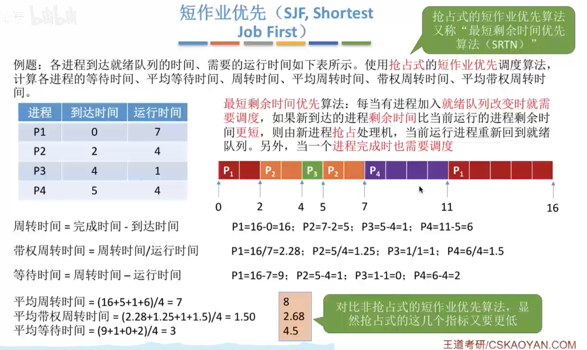

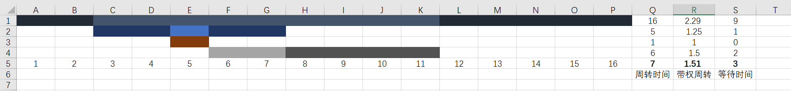

##### 高响应比优先HRRN（Highest Response Ratio Next）

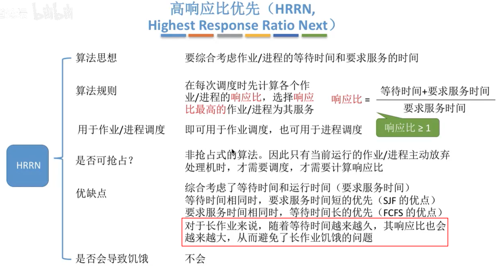

**只有在当前进程主动放弃处理机时，才发生调度**

#### 交互式

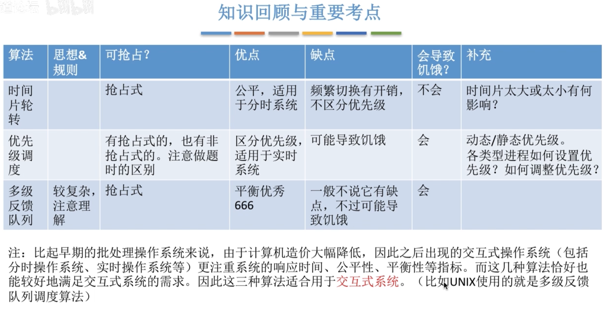

##### 时间片轮转RR（Round-Robin）

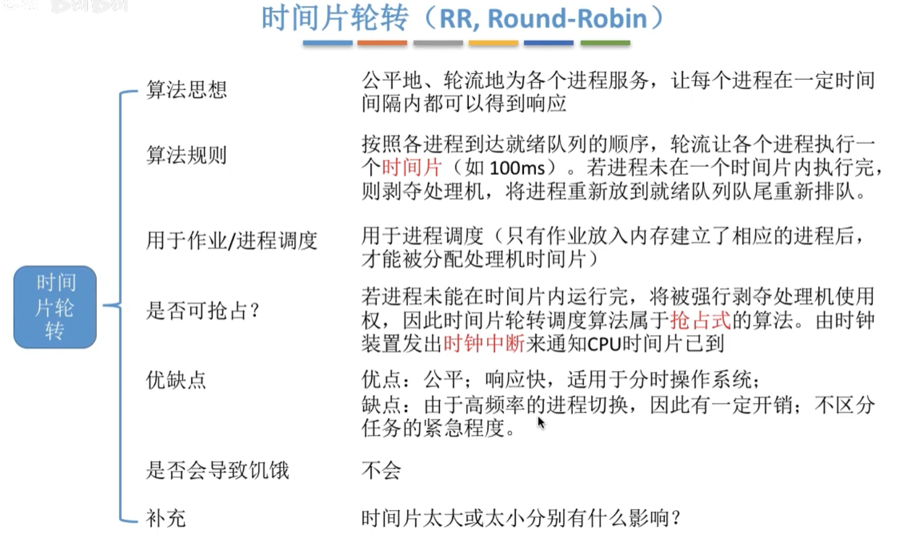

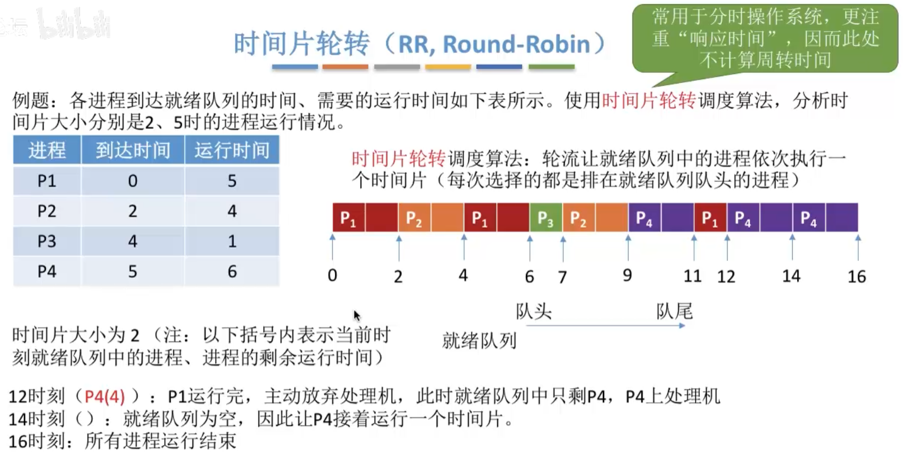

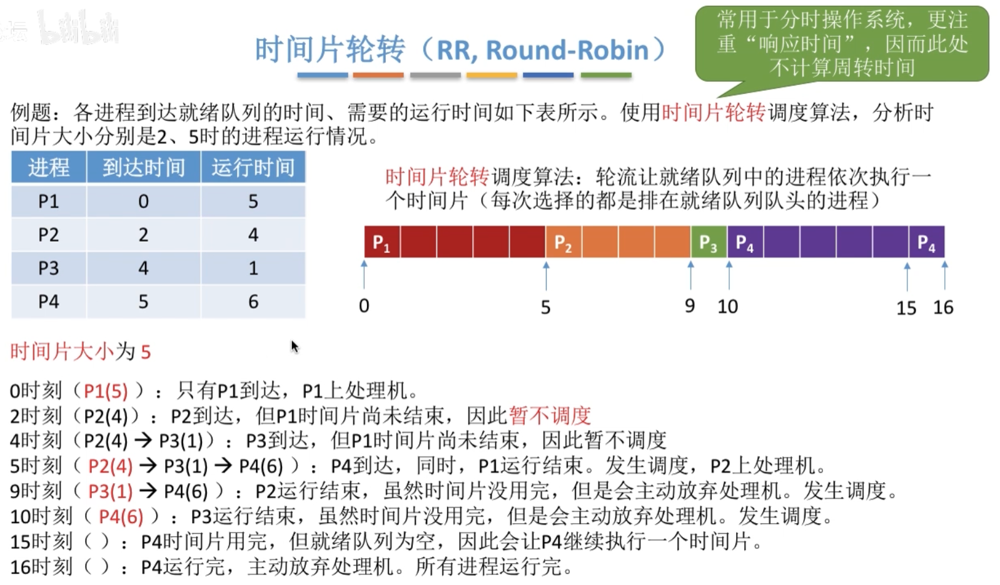

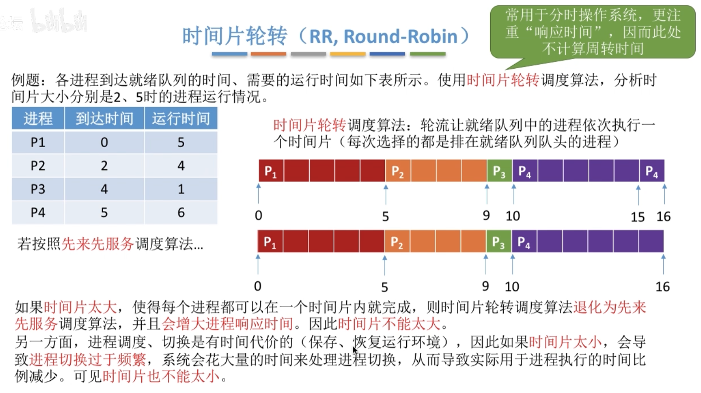

> 时间片过大增大响应时间：
>
> 比如：系统中有10个进程在并发执行，如果时间片为1秒，则一个进程被响应可能需要等9秒...也就是说，如果用户在自己进程的时间片外通过键盘发出调试命令，可能需要等待9秒才能被系统响应。
>
> 时间片大小：一般来说，设计时间片时要让切换进程的开销占比不超过1%。

##### 优先级调度算法


1. 非抢占式

   **只有在当前进程主动放弃CPU时，发生调度**

   

2. 抢占式

   **非抢占式 + 就绪队列发生改变时，也调度**

   

   

> 就绪队列未必只有一个，可以按照不同优先级来组织。另外，也可以把优先级高的进程排在更靠近队头的位置。

优先级分类：

1. 静态：创建时确定，之后一直不变

2. 动态：创建时定义初始值，之后根据情况动态调整

   从追求公平、资源利用率等角度考虑：

   - **如果某进程在就绪队列中等待了很长时间，则可以适当提升其优先级**

     **类似于响应比**，时间越长越大

   - 如果某进程占用处理机运行了很长时间，则可适当降低其优先级

   - **如果发现一个进程频繁地进行I/O操作，则可适当提升其优先级**

     > I/O型进程优先级更高

通常：

- 系统进程 > 用户进程

- 前台进程 > 后台进程

- 操作系统更偏向于I/O型进程（I/O繁忙型进程）

  与之相对的是计算型进程（CPU繁忙型进程）

  > I/O设备和CPU可以并行工作。如果优先让I/O繁忙型进程优先运行的话，则越有可能让I/O设备尽早地投入工作，则资源利用率、系统吞吐量都会得到提升

#### 多级反馈队列调度算法


规则：

1. **多级就绪队列，各级队列优先级从高到低，时间片从小到大**

2. **新进程到达时先进入第1级队列，按照FCFS原则排队等待分配时间片。**

3. **处于运行态的进程若时间片用完还未结束，则进入下一级队列队尾。**

   若已经在最下级，则重新放回最下级队尾

4. 只有较高优先级的队列为空时，才会为低级别队列分配时间片

5. **抢占式：高级别就绪队列有新的进程时，会发生抢占**

   > 有新的更高优先级进程进入第一级队列时，正在执行的低级别进程会被抢占

   **被强占处理机的进程重新放回原队列队尾**


优点：

1. 公平（FCFS）
2. 响应快（RR）
3. 短进程用时少（SPF）
4. 可灵活调整优先级

### 进程同步和进程互斥


> 进程的并发性 -> 异步性：各并发执行的进程以各自独立的、不可预知的速度向前推进


为了实现对临界资源的互斥访问，同时保证系统整体性能，需要遵循以下原则：

1. **空闲让进**

   临界区空闲时，可以允许一个请求进入临界区的进程立即进入临界区；

2. **忙则等待**

   当已有进程进入临界区时，其他试图进入临界区的进程必须等待；

3. **有限等待**

   对请求访问的进程，应保证能在有限时间内进入临界区（保证不会饥饿）;

4. **让权等待**

   当进程不能进入临界区时，应立即释放处理机，防止进程忙等待。

#### 进程互斥的软件实现方法


分析方法：分析进入区的操作，然后使两个进程根据不同的顺序并发执行。

##### 单标志法

##### 单标志法


> 两个进程交替访问

若临界区空闲时，P2进程想首先访问临界区，则无法访问。——违背“空闲让进”

##### 双标志先检查法


先检查，后上锁——若进程切换，则导致同时访问临界区——违反“忙则等待”

##### 双标志后检查法


先上锁，后检查——若发生进程切换，则都无法进入临界区——违背“空闲让进”和“有限等待”

> 双标志先/后检查法都是由于程序的异步性导致的问题

##### Peterson算法


==用软件方法解决了进程互斥问题，遵循了**空闲让进**、**忙则等待**、**有限等待**三个原则，但是**未遵循让权等待**的原则。==

> 空闲让进：空闲时不用谦让
>
> 忙则等待：对方想进入临界区则卡在循环处等待
>
> 有限等待：不会谦让太多次，最多谦让两次，则P0进入临界区
>
> 为遵循让权等待：谦让卡在循环的时候，占用时间片

#### 进程互斥的硬件实现方法


##### 中断屏蔽方法


> 一个中断指令只能管一个CPU，因此不适用于多处理机

##### `TestAndSet`指令


##### `Swap`指令

和`TestAndSet`逻辑一模一样


### 信号量机制


|      | P/wait            | V/signal           |
| ---- | ----------------- | ------------------ |
| 0    | `s.value--;`      | `s.value++;`       |
| 1    | `if (s.value<0):` | `if (s.value<=0):` |
| 2    | `block(s.L)`      | `wake(s.L)`        |

#### 整型信号量

使得“检查”、“上锁”一气呵成，避免了双标志先/后检查的缺点


> 问题：由于P操作是原语，不可中断，因此是否会导致忙等的过程中无法切换进程？

忙等——不满足“让权等待”

#### 记录型信号量


> 记录型信号量包含两个变量：
>
> 1. value
>
>    **若为负数，则其绝对值即为等待队列中进程的数量**
>
> 2. L ：等待资源的进程队列
>
> **在signal原语中，P0释放后，`s.value++;`，所以可能会暂时出现value == 0的情况，此时，==value <= 0 说明有进程在等待使用资源==**


#### 信号量机制实现进程互斥

> **互斥信号量一般初始化为1**
>
> ==**在一个进程内成对使用P/V**==


#### **信号量机制实现进程同步**

- 初始化同步信号量 **`S = 0`**
- **在前操作完成之后进行V操作，使得后操作的约束满足**
- **在后操作进行之前进行P操作，唤醒后操作的进程**


##### 进程的前驱关系


> 代码顺序没有要求


#### 生产者——消费者问题


|                                            | 分析               | 关系                                   | 初值 |
| ------------------------------------------ | ------------------ | -------------------------------------- | ---- |
| 只有缓冲区没满，生产者才能把产品放入缓冲区 | 空闲是信号量       | 同步关系，空闲数用于限制生产者         | 5    |
| 只有缓冲区不空，消费者才能从缓冲区取走产品 | 已生产的产品是资源 | 同步关系，已生产的产品数用于限制消费者 | 0    |
| 各进程必须互斥的访问缓冲区                 | 缓冲区是临界资源   | 各进程之间是互斥关系                   | 1    |

流程：生产者每次要消耗（P）一个空闲缓冲区，并生产（V）一个产品。消费者每次要消耗（P）一个产品，并释放一个空闲缓冲区（V）。往缓冲区放入/取走产品需要互斥。


实现：


> **互斥关系——在一个进程里成对使用**
>
> **同步关系——在前后进程里分别使用，前进程V（生产），后进程P（消费）**
>
> **互斥和同步同时使用时，一定先同步的P，再互斥的P，否则产生死锁**
>
> > 先互斥的P的话，会先占据临界区资源，再判断是否有空闲，这样若没有空闲的话，生产者无法进行下去，导致无法释放临界区资源，消费者同时也无法访问临界区，造成死锁。
>
> V的顺序没有关系。
>
> **生产产品和使用产品放在P/V之外，提高临界区资源的并发性。**

##### 多生产者——多消费者问题


> 只要有消费者取走产品（不管什么类型），就会激活生产者（同样不管什么类型）
>
> 所以**得用一个与产品类型不相关的信号量，来唤醒生产者**
>
> 这时，应该用事件而不是进程的先后关系来分析：
>
> 

实现：


> **当缓冲区大小为1时，由于在同一时刻，`apple`、`orange`、`plate`最多只有一个为1，因此在任何时刻，最多只有一个进程不会被阻塞，因此，可以不设置互斥变量`mutex`**
>
> **当缓冲区大小 >1 时，在同一时刻，`apple`、`orange`、`plate`可能不只有一个为1，所以必须设置`mutex`，以防多个进程同时访问临界区**


##### 抽烟者问题（可生产多种产品的单生产者——多消费者）


> <font color=green>? 生产者的P可以放在开头吧</font>


##### 读——写者问题


> 两个条件：
>
> 1. 写者和其他进程互斥
> 2. **多个读者之间不互斥**
>
> ③和④实际上不用同步关系，只需要互斥就行


> P/V实际上就是加锁/加锁

```c
// 变量
semaphore rw = 0;

// 写
void writer () {
	  P(rw);  // 写之前上锁
  	write();
  	P(rw);  // 写之后解锁
};
```

```c
// 版本1
void reader () {
    p(rw);
    read();
    p(rw);
};
```

> 不能实现读者与读者之间的共享
>
> -> 
>
> - 为了实现`writer`和`reader`的互斥，必须使用`p(rw)`。
> - 但为了reader之间相容，reader和reader之间不能上锁。
> - 因此新增`count`变量，用于判断当前访问缓冲区的是写者还是读者。若有读者在访问缓冲区，则可以访问；若没有，且被上锁了，则说明写者正在访问。
> - ==**只在第一个reader进程上锁，最后一个reader进程解锁**==


```c
int count = 0;

// 版本2
void reader () {
    if (count == 0) { // 检查
        p(rw);  // 第一个reader上锁
    };
    count++;  //  上锁的其他工作，读者+1
    
    read();
    
    count--;  // 解锁的其他工作，读者-1
    if (count == 0) {  // 检查
        v(rw);  // 最后一个reader解锁
    };
};
```

> 问题：
>
> 1. 再使用并发分析一下：
>
>    1. **若两个`reader`在第一个`if`处并发，则会执行两次`p(rw)`，第一个`reader`会阻塞第二个`reader`**
>    2. **若两个reader在第二个if处并发，则会执行两次`v(rw)`，会解锁两次，造成错误**
>
>    ==**原因：检查和上锁不能一气呵成 -> 可以使用一个互斥信号量mutex使得`reader`之间对`count`的访问是互斥的**==
>
> 2. 这是一个读优先的算法，只要有读进程源源不断的进来，写进程就会一直饥饿

```c 
int count = 0;
semaphore mutex = 1;

// 版本3
void reader () {
    p(mutex);  // 对count上锁
    if (count == 0) {
        p(rw);
    };
    count++;
    v(mutex);  // 对count解锁
    
    read();
    
    p(mutex);
    count--;
    if (count == 0) {
        v(rw);
    };
    p(mutex);  // 对count解锁
};
```

> 写者饥饿：
>
> ==**读者一直占用临界区资源的访问权，可以捏造一个虚空资源——缓冲区的使用权，使其实现写和读的排队**==


> **`writer`的`v(w)`不能放在后面，否则会使reader之间无法共享。**

##### 信号量总结

| 历程                                         | 互斥                                                         | 同步                                                         |
| -------------------------------------------- | ------------------------------------------------------------ | ------------------------------------------------------------ |
| 生产者——消费者                               | 需要互斥的+互斥信号量                                        | 先后顺序用同步                                               |
| 多生产者——多消费者                           | **若缓冲区大小=1，则通过其他的信号量可能可以代替互斥信号量**（最多同时只有一个信号量为1可以通过检查） | 1. 对于不同的产品，用不同的信号量<br />2. 事件信号量——多前驱或多后后续 |
| 抽烟者（可生产多类产品的单生产者——多消费者） | 同上                                                         | 1. 随机生产一种产品<br />2. 轮流生产一种产品<br />3. 事件信号量 |
| 读——写者问题                                 | 1. 写者与其他进程互斥，代码照旧<br />2. **读者之间共享，可以使用`count`查看当前访问临界区资源的进程是什么**<br />    **只在第一个reader上锁，最后一个reader解锁**<br />3. ==**上锁工作的不一气呵成会导致错误，使用P/V使之一气呵成**==<br />4.  ==**写进程饥饿问题**== |                                                              |
|                                              |                                                              |                                                              |
