# 操作系统

[TOC]


## 概论

计算机系统的层次结构：


概念：操作系统（Operating System,OS)是指**控制和管理整个计算机系统的硬件和软件资源**，并合理地组织调度计算机的工作和资源的分配，以**提供给用户和其他软件方便的接口和环境**，它是计算机系统中最基本的**系统软件**。


### 功能

1. 作为系统资源（硬件和软件）的管理者

   1. 文件管理
   2. 内存管理
   3. 处理机（进程）管理
   4. 设备管理——硬件资源

2. 提供用户接口，方便用户使用

   

   1. 命令接口

      1. 联机命令接口——交互式命令接口，例如命令行指令
      2. 脱机命令接口——批处理命令接口，例如`.bat`脚本

   2. 程序接口

      只能通过程序间接使用，该过程即为系统调用，例如各种程序的`.dll`文件。
      程序接口=**==系统调用==**

   3. GUI

3. 实现对硬件机器功能的拓展

### 特征

1. **==并发==**

2. **==共享==**

   **并发和共享互为存在条件**，没有了并发执行，就不可能共享，没有了共享（“同时”访问某一资源），也就无法并发了。例如不能同时使用内存，那哪来的并发呢

3. 虚拟

4. 异步

**并发和共享是两个最基本的特征**

#### 1、并发

**操作系统的并发性**指计算机系统中同时存在着多个运行着的程序。

并发：指两个或多个事件在同一时间间隔内发生。这些事件**宏观上是同时发生**的，但**微观上是交替发生**的。

>  并行：同时发生

#### 2、共享

共享即资源共享，是指系统中的资源可供内存中多个并发执行的进程共同使用。

1. 互斥共享

2. 同时共享

   同一时间段内同时访问某资源。同时包括分时共享（微观上交替）和同时共享

#### 3、虚拟

**虚拟是指把一个物理上的实体变为若干个逻辑上的对应物。**物理实体（前者）是实际存在的，而逻辑上对应物（后者）是用户感受到的。

虚拟技术：

1. 空分复用

   虚拟存储器

2. 时分复用

   虚拟处理器

**没有并发性，谈不上虚拟性**

#### 4、异步

异步是指，在多道程序环境下，允许多个程序并发执行，但由于资源有限，进程的执行是异步执行的。

**只有有了并发性，才可能出现异步**

### 发展和分类

1. 手工操作阶段

   处理速度快，输入输出慢，用户独占全机，人机速度矛盾，导致资源利用率低

2. 批处理阶段

   1. 单道批处理系统
   
      引入脱机输入输出技术（磁带），监督程序负责控制作业输入输出
   
      缓解了一定程度的人机速度矛盾
   
      内存中仅能有一道程序运行
   
   2. 多道批处理系统
   
      每次往内存中输入多道程序，操作系统正式诞生，并引入了**中断**技术，**各个程序之间并发执行**
   
      优点：多个程序**并发**执行，**共享**资源，资源利用率大幅提升
   
      
   
      缺点：没有人机交互功能，用户响应时间长
   
3. 分时操作系统

   计算机以**时间片**为单位**轮流为各个用户/作业服务**，各个用户可通过终端与计算机进行交互。

   优点：解决了人机交互问题

   缺点：不区分任务的紧急型

4. 实时操作系统

   特点：及时性、可靠性

   优点：能够优先相应一些紧急任务

   分类：

   1. 硬实时操作系统：必须绝对严格在规定时间内完成
   2. 软实时操作系统：可以偶尔延迟

5. 网络操作系统

6. 分布式操作系统

7. 个人计算机操作系统

### 操作系统的运行机制和体系结构


#### 运行机制


两种指令：

1. 特权指令：不允许用户程序使用，如内存清0指令
2. 非特权指令

两种处理器状态——判断当前是否可以执行特权指令：

> 程序状态字寄存器PSW中的某个标志位来标识，如0为用户态，1为核心态

1. 用户态（目态）——只能执行非特权指令
2. 核心态（管态）

两种程序：

1. 操作系统的内核程序：运行在核心态
2. 应用程序：运行在用户态

#### 操作系统的体系结构


内核——底层软件，是最核心/最基本的部分


分类：

1. 大内核
2. 微内核


### 中断和异常

#### 中断的概念和作用

**多道批处理系统为了程序的并发执行，引入了中断。**

1. **当中断发生时，CPU立即进入核心态**
2. 当中断发生后，当前运行的进程暂停运行，并由操作系统内核对中断进行处理
3. 对于不同的中断信号，会进行不同的处理

发生了中断，就意味着需要操作系统介入，开展管理工作。由于操作系统的管理工作（比如进程切换、分配I/O设备等）需要使用特权指令，因此CPU要从用户态转为核心态。==**通过中断，使CPU从用户态切换为核心态，进而进行进程切换，实现并发**==，使操作系统获得计算机的控制权。**有了中断，才能实现多道程序并发执行。**

> **用户态->核心态是通过中断实现的，且是唯一的切换途径**
>
> 核心态 -> 用户态的切换是通过执行一个特权指令，修改PSW的标志位实现的

#### 中断的分类

区别在于中断信号的来源是CPU内部还是CPU外部

1. 内中断（异常）

   1. 自愿中断——指令中断

      例如系统调用时使用的访管指令

   2. 强迫中断

      1. 硬件故障（故障）——可能被故障处理程序修复

         缺页中断

      2. 软件中断（终止）

         整数除0

2. 外中断（中断）

   1. 外设请求

      例如I/O操作完成的中断信号

   2. 人工干预

#### 外中断的处理过程

1. 每个指令执行完成后，在中断周期检查是否有外部中断信号
2. 若检测到外中断信号，则需要保护被中断进程的CPU环境
3. 根据中断信号的类型转入中断处理程序
4. 恢复原进程的CUP环境状态，推出中断，返回原进程

### 系统调用


#### 概念

**“系统调用”是操作系统提供给应用程序（程序员/编程人员）使用的接口**，可以理解为一种可供应用程序调用的特殊函数，应用程序可以发出系统调用请求来获得操作系统的服务。

**应用程序通过系统调用请求操作系统的服务。**系统中的各种共享资源都由操作系统统一掌管，因此在用户程序中，凡是与资源有关的操作（如存储分配、I/O操作、文件管理等），都必须通过系统调用的方式向操作系统提出服务请求，由操作系统代为完成。这样可以**保证系统的稳定性和安全性**，防止用户进行非法操作。

分类：

1. 设备管理
2. 文件管理
3. 进程控制
4. 进程通信
5. 内存管理

> 系统调用和库函数的区别：
>
> 系统调用由操作系统提供，以供应用程序使用
>
> 编程语言向上提供库函数，有时会将系统调用封装成库函数，隐藏一些细节，使得上层进行系统调用更加方便
>
> 

#### 系统调用的后台逻辑

1. 传递系统调用参数
2. 执行中断指令int，产生内中断
3. 执行系统调用相应的服务程序
4. 返回用户程序


> ==**`int x`：中断指令，interrupt，该指令实际上是运行在用户态下的，执行完之后引发内中断，CPU进入核心态，处理后续的工作**==
>
> **==陷入指令是唯一一个只能在用户态下执行，而不能在核心态下执行的指令==**

## 进程管理

### 进程的描述

#### 进程和进程实体

为了方便操作系统管理，完成各程序并发执行，引入了**进程**、**进程实体**的概念。

> 进程：进程实体的运行过程，是资源分配和调度的一个独立单位。动态
>
> 进程实体：静态

**进程实体（进程映像） =  PCB + 程序段 + 数据段**

> PCB：系统为每个运行的程序配置一个数据结构，称为进程控制块（PCB)，用来描述进程的各种信息，如程序代码存放位置（页表PT）。PCB存放在系统区中。
>
> **==PCB是进程存在的唯一标志==**

- 创建进程——创建进程实体的PCB
- 撤销进程——撤销该进程实体的PCB

#### 进程的组成

1. 程序段——程序代码存放的位置

2. 数据段

3. PCB：进程管理的各种信息

   1. **进程描述信息**

      1. 进程标识符PID
      2. 用户标识符UID

   2. **进程控制和管理信息**

      1. 进程**当前状态**
      
      2. 进程**优先级**
      
   3. **资源分配清单**

      1. **程序段指针**

      2. **数据段指针**

      3. **硬件等**

      4. 处理器相关信息——各种寄存器的值

         进程切换时保存当前进程的运行情况，相当于**存档**


#### 进程的组织

多个进程之间的组织方式

1. 链接方式

   

   1. 按照进程状态将PCB分为多个队列
   2. 操作系统持有各个队列的指针

2. 索引方式

   

   1. 根据进程状态的不同，建立几张索引表
   2. 操作系统持有各个索引表的指针

#### 进程的特征

1. **动态性——进程最基本的特征**

   进程时程序的一次执行过程，是动态产生/变化/消亡的

2. 并发性

   内存中有多个进程实体，并发执行

3. 独立性

   **==进程是能够独立运行、独立分配资源、独立接收调度的基本单位==**

4. 异步性

   有可能导致进程运行结果的不确定性

   操作系统需要提供进程同步机制来解决异步问题

5. 结构性

   由三部分数据结构组成，每个进程都有一个PCB

### 进程控制

#### 进程的状态


状态：

1. **运行态Running**——占有CPU，正在执行

   单核CPU只能最多同时有一个进程处于运行态

2. **就绪态Ready**

   具备运行条件，但没有运行

   具有了除CPU之外的所有资源

   ==**阻塞态 -> 就绪态是一种被动行为，不是进程主动控制的**==

3. **阻塞态Waiting/Blocking**

   **==只能由进程主动请求，因此只能由运行态转为阻塞态==**

   **因申请资源（通过系统调用）或等待某一事件而暂时不能运行**

4. 创建态——创建进程时的状态，分配资源、初始化PCB等

5. 终止态——正在撤销，回收资源、撤销PCB等

   例如由于bug而无法继续运行

6. 挂起态suspend

   将进程映像调到外存中

   1. 就绪挂起——将一个就绪态的进程转移到外存中，挂起
   2. 阻塞挂起——将一个阻塞态的进程挂起

   **运行态可以直接转为挂起态**

（五）进程状态的转换：


七状态转换：


#### 进程控制——原语

实现进程转换


使用原语（一种特殊程序）进行进程控制。

> 原语：不允许中断，原子操作
>
> **采用“关中断”指令、“开中断”指令实现**
>
> **“关中断”指令、“开中断”指令只能在核心态下执行的特权指令**

相关工作：

1. **更新PCB信息**
   1. **进程状态标志位——进程状态控制**
   2. 保存运行环境——**PCB中保存了当前进程的寄存器消息**
   3. 恢复运行环境
2. **将PCB插入到合适的队列**
3. **分配/回收资源**

原语的分类：

1. **创建原语**

   

2. **撤销原语**

   1. **找到PCB**
   2. **终止进程（包括子进程）**
   3. **回收资源**
   4. **删除PCB**

   

3. 阻塞原语和唤醒原语——成对使用

   1. **找到PCB**
   2. **[保护现场（阻塞原语）]，修改状态标志位**
   3. **修改队列**

   

4. ==**切换原语——用于调度**==

   1. **保护现场**
   2. **修改进程（两个队列）**
   3. **恢复新进程的现场**

   

   

### 进程通信

**进程时是分配系统资源的单位，因此各个进程所拥有的内存空间相互独立。**

为了保证安全，进程之间不能直接访问其他进程的内存空间

1. 共享存储

   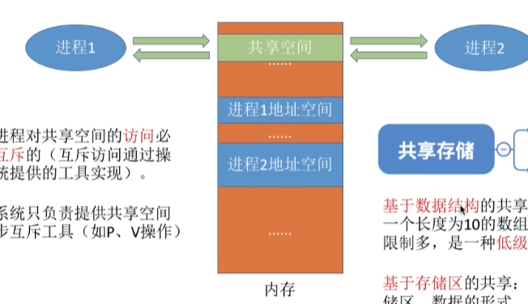

   创建共享空间，但是**==对这个共享空间的访问必须是互斥的==**

   > 使用操纵系统提供的同步互斥工具实现，如P、V操作

   1. 基于数据结构的共享

      共享某一个创建的数据结构，有限制

      例如只能放长度为10 的数组

      低级通信方式，速度慢，限制多00

   2. 基于存储区的共享

      一种高级通信方式，**该存储区的使用由进程控制，而不是操作系统**

2. 管道通信

   

   管道：用户连接读写进程的共享文件，实际上就是**一段固定大小的缓冲区**

   > 1. 只能采用**半双工**（同一时间段只能实现单向传输）。实现双向同时通信，只能设置双管道
   >
   > 2. 各进程之间**互斥的访问管道**
   >
   > 3. 数据以字符流的形式写入管道。写满时，写进程被阻塞；数据全部被取走后，管道变空，读进程被阻塞
   >
   > 4. **==没有写满，不允许读；没有读空，不允许写==**
   >
   > 5. 数据一旦被读出，就从管道中抛弃
   >
   >    **==因此读进程最多只有一个==**

3. 消息传递

   

   以格式化的消息为单位，通过操作系统提供的“发送/接收消息”两个原语进行数据交换

   1. 直接通信方式

      
      
      > 消息队列

      直接把消息挂到进程的消息缓冲队列上（队尾）
      
   2. 间接通信方式（信箱通信方式）
   
      
   

### 线程


可以把线程理解为“轻量级进程”。**==线程是一个基本的CPU执行单元，也是程序执行流的最小单位。==**引入线程之后，**不仅是进程之间可以并发，进程内的各线程之间也可以并发，从而==进一步提升了系统的并发度==**，使得一个进程内也可以并发处理各种任务（如QQ视频、文字聊天、传文件）。

**==引入线程后，进程只作为除CPU之外的系统资源的分配单元==**（如打印机、内存地址空间等都是分配给进程的）。

- **==调度的基本单位==**
- **==分配处理机资源的基本单位==**


####  线程的属性

1. ==**线程是处理机调度的单位**==
2. 多CPU计算机中，各个线程可占用不同的CPU
3. 每个线程都有一个**线程ID**、**线程控制块（TCB)**
4. 线程也有**就绪**、**阻塞**、**运行**三种基本状态
5. ==**线程几乎不拥有系统资源（资源是分配给线程的）**==
6. **同一进程的不同线程间共享进程的资源**
7. ==**由于共享内存地址空间，同一进程中的线程间通信甚至无需系统干预**==
8. ==**同一进程中的线程切换，不会引起进程切换**==——开销小

#### 线程的实现方式

1. 用户级线程（User-Level Thread，ULT）

   

   用户级线程通过**线程库**实现，**所有的线程管理工作由应用程序负责**

   用户级线程在**用户态**下即可完成，**对操作系统透明，对用户不透明**

2. 内核级线程

   

   **内核级线程由操作系统内核管理，其切换在核心态下进行。**

   内核级线程就是操作系统能看到的线程。

3. 二者组合：将n个用户级线程分配到m个内核级线程，**n≥m**

   

   用户级线程对操作系统是透明的，因此**==内核级线程才是分配CPU资源的单位==**。

#### 多线程模型

用户级线程和内核级线程的映射

1. 多对一

   

   优点：**用户态下即可实现线程的切换，不需要切换到核心态，系统开销小，效率高**

   缺点：由于内核级线程才是分配资源的最小单位，因此一个用户级线程被阻塞会导致整个进程阻塞，**并发度不高**。多个线程不能在多核处理机上运行

2. 一对一模型——纯粹的内核级线程

   

   优点：**并发能力强，单个线程阻塞不会导致其他线程阻塞。**多线程可以在多核处理机下完成

   缺点：线程切换在核心态下进行，线程切换由操作系统内核完成，**开销较大**

3. 多对多

   

   **既实现了较高的并发性，又减少了系统开销**

   


## 处理机调度

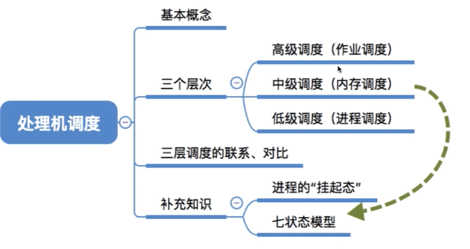

### 调度的三个层次


#### 1、作业调度（高级调度）

高级调度主要是按照一定的调度算法**把作业从外存调入内存并为作业分配相应的资源建立相应的进程**。


由于内存空间有限，有时无法将用户提交的作业全部放入内存，因此就需要确定某种规则来决定将作业调入内存的顺序。

按一定的原则从外存上处于后备队列的作业中挑选一个（或多个）作业，给他们分配内存等必要资源，并建立相应的进程（建立PCB)，以使它（们）获得竞争处理机的权利。

**==高级调度是辅存（外存）与内存之间的调度。==每个作业只调入一次，调出一次。作业调入时会建立相应的PCB，作业调出时才撤销PCB。**高级调度主要是指调入的问题，因为只有调入的时机需要操作系统来确定，但调出的时机必然是作业运行结束才调出。

#### 2、内存调度（中级调度）

**中级调度主要是为了对内存空间进行逻辑扩充。**


引入了**虚拟存储**技术之后，可将暂时不能运行的进程调至外存等待。等它重新具备了运行条件且内存又稍有空闲时，再重新调入内存。

这么做的目的是为了**提高内存利用率和系统吞吐量**。

**暂时调到外存等待的进程状态为挂起状态。**值得注意的是，**==PCB并不会一起调到外存，而是会常驻内存==**。PCB中会记录进程数据在外存中的存放位置，进程状态等信息，操作系统通过内存中的PCB来保持对各个进程的监控、管理。被挂起的进程PCB会被放到的挂起队列中。

中级调度（内存调度），就是要决定将哪个处于挂起状态的进程重新调入内存。

一个进程可能会被多次调出、调入内存，因此**中级调度发生的频率要比高级调度更高**。

#### 3、进程调度（低级调度）

进程调度（低级调度），其**主要任务是按照某种方法和策略从==就绪队列==中选取一个进程，将处理机分配给它**。

**进程调度是操作系统中最基本的一种调度，在一般的操作系统中都必须配置进程调度。**

**进程调度的频率很高**，一般几十毫秒一次。


### 进程调度的时机、切换与过程、调度方式


#### 进程调度的时机

需要进程调度和切换的时机

1. :slightly_smiling_face: 进程主动放弃处理机——非剥夺式
   1. 进程正常终止
   2. 进程发生异常而终止
   3. 进程主动请求阻塞
2. :angry: 被动放弃——剥夺式
   1. 时间片用完
   2. <font color=green>有更紧急的事需要处理，例如I/O中断</font>
   3. 有更高优先级的进程进入就绪队列

不能进行进程调度和切换的情况：

1. **中断处理过程中**

2. **进程在操作系统内核程序临界区中**

   

   > **内核程序临界区**一般是用来访问**某种内核数据结构**的，比如进程的就绪队列（由各就绪进程的PCB组成），在访问的过程调度会影响到当前进程，因此不允许进程调度。
   >
   > 普通临界区可以进行进程调度。
   >
   > > 临界资源：一个时间段内只允许一个进程使用的资源。各个进程需要互斥的访问临界资源
   > >
   > > 临界区：访问临界资源的那段代码

3. **原子操作过程中**（“关中断”指令）

   原语执行过程中

#### 进程调度的方式分类

1. 非剥夺调度方式（非抢占式）

   **只允许进程主动放弃处理机**。在运行过程中即便有更紧迫的任务到达，当前进程依然会继续使用处理机，直到该进程终止或主动要求进入阻塞态。

   实现简单，系统开销小，但是无法优先处理紧急任务（早期的批处理系统）

2. 剥夺调度方式（抢占式）

   当一个进程正在处理机上执行时，如果有一个更重要或更紧迫的进程需要使用处理机，则立即暂停正在执行的进程，将处理机分配给更重要紧迫的那个进程。

   可以优先处理更紧急的任务，也可以按照时间片轮转（通过时钟中断），适合于实时操作系统、分时操作系统

#### 进程的切换与过程

> “狭义的进程调度”——选中
>
> “进程切换”——切换进程
>
> **狭义的进程调度指的是从就绪队列中选中一个要运行的进程。**（这个进程可以是刚刚被暂停执行的进程，也可能是另一个进程，后一种情况就需要进程切换）
>
> 进程切换是指一个进程让出处理机，由另一个进程占用处理机的过程。
>
> **广义的进程调度包含了选择一个进程和进程切换两个步骤。**

进程切换的过程：

1. **对原来的正在运行的进程的各种数据进行保存**

2. **对新的进程的各种数据进行恢复**

   程序计数器、程序状态字、各种数据寄存器等处理机现场信息，这些信息一般保存在PCB中

**==进程的调度、切换是有代价的==**：如果过于频繁的进行进程调度、切换，必然会使整个系统的效率降低使系统大部分时间都花在了进程切换上，而真正用于执行进程的时间减少。


### 调度算法的评价指标


$$
利用率 = \frac {忙碌时间} {空闲时间}
$$


$$
周转时间 = 提交作业至作业完成的时间 \\
\ \ \ \ \ \ \ \ \ \ \ \ \ \ = 在外存上等待作业调度的时间 + 进程在就绪队列上的时间 \\
\ \ \ \ \ \ + 进程在执行的时间 + 进程等待\mathrm{I/O}完成的时间 \\
\ \ \ \ \ \ \ = 在外存上等待作业调度的时间 + 进程在就绪态的时间 \\
\ \ \ \ \ \ + 进程在执行态的时间 + 进程在阻塞态的时间
$$


$$
平均周转时间 = \frac {各个作业周转时间之和} {作业数}
$$


$$
带权周转时间 = \frac {作业周转时间} {作业实际运行的时间} = \frac {作业提交时间 - 作业完成时间} {作业实际运行的时间} \ge 1
$$


$$
平均带权周转时间 = \frac {各个作业带权周转时间之和} {作业数}
$$


$$
等待时间 = 进程/作业处于等待处理机状态时间之和 \\
\ \ \ \ \ \ \ \ \ \ \ = 周转时间 - 运行时间 - \mathrm{I/O}服务时间
$$

> **对于进程，I/O实际上也是被服务的，不算在等待时间里面**
>
> 对于作业，不仅要考虑进程建立后的等待时间，还要加上**作业在外存后备队列中的等待时间**


$$
平均等待时间
$$


$$
响应时间 = 用户首次请求至首次相应的时间
$$


### 调度算法


#### 早期批处理系统


##### 先来先服务FCFS


优点：简单

缺点：带权周转时间大，对长作业有利，对短作业不利

> 等待时间最长：
>
> 不考虑运行时间，因此对长作业有利，对短作业不利

##### 短作业优先SJF/SPF

> Shortest Job/Process First

“最短的”平均等待时间、平均周转时间


> 运行时间最短：
>
> 不考虑等待时间，因此对短作业有利，对长作业不利

###### 非抢占式

> <u>在所有进程几乎同时到达时</u>，SJF/SPF 的平均等待时间、平均周转时间最短

每次调度时选择当前已到达且运行时间最短的作业/进程

###### 抢占式SRTN（Shortest Remaining Time First）

> ==**平均等待时间、平均周转时间最短**==
>
> **对短作业有利，长作业不利**
>
> **有饥饿现象**

**==每当有进程加入就绪队列改变时==就需要调度，如果新到达的进程剩余时间比当前运行的进程剩余时间更短，则由新进程抢占处理机，当前运行进程重新回到就绪队列。另外，==当一个进程让出处理器资源时也需要调度。==**


##### 高响应比优先HRRN（Highest Response Ratio Next）


**只有在当前进程主动放弃处理机时，才发生调度**

#### 交互式


##### 时间片轮转RR（Round-Robin）


> 时间片过大增大响应时间：
>
> 比如：系统中有10个进程在并发执行，如果时间片为1秒，则一个进程被响应可能需要等9秒...也就是说，如果用户在自己进程的时间片外通过键盘发出调试命令，可能需要等待9秒才能被系统响应。
>
> 时间片大小：一般来说，设计时间片时要让切换进程的开销占比不超过1%。

##### 优先级调度算法


1. 非抢占式

   **只有在当前进程主动放弃CPU时，发生调度**

   

2. 抢占式

   **非抢占式 + 就绪队列发生改变时，也调度**

   

   

> 就绪队列未必只有一个，可以按照不同优先级来组织。另外，也可以把优先级高的进程排在更靠近队头的位置。

优先级分类：

1. 静态：创建时确定，之后一直不变

2. 动态：创建时定义初始值，之后根据情况动态调整

   从追求公平、资源利用率等角度考虑：

   - **如果某进程在就绪队列中等待了很长时间，则可以适当提升其优先级**

     **类似于响应比**，时间越长越大

   - 如果某进程占用处理机运行了很长时间，则可适当降低其优先级

   - **如果发现一个进程频繁地进行I/O操作，则可适当提升其优先级**

     > I/O型进程优先级更高

通常：

- 系统进程 > 用户进程

- 前台进程 > 后台进程

- 操作系统更偏向于I/O型进程（I/O繁忙型进程）

  与之相对的是计算型进程（CPU繁忙型进程）

  > I/O设备和CPU可以并行工作。如果优先让I/O繁忙型进程优先运行的话，则越有可能让I/O设备尽早地投入工作，则资源利用率、系统吞吐量都会得到提升

#### 多级反馈队列调度算法


规则：

1. **多级就绪队列，各级队列优先级从高到低，时间片从小到大**

2. **新进程到达时先进入第1级队列，按照FCFS原则排队等待分配时间片。**

3. **处于运行态的进程若时间片用完还未结束，则进入下一级队列队尾。**

   若已经在最下级，则重新放回最下级队尾

4. 只有较高优先级的队列为空时，才会为低级别队列分配时间片

5. **抢占式：高级别就绪队列有新的进程时，会发生抢占**

   > 有新的更高优先级进程进入第一级队列时，正在执行的低级别进程会被抢占

   **被强占处理机的进程重新放回原队列队尾**


优点：

1. 公平（FCFS）
2. 响应快（RR）
3. 短进程用时少（SPF）
4. 可灵活调整优先级

### 进程同步和进程互斥


> 进程的并发性 -> 异步性：各并发执行的进程以各自独立的、不可预知的速度向前推进


为了实现对临界资源的互斥访问，同时保证系统整体性能，需要遵循以下原则：

1. **空闲让进**

   临界区空闲时，可以允许一个请求进入临界区的进程立即进入临界区；

2. **忙则等待**

   当已有进程进入临界区时，其他试图进入临界区的进程必须等待；

3. **有限等待**

   对请求访问的进程，应保证能在有限时间内进入临界区（保证不会饥饿）;

4. **让权等待**

   当进程不能进入临界区时，应立即释放处理机，防止进程忙等待。

#### 进程互斥的软件实现方法


分析方法：分析进入区的操作，然后使两个进程根据不同的顺序并发执行。

##### 单标志法

##### 单标志法


> 两个进程交替访问

若临界区空闲时，P2进程想首先访问临界区，则无法访问。——违背“空闲让进”

##### 双标志先检查法


先检查，后上锁——若进程切换，则导致同时访问临界区——违反“忙则等待”

##### 双标志后检查法


先上锁，后检查——若发生进程切换，则都无法进入临界区——违背“空闲让进”和“有限等待”

> 双标志先/后检查法都是由于程序的异步性导致的问题

##### Peterson算法


==用软件方法解决了进程互斥问题，遵循了**空闲让进**、**忙则等待**、**有限等待**三个原则，但是**未遵循让权等待**的原则。==

> 空闲让进：空闲时不用谦让
>
> 忙则等待：对方想进入临界区则卡在循环处等待
>
> 有限等待：不会谦让太多次，最多谦让两次，则P0进入临界区
>
> 为遵循让权等待：谦让卡在循环的时候，占用时间片

#### 进程互斥的硬件实现方法

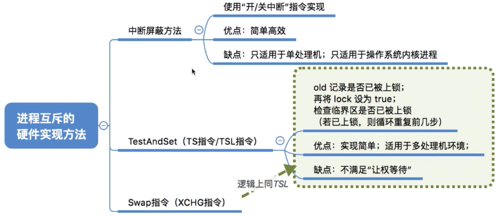

##### 中断屏蔽方法


> 一个中断指令只能管一个CPU，因此不适用于多处理机

##### `TestAndSet`指令


##### `Swap`指令

和`TestAndSet`逻辑一模一样


### 信号量机制


|      | P/wait            | V/signal           |
| ---- | ----------------- | ------------------ |
| 0    | `s.value--;`      | `s.value++;`       |
| 1    | `if (s.value<0):` | `if (s.value<=0):` |
| 2    | `block(s.L)`      | `wake(s.L)`        |

#### 整型信号量

使得“检查”、“上锁”一气呵成，避免了双标志先/后检查的缺点


> 问题：由于P操作是原语，不可中断，因此是否会导致忙等的过程中无法切换进程？

忙等——不满足“让权等待”

#### 记录型信号量


> 记录型信号量包含两个变量：
>
> 1. value
>
>    **若为负数，则其绝对值即为等待队列中进程的数量**
>
> 2. L ：等待资源的进程队列
>
> **在signal原语中，P0释放后，`s.value++;`，所以可能会暂时出现value == 0的情况，此时，==value <= 0 说明有进程在等待使用资源==**


#### 信号量机制实现进程互斥

> **互斥信号量一般初始化为1**
>
> ==**在一个进程内成对使用P/V**==


#### 信号量机制实现进程同步

- 初始化同步信号量 **`S = 0`**
- **在前操作完成之后进行V操作，使得后操作的约束满足**
- **在后操作进行之前进行P操作，唤醒后操作的进程**


##### 进程的前驱关系


> 代码顺序没有要求


#### 生产者——消费者问题


|                                            | 分析               | 关系                                   | 初值 |
| ------------------------------------------ | ------------------ | -------------------------------------- | ---- |
| 只有缓冲区没满，生产者才能把产品放入缓冲区 | 空闲是信号量       | 同步关系，空闲数用于限制生产者         | 5    |
| 只有缓冲区不空，消费者才能从缓冲区取走产品 | 已生产的产品是资源 | 同步关系，已生产的产品数用于限制消费者 | 0    |
| 各进程必须互斥的访问缓冲区                 | 缓冲区是临界资源   | 各进程之间是互斥关系                   | 1    |

流程：生产者每次要消耗（P）一个空闲缓冲区，并生产（V）一个产品。消费者每次要消耗（P）一个产品，并释放一个空闲缓冲区（V）。往缓冲区放入/取走产品需要互斥。


实现：


> **互斥关系——在一个进程里成对使用**
>
> **同步关系——在前后进程里分别使用，前进程V（生产），后进程P（消费）**
>
> **互斥和同步同时使用时，一定先同步的P，再互斥的P，否则产生死锁**
>
> > 先互斥的P的话，会先占据临界区资源，再判断是否有空闲，这样若没有空闲的话，生产者无法进行下去，导致无法释放临界区资源，消费者同时也无法访问临界区，造成死锁。
>
> V的顺序没有关系。
>
> **生产产品和使用产品放在P/V之外，提高临界区资源的并发性。**

##### 多生产者——多消费者问题


> 只要有消费者取走产品（不管什么类型），就会激活生产者（同样不管什么类型）
>
> 所以**得用一个与产品类型不相关的信号量，来唤醒生产者**
>
> 这时，应该用事件而不是进程的先后关系来分析：
>
> 

实现：


> **当缓冲区大小为1时，由于在同一时刻，`apple`、`orange`、`plate`最多只有一个为1，因此在任何时刻，最多只有一个进程不会被阻塞，因此，可以不设置互斥变量`mutex`**
>
> **当缓冲区大小 >1 时，在同一时刻，`apple`、`orange`、`plate`可能不只有一个为1，所以必须设置`mutex`，以防多个进程同时访问临界区**


##### 抽烟者问题（可生产多种产品的单生产者——多消费者）


> <font color=green>? 生产者的P可以放在开头吧</font>


##### 读——写者问题


> 两个条件：
>
> 1. 写者和其他进程互斥
> 2. **多个读者之间不互斥**
>
> ③和④实际上不用同步关系，只需要互斥就行


> P/V实际上就是加锁/加锁

```c
// 变量
semaphore rw = 0;

// 写
void writer () {
	  P(rw);  // 写之前上锁
  	write();
  	P(rw);  // 写之后解锁
};
```

```c
// 版本1
void reader () {
    p(rw);
    read();
    p(rw);
};
```

> 不能实现读者与读者之间的共享
>
> -> 
>
> - 为了实现`writer`和`reader`的互斥，必须使用`p(rw)`。
> - 但为了reader之间相容，reader和reader之间不能上锁。
> - 因此新增`count`变量，用于判断当前访问缓冲区的是写者还是读者。若有读者在访问缓冲区，则可以访问；若没有，且被上锁了，则说明写者正在访问。
> - ==**只在第一个reader进程上锁，最后一个reader进程解锁**==


```c
int count = 0;

// 版本2
void reader () {
    if (count == 0) { // 检查
        p(rw);  // 第一个reader上锁
    };
    count++;  //  上锁的其他工作，读者+1
    
    read();
    
    count--;  // 解锁的其他工作，读者-1
    if (count == 0) {  // 检查
        v(rw);  // 最后一个reader解锁
    };
};
```

> 问题：
>
> 1. 再使用并发分析一下：
>
>    1. **若两个`reader`在第一个`if`处并发，则会执行两次`p(rw)`，第一个`reader`会阻塞第二个`reader`**
>    2. **若两个reader在第二个if处并发，则会执行两次`v(rw)`，会解锁两次，造成错误**
>
>    ==**原因：检查和上锁不能一气呵成 -> 可以使用一个互斥信号量mutex使得`reader`之间对`count`的访问是互斥的**==
>
> 2. 这是一个读优先的算法，只要有读进程源源不断的进来，写进程就会一直饥饿

```c 
int count = 0;
semaphore mutex = 1;

// 版本3
void reader () {
    p(mutex);  // 对count上锁
    if (count == 0) {
        p(rw);
    };
    count++;
    v(mutex);  // 对count解锁
    
    read();
    
    p(mutex);
    count--;
    if (count == 0) {
        v(rw);
    };
    p(mutex);  // 对count解锁
};
```

> 写者饥饿：
>
> ==**读者一直占用临界区资源的访问权，可以捏造一个虚空资源——缓冲区的使用权，使其实现写和读的排队**==


> **`writer`的`v(w)`不能放在后面，否则会使reader之间无法共享。**

#### 哲学家问题


> 造成死锁

**解决死锁**

思路1：最多允许四个哲学家同时进餐 -> 至少有一个哲学家可以拿到左右两只筷子

> 破坏了循环等待条件，不会存在循环等待链

```c
chopsticks[5] = [1, 1, 1, 1, 1];
eating = 4;

philosopher() {
	while(1) {
		思考;
        p(eating);  // 准备吃饭
		p(chopsticks[i]);  // 拿左筷子
		p(chopsticks[(i+1)%5]);  // 拿右筷子
		吃饭;
		v(chopsticks[(i)]);  // 放左筷子
		v(chopsticks[(i+1)%5]);  // 放右筷子
        v(eating);  // 吃完了
	}
}
```

> 保证至少有一个人拿到左右两只筷子
>
> 

思路2：奇数号哲学家先拿左边的筷子，再拿右边的筷子；偶数号哲学家相反。 

> 破坏循环等待条件

``` c
chopsticks[5] = [1, 1, 1, 1, 1];

philosopher() {
	while(1) {
		思考;
        if (i%2 == 1) {
            p(chopsticks[i]);  // 拿左筷子
            p(chopsticks[(i+1)%5]);  // 拿右筷子
        }
		else {
            p(chopsticks[(i+1)%5]);  // 拿右筷子
            p(chopsticks[i]);  // 拿左筷子
        }
		吃饭;
		v(chopsticks[(i)]);  // 放左筷子
		v(chopsticks[(i+1)%5]);  // 放右筷子
	}
}
```

> 如果相邻的两个哲学家同时想吃饭，则会同时竞争同一只筷子。那么只有一个可以拿到筷子，另一个会直接阻塞，避免了占有一只再等待另一只的情况。

思路3：在左右两只筷子同时可用时，才吃饭（**不保证同时可用时，才拿筷子**）

> 破坏了请求和保持条件——在左右两只筷子同时可用时，才吃饭

> 使得左右两只筷子的检查和上锁一气呵成——**互斥的执行拿筷子的动作**
>
> 如果一个哲学家正在拿筷子，则其他哲学家也无法拿筷子

```c
chopsticks[5] = [1, 1, 1, 1, 1];
mutex = 1;

philosopher() {
	while(1) {
		思考;
     	p(mutex);  // 原子操作
		p(chopsticks[i]);
		p(chopsticks[(i+1)%5]);
        v(mutex);
		吃饭;
		v(chopsticks[(i)]);
		v(chopsticks[(i+1)%5]);
        v(eating);
	}
}
```

> 特殊情况：
>
> 1. **0号先拿筷子，当其相邻的人同样想吃饭时，会阻塞在`mutex`里。导致其他的人也无法拿筷子。**
>
>    
>
> 2. 0号先拿筷子，则4号会先拿左筷子，再被阻塞在其拿右筷子的过程中。
>
>    **所以会占有一只筷子**
>
>    ==**并不保证只有两边的筷子都可用时，才拿起筷子**==
>
>    

#### 信号量总结

| 历程                                         | 互斥                                                         | 同步                                                         |
| -------------------------------------------- | ------------------------------------------------------------ | ------------------------------------------------------------ |
| 生产者——消费者                               | 需要互斥的+互斥信号量                                        | 先后顺序用同步                                               |
| 多生产者——多消费者                           | **若缓冲区大小=1，则通过其他的信号量可能可以代替互斥信号量**（最多同时只有一个信号量为1可以通过检查） | 1. 对于不同的产品，用不同的信号量<br />2. 事件信号量——多前驱或多后后续 |
| 抽烟者（可生产多类产品的单生产者——多消费者） | 同上                                                         | 1. 随机生产一种产品<br />2. 轮流生产一种产品<br />3. 事件信号量 |
| 读——写者问题                                 | 1. 写者与其他进程互斥，代码照旧<br />2. **读者之间共享，可以使用`count`查看当前访问临界区资源的进程是什么**<br />    **只在第一个reader上锁，最后一个reader解锁**<br />3. ==**上锁工作的不一气呵成会导致错误，使用P/V使之一气呵成**==<br />4.  ==**写进程饥饿问题**== |                                                              |
| 哲学家吃饭问题                               | 三种解决死锁的方法<br />1. 使多个临界资源的检查上锁一气呵成<br />2. 添加限制，最多同时有四个人吃饭<br />3. 分左右 |                                                              |

### 管程


**管程是一种特殊的软件模块（==相当于类的封装==）**，由以下部分组成：

1. 局部于管程的共享数据结构（对象的数据）

   生产者——消费者问题的缓冲区

2. 对该数据结构进行操作的一组过程（对象的方法，对P/V操作进行了封装）

   缓冲区共享数据的入口

3. 对局部于管程的共享数据设置初始值的语句（对象的数据的初始化）

4. 管程有一个名字（对象名）

管程的基本特征：

1. 局部于管程的数据只能被局部于管程的过程所访问；  

2. 一个进程只有通过调用管程内的过程才能进入管程访问共享数据；

   ==**只能通过管程定义的方法访问数据**==

3. **==每次仅允许一个进程在管程内执行某个内部过程。==**——==**由编译器实现**==

   **管冲区有很多入口，但每次只开放一个入口，并且只能让一个进程/线程进入**

扩展1：管程实现生产者消费者问题


```c
// 管程定义
monitor ProducerConsumer
	condition full, empty;  // 条件变量，用于实现同步（排队）
	int count = 0;  // 缓冲区的产品数

	void insert (Item item) {
		// 把产品放入缓冲区
		if (count == N)  // 若缓冲区已满，则需要阻塞
			wait(full);
		count++;
		insert_item(item);
		if (count == 1)  // 若原来为空
			signal(empty);  // 唤醒排队在empty变量上的进程
	}

	Item remove () {
		// 从缓冲区起初一个产品
		if (count == 0)
			wait(empty);  // 若缓冲区已空，则需要阻塞
		count--;
		if (count == N-1)
			signal(full);  // 唤醒排队在full变量上的进程
		return remove_item();
	}
end monitor;

// 缓冲区大小为N
// 缓冲区存储的数据类型为 Item
```

> ==**在管程中设置条件变量和wait/signal操作解决同步问题。**==可以让一个线程/进程在条件变量上等待，也可以唤醒在条件变量上等待的进程/线程
>
> 由于管程天然的只允许最多一个进程同时访问缓冲区，因次只需要在空/不空时进行P/V，无需每次P/V。
>
> 从另一个角度理解，也可以把empty/full理解为空闲/已使用缓冲区大小，这样，上述代码中的empty和full定义反了。

扩展2：Java中管程机制，`synchronized`关键字

### 死锁


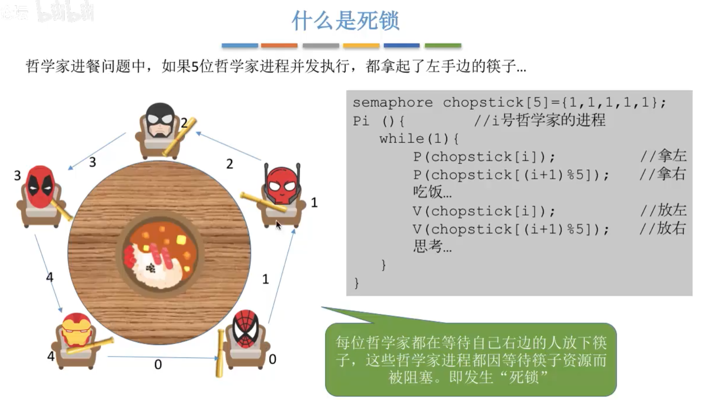

在并发环境下，各进程因竞争资源而造成的一种互相等待对方手里的资源，导致各进程都阻塞，都无法向前推进的现象，就是“死锁”。发生死锁后若无外力干涉，这些进程都将无法向前推进。

> 死锁、饥饿、死循环
>
> 

死锁发生的条件：

1. **互斥条件**

   只有争抢必须互斥使用的资源才会导致死锁（例如哲学家的筷子、打印机等）

2. **不可剥夺条件**

   进程所获得的资源在未使用完之前，不能被其他进程强行剥夺资源

3. **请求和保持条件**

   进程已经保持了至少一个资源，但又提出了新的资源请求，而该资源又被其他进程占有，此时请求进程被阻塞，但又对自己已有的资源保持不放。

4. **循环等待条件（死锁的必要不充分条件）**

   存在一种进程资源的**循环等待链**，链中的每一个进程已获得的资源同时被下一个进程所请求。

   

   > 发生死锁时一定有循环等待，但是发生循环等待时未必死锁（循环等待是死锁的必要不充分条件）
   >
   > 当别的进程占有相同类型可替代的资源时，不会死锁

什么时候发生死锁——对系统资源的不合理分配

1. **对系统资源的竞争。**

   各进程对不可剥夺的资源（如打印机）的竞争可能引起死锁，对可剥夺的资源（CPU)的竞争是不会引起死锁的。

2. **进程推进顺序非法。**

   请求和释放资源的顺序不当，也同样会导致死锁。例如，并发执行的进程P1、P2分别申请并占有了资源R1、R2，之后进程P1又紧接着申请资源R2，而进程P2又申请资源R1,两者会因为申请的资源被对方占有而阻塞，从而发生死锁。

3. **信号量的使用不当也会造成死锁。**

   如生产者-消费者问题中，如果实现互斥的P操作在实现同步的P操作之前，就有可能导致死锁。（可以把互斥信号量、同步信号量也看做是一种抽象的系统资源）

死锁的处理策略：

1. 预防死锁

   破坏死锁产生的四个必要条件的一个或几个

2. 避免死锁

   用某种方法防止系统进入不安全状态，从而避免死锁（银行家算法）

3. 死锁的检测和解除

   允许死锁的发生，操作系统会自动检测死锁，然后通过某种措施解除死锁。


##### 预防死锁——破坏死锁产生的必要条件


1. 破坏互斥条件

   **如果把只能互斥使用的资源改造为允许共享使用，则系统不会进入死锁状态。**比如：**SPOOLing技术**操作系统可以采用SPOOLing技术把独占设备在逻辑上改造成共享设备。比如，用SPOOLing技术将打印机改造为共享设备...

   

   缺点：并**不是所有的资源都可以改造成可共享使用的资源**。并且为了系统安全，很多地方不必须保护这种互斥性。因此，很多时候都无法破坏互斥条件。

2. 破坏不剥夺条件

   1. 被剥夺——**当某个进程请求新的资源得不到满足时，它必须立即释放保持的所有资源，待以后需要时再重新申请。**也就是说，即使某些资源尚未使用完，也需要主动释放，从而破坏了不可剥夺条件。
   2. 主动剥夺——当某个进程需要的资源被其他进程所占有的时候，可以由操作系统协助，将想要的资源强行剥夺。这种方式一般需要考虑各进程的优先级（比如：剥夺调度方式，就是将处理机资源强行剥夺给优先级更高的进程使用）

   缺点：

   1. 实现复杂

   2. 释放已获得的资源可能造成前一阶段工作的失效。因此这种方法一般**只适用于易保存和恢复状态的资源**，如CPU。

   3. 反复地申请和释放资源会**增加系统开销**，**降低系统吞吐量**。

   4. **可能导致进程饥饿**

      若采用方案一，意味着只要暂时得不到某个资源，之前获得的那些资源就都需要放弃，以后再重新申请。如果一直发生这样的情况，就会导致进程饥饿。

3. 破坏请求和保持条件——**在运行前就保证其拥有所有资源**

   可以采用静态分配方法，即**进程在运行前一次申请完它所需要的全部资源，在它的资源未满足前，不让它投入运行**。一旦投入运行后，这些资源就一直归它所有，该进程就不会再请求别的任何资源了。

   缺点：有些资源可能只需要用很短的时间，因此如果**进程的整个运行期间都一直保持着所有资源**，就会造成严重的**资源浪费，资源利用率极低**。另外，该策略也有**可能导致某些进程饥饿**。

   

   若有源源不断的A类进程到来，由于该类进程一致占有资源，C可能会饥饿

4. 破坏循环等待条件

   可采用**顺序资源分配法**。首先给系统中的资源编号，规定每个进程必须按编号递增的顺序请求资源，同类资源（即编号相同的资源）一次申请完。

   原理分析：**一个进程只有已占有小编号的资源时，才有资格申请更大编号的资源**。<font color=green>**按此规则，已持有大编号资源的进程不可能逆向地回来申请小编号的资源，从而就不会产生循环等待的现象。**</font>

   

   缺点：

   1. 不方便新增资源
   2. 实际的使用资源顺序和编号递增顺序不一致，导致资源浪费
   3. 必须按照次序申请资源，用户编程麻烦


##### 避免死锁


**安全序列：如果系统按照这种序列分配资源，则每个进程都能顺利进行。**

**只要能找出一个安全序列，系统就是安全状态。安全序列可能有多个。**如果分配了资源后，找不到安全序列，则系统就进入了不安全状态，有可能发生死锁。

**如果系统处于安全状态，就一定不会发生死锁。如果系统进入不安全状态，就可能发生死锁（处于不安全状态未必就是发生了死锁，但发生死锁时一定是在不安全状态）。**

因此可以==**在资源分配之前预先判断这次分配是否会导致系统进入不安全状态**==，以此决定是否答应资源分配请求。这也是“**银行家算法**”的核心思想。

###### 银行家算法

**核心思想：在进程提出资源申请时，先预判此次分配是否会导致系统进入不安全状态。如果会进入不安全状态，就暂时不答应这次请求，让该进程先阻塞等待。**

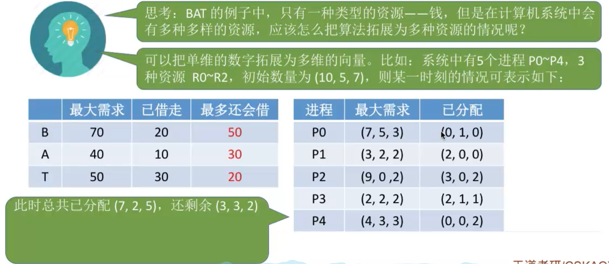


> 试探分配需要更改三个红框的值


##### 死锁的检测和解除


###### 死锁的检测


> 可完全简化相当于找到了一种安全序列
>
> 并不是所有进程都处于死锁状态，只有简化后还连着边的进程处于死锁状态


###### 死锁的解除

一旦检测到死锁，应该立即解除

1. **资源剥夺法**

   **挂起（调出到外存）某个死锁进程，并剥夺其资源。**

   但是应防止被挂起的进程饥饿

2. **撤销进程法**

   **强制撤销部分、甚至全部死锁进程，并剥夺资源。**

   代价较大。某些进程可能已经快运行结束，但由于死锁还得重新来过。

3. **进程回退法**

   **让一个或多个死锁进程会推倒足以避免死锁的地步。**

   要求系统记录进程的历史信息，甚至还原点

那么牺牲哪个进程？

1. 按照进程优先级

2. 按照已执行时间

   优先牺牲短的

3. 按照剩余时间

   牺牲剩余时间长的

4. 按照已使用资源数

   优先牺牲已经占有资源较多的

5. 优先牺牲批处理式的进程，留下交互式的进程


## 内存管理


> 冯诺依曼存储程序思想


### 内存管理


1. 分配与回收

   1. 分配
   2. 记录
   3. 回收

   

2. 内存空间扩充

   

3. 地址转换

   逻辑地址转换的时机：

   

4. 存储保护

   防止越界

   

   1. 设置上下限寄存器

      

   2. 重定位寄存器（基址寄存器）和界地址寄存器

      

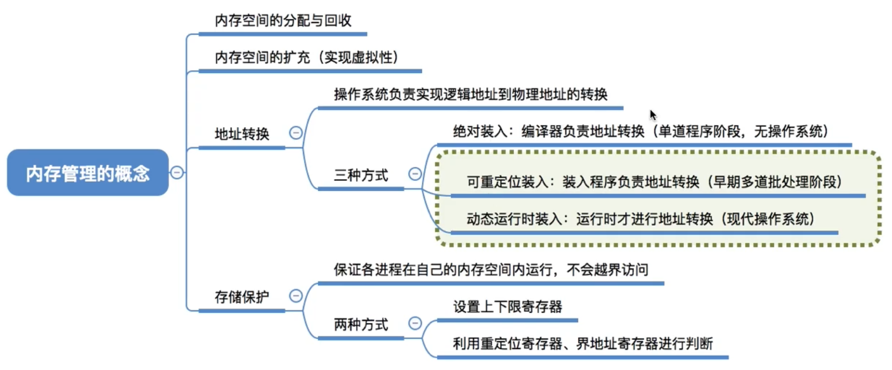

### 内存分配

#### 连续分配方式


> 连续：系统为进程分配的空间是连续的

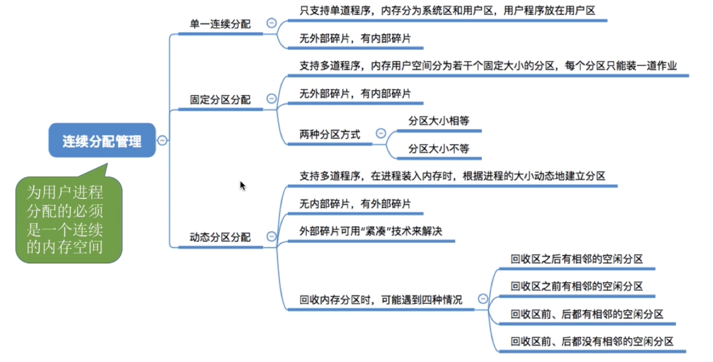

##### 单一连续分配

> 单道用户程序


##### 固定分区分配

> **提前分配好了，不会出现分区太小而无法利用的情况——无外部碎片**

> **多个单一连续分配**

20世纪60年代出现了支持多道程序的系统，**为了能在内存中装入多道程序**，且这些程序之间又不会相互干扰，于是将整个用户空间划分为若干个固定大小的分区，**在每个分区中只装入一道作业**，这样就形成了最早的、最简单的一种可运行多道程序的内存管理方式。

1. **分区大小相等**

   缺乏灵活性，但是很适合用于用一台计算机控制多个相同对象的场合（比如：钢铁厂有n个相同的炼钢炉，就可把内存分为n个大小相等的区域存放n个炼钢炉控制程序）

   如果一个进程的大小超过了分区的大小，则必须使用覆盖等技术扩充内存大小，降低系统性能

   **没有外部碎片，有内部碎片**

2. **分区大小不等**

   分区大小不等：增加了灵活性，可以满足不同大小的进程需求。根据常在系统中运行的作业大小情况进行划分(比如：划分多个小分区、适量中等分区、少量大分区）

   优点：灵活简单，**无外部碎片**

   缺点：

   1. 如果一个进程的大小超过了所有分区的大小，则必须使用覆盖等技术扩充内存大小，降低系统性能

   2. **有内部碎片，内存利用率低**


###### 记录

==**分区说明表**==


##### 动态分区分配

动态分区分配又称为可变分区分配。这种分配方式**不会预先划分内存分区，而是在进程装入内存时根据进程的大小动态地建立分区，并使分区的大小正好适合进程的需要**。因此系统分区的大小和岁目是可变的。（eg:假设某计算机内存大小为64MB,系统区8MB,用户区共56MB...)


###### 1、记录

> **分配时注意修改表项（链结点）**

1. 空闲分区表
2. 空闲分区链


###### 2、动态分区分配算法——怎么选空闲分区

**把一个新作业装入内存时，须按照一定的动态分区分配算法，从空闲分区表（或空闲分区链）中选出一个分区分配给该作业。**

1. 首次适应算法（最好）

   从低地址查找，找到第一个满足大小的空闲分区，从中分配

   > 如何实现：==**空闲分区以地址递增的次序排列**==。每次分配内存时顺序查找空闲分区链（或空闲分区表），找到大小能满足要求的第一个空闲分区。
   >
   > **空闲分区以地址次序排列时，一般低地址部分小空闲分区多，高地址部分大空闲分区多**

   优点：

   1. **分配完成后不需要重新排列空闲分区表（链），算法开销小**
   2. 首次适应算法每次都要从头查找，每次都需要检索低地址的小分区。但是这种规则也决定了当低地址部分有更小的分区可以满足需求时，会更有可能用到低地址部分的小分区，也会**更有可能把高地址部分的大分区保留下来**（最佳适应算法的优点）

   缺点：**首次适应算法每次都从链头开始查找的。这可能会导致低地址部分出现很多小的空闲分区，而每次分配查找时，都要经过这些分区，因此也==增加了查找的开销==。**

2. 最佳适应算法

   **查找时优先使用更小的空闲分区从中分配**

   > 算法思想：由于**动态分区分配是一种连续分配方式**，为各进程分配的空间必须是连续的一整片区域。因此为了保证当“大进程”到来时能有连续的大片空间，可以**尽可能多地留下大片的空闲区**，即，优先使用更小的空闲区。

   实现：==**空闲分区按容量递增次序链接**==。每次分配内存时顺序查找空闲分区链（或空闲分区表），找到大小能满足要求的第一个空闲分区。**分配完成需要对分区表或分区链重新排序。**

   优点：更优先把大分区保留下来

   缺点：每次都选最小的分区进行分配，会留下越来越多的、很小的、难以利用的内存块。因此这种方法==**会产生很多的外部碎片**==。

3. 最坏（大）适应算法

   **查找时优先使用最大的空闲分区从中分配**

   实现：==**空闲分区按容量递减次序链接**==。**分配完成需要对分区表或分区链重新排序。**

   缺点：每次都选最大的分区进行分配，虽然可以让分配后留下的空闲区更大，更可用，但是这种方式会**导致较大的连续空闲区被迅速用完**。如果之后有“大进程”到达，就没有内存分区可用了。

4. 邻近适应算法

   为了解决首次适应算法的缺点，**每次查找时从上次查找结束的位置查找**。

   实现：同首次适应算法，按照地址递增的顺序（可以排列成一个循环列表），每次分配内存时从上次查找结束的位置开始查找空闲分区链（或空闲分区表）,找到大小能满足要求的第一个空闲分区。

   优点：**分配完成后不需要重新排列空闲分区表（链），算法开销小**

   缺点：邻近适应算法的规则可能会导致无论低地址、高地址部分的空闲分区都有相同的概率被使用，也就**导致了高地址部分的大分区更可能被使用，划分为小分区，最后导致无大分区可用（最大适应算法的缺点）**


###### 3、分区的分配与回收

分配：

1. 从一个大的空闲分区分配部分空间给进程

   

   修改对应空闲分区的表项：大小、起始地址、状态

2. 将一个空闲分区完整的分配给进程

   删去对应表项

回收：

能合并合并，不能合并新增

1. 回收区有相邻的空闲分区

   合并多个相邻的空闲分区，并修改表项等

   

2. 回收区没有相邻的空闲分区

   新增一个空闲分区表项

   > 注意表项的排列顺序

   

###### 内部碎片和外部碎片

内部碎片，分配给某进程的内存区域中，如果有些部分没有用上。

外部碎片，是指内存中的某些空闲分区由于太小而难以利用。


> 拼凑：如果进程的大小超过了所有空闲分区的大小，但其总和满足其大小，则可以对已经分配的分区挪位，拼凑一个大小合适的空闲分区。
>
> 时间代价大
>
> ==**适合于动态运行时装入技术**==

#### 非连续分配管理方式


内部碎片和外部碎片，综合来看，还是连续分配的锅

引入了一个基本问题——怎么实现地址转换？

##### 基本分页存储管理

==**把内存分为一个个大小相等的小分区，再按照分区大小把进程拆分为一个个小部分**==


> 页框（内存）——页面（进程） 一一对应
>
> ==**页号从0开始**==

###### 逻辑地址的转换


------

手动计算：

1. 算出逻辑地址对应的页号
   $$
   页号 = \frac {逻辑地址} {页面长度}  （除法的整数部分）
   $$
   
2. 知道该页号对应页面的起始地址

3. 算出**逻辑地址在页面内的偏移**
   $$
   在页面内的偏移量 = 逻辑地址 \% 页面长度  （除法的余数部分）
   $$
   
4. 物理地址 = 页面起始地址 + 偏移

==**为了方便计算页号、页面偏移量，页面大小一般设置为2的整数幂**==


> 如果页面大小为$2^kB$，用二进制表示该逻辑地址，则末尾的k位即偏移量，剩余的高地址位即为页号。


------

硬件实现——基本地址变换机构

> ==**需要访问两次内存**==：
>
> 1. 访问页表
> 2. 访问内存

基本地址变换机构借助**页表**实现地址转换。

通常会在系统中设置一个**==页表寄存器（PTR），存放页表在内存中的起始地址F和页表长度M==**。**==进程未执行时，页表的始址和页表长度放在进程控制块（PCB)中，当进程被调度时，操作系统内核会把它们放到页表寄存器中。==**


1. 查询逻辑地址的页号、页面偏移量

2. 判断页号是否越界

3. 根据页号查询页表，查得对应的内存块号

   页表项地址 = 页表起始地址F + 页号*页表项长度M

4. 内存块号起始地址 + 偏移地址 = 物理地址


==**由于页表也需要存储到内存块中，为了查询的方便，通常一个页表项要占据更多的字节，使得每个页面可以恰好装得下整个页表项。**==


------

具有快表的地址变换机构


**快表：又称联想寄存器（TLB），是一种访问速度比内存快很多的<u>高速缓冲存储器</u>，用来存放当前访问的若干页表项，以加速地址变换的过程。**与此对应，内存中的页表常称为慢表。


1. CPU给出逻辑地址，由某个硬件算得页号、页内偏移量，将页号与快表中的所有页号进行比较。
2. 如果找到匹配的页号，说明要访问的页表项在快表中有副本，则直接从中取出该页对应的内存块号，再将内存块号与页内偏移量拼接形成物理地址，最后，访问该物理地址对应的内存单元。**因此，若快表命中，则访问某个逻辑地址仅需一次访存即可。**
3. 如果没有找到匹配的页号，则需要访问内存中的页表，找到对应页表项，得到页面存放的内存块号，再将内存块号与页内偏移量拼接形成物理地址，最后，访问该物理地址对应的内存单元。**因此，若快表未命中，则访问某个逻辑地址需要两次访存（注意：在找到页表项后，应同时将其存入快表，以便后面可能的再次访问。但若快表已满，则必须按照一定的算法对旧的页表项进行替换）**

由于查询快表的速度比查询页表的速度快很多，因此只要快表命中，就可以节省很多时间。因为局部性原理，一般来说快表的命中率可以达到90%以上。


###### 记录——页表

页表记录了进程的页面和实际存放的内存块之间的对应关系。


1. **一个进程一个页表**

2. **进程的每一页一个页表项**

3. **每个页表项由页号和块号组成**

   页号：进程的页面编号

   块号：内存的页块编号

4. **每个页表项的长度是相同的，页号是隐含的**

   ==**各页表项是按照内存递增顺序放入内存中。**==

   

**页块的起始地址 = 块号 × 页块大小**


-----

两级页表

单级页表存在的问题：

1. 页表必须连续存放，因此当页表很大时，需要蚕占用多个连续的内存块（和离散分配相悖）

   

2. 根据局部性原理，一段时间内可能只需要查询特定的几个页表项/页面，因此，没有必要让整个页表常驻内存。

------

解决问题1：


==**可将长长的页表进行分组，使每个内存块刚好可以放入一个分组**==（比如上个例子中，页面大小4KB，每个页表项4B，每个页面可存放1K个页表项，因此每1K个连续的页表项为一组，每组刚好占一个内存块，再讲各组离散地放到各个内存块中）

另外，要**为离散分配的页表再建立一张页表，称为页目录表**，或称外层页表，或称顶层页表，用于==**存储分页表的内存块号**==。

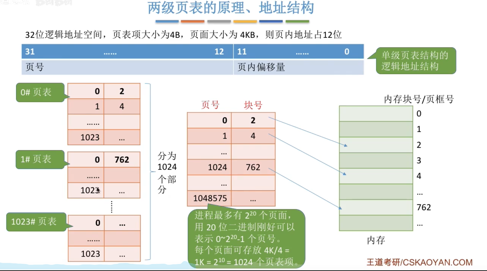


------

解决问题2：

**可以在需要访问页面时才把页面调入内存（虚拟存储技术）。可以==在页表项中增加一个标志位，用于表示该页面是否已经调入内存。==**


> 注意：
>
> 1. **若采用多级页表机制，则各级页表的大小不能超过一个页面。**
>
>    
>
> 2.  两级页表的访存次数（假设没有快表）为3 -> **多级页表的时间代价较大**
>
>    3次：页目录表1，慢表1，访存1

##### 基本分段存储管理方式


==**与“分页”最大的区别是——离散分配时所分配的地址空间的基本单位不同**==

> 分页式存储由于页面/内存块大小一样，因此不需要对页内地址偏移进行检查。（低k位地址由于寻址时位数固定、页面大小固定，因此一定不会超出）
>
> 分段式存储由于每个段的大小不一样，所以==**需要对段内偏移地址做出检查**==，防止其超出该段的大小。


> 分段是按照程序自身逻辑进行分段。


> ==**段号同样是隐含的**==（段表项的长度是固定的）

------

地址变换

**段表寄存器：存储段表起始地址F、段表长度M**


> **同分页式一样，在进程未执行时，页表的始址和页表长度放在进程控制块（PCB)中，当进程被调度时，操作系统内核会把它们放到页表寄存器中。**
>
> **分页式管理最后的物理地址是拼接得到的（因为访问页表得到的是内存块号，即物理地址的高位地址），分段式管理最后的物理地址是相加得到的**

------

分页、分段对比

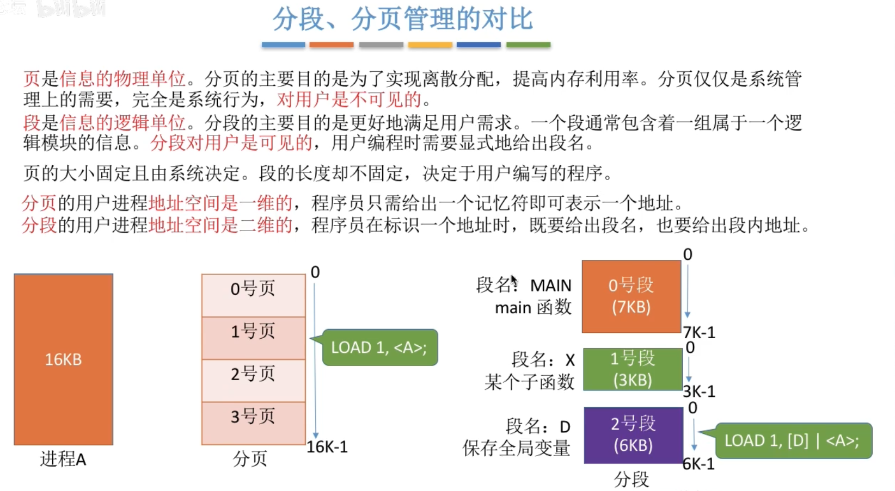

**分段更容易实现信息的共享和保护**


> 不能被修改的代码称为纯代码或可重入代码，可以共享。可以被修改的代码不能共享（例如含有多个变量的代码），否则若多个进程并发地访问改代码时，容易出现数据不一致的错误。


------


##### 段页式管理方式


------

分页、分段的优缺点：


------

（先）分段 + （后）分页 = 段页式管理


------

逻辑地址结构


**段页式存储管理的地址结构是二维的**

------

记录——段表、页表


**一个进程对应一个段表，一个段表对应多个页表，因此一个进程对应多个页表**

------

地址转换


> 也可以引入快表机制
>
> 需要3次访存

------


### 内存空间的扩充


#### 覆盖技术——一个进程使用内存太大

**将程序分为多个段（多个模块）。常用的段常驻内存，不常用的段在需要时调入内存。内存中分为一个“固定区”和若干个“覆盖区”。**

> 需要常驻内存的段放在“固定区”中，调入后就不再调出（除非运行结束）
>
> 不常用的段放在“覆盖区”，需要用到时调入内存，用不到时调出内存


必须有程序员声明覆盖结构，操作系统完成自动覆盖。对用户不透明，增加了编程负担。只适用于早期的计算机。交换技术

交换（对换）技术的设计思想：内存空间紧张时，系统将内存中某些进程暂时换出外存，把外存中某些已具备运行条件的进程换入内存（进程在内存与磁盘间动态调度）。

> 中级调度（内存调度）：选择一个挂起的进程重新调入内存
>
> 进程挂起，PCB常驻内存


1. 挂起的进程储存在外存的位置

   **对换区，主要追求换入换出速度，通常采用连续分配方式**

   

2. 交换的时机

   进程较多、内存吃紧的时候，例如经常发生缺页的时候

3. 应该换出哪些进程

   阻塞态的进程、优先级低的进程，为了防止优先级低的进程饥饿（被调入又很快被调出），还要考虑进程在内存的驻留时间

#### 虚拟存储技术


------

传统存储管理方式的缺点


局部性原理


------

虚拟内存


特征：

1. 多次性——传统内存管理的一次性

   作业运行时分多次调入内存

2. 对换性——传统内存管理的驻留性

   作业运行时无需一直常驻内存，而是允许在运行过程中将作业换入、换出

3. 虚拟性

   从逻辑上扩充了内存的容量

------

虚存的实现

**虚存技术建立在离散式分配内存的管理方式上**

> 若采用连续式，则每次调入都需要分配较大的连续空间，不方便实现。


**由于采用了虚存技术，则需要对原来的三种离散式内存管理方式扩充两种新的功能：1、从外存调入；2、从内存调出。**


#####  请求分页管理方式


------

页表机制


------

缺页中断机构

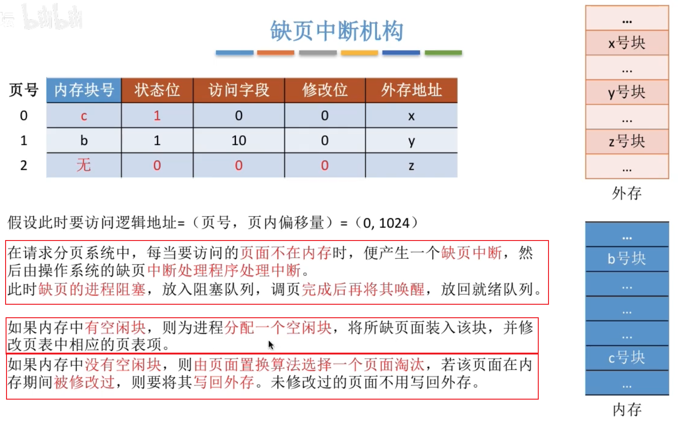

> **调入调出记得需要更改页表**


------

地址变换机构


> **在具有快表机构的请求分页系统中，访问一个逻辑地址时，若发生缺页，则地址变换步骤是：**
>
> ==**查快表（未命中） -> 查慢表（发现未调入内存） -> 调页（调入的页面对应的表项会直接加入快表） -> 查快表（命中） -> 访问目标内存单元**==

------


###### 页面置换算法


------

1、最佳置换算法（OPT）

**每次选择淘汰的页面将是以后永不使用，或者在最长时间内不再被访问的页面，这样可以保证最低的缺页率。**


> 缺页中断发生的时候，只有内存已满的时候，才需要页面置换

然而，由于操作系统无法提前预知访问序列，因此无法实现。

------

2、先进先出置换算法

每次选择最早进入内存的页面淘汰。

实现：将调入内存的页面根据调入顺序依次拍成一个队列，页面置换的时候选择对头的页面换出即可。


> Belady异常——当为进程分配的物理块数增大时，缺页次数不减反增的异常现象。

**只有FIFO算法会产生Belady异常。**另外，FIFO算法虽然实现简单，但是**该算法与进程实际运行时的规律不适应，因为先进入的页面也有可能最经常被访问**。因此，算法性能差。

------

3、最近最久未使用（LRU，least recently used）

**每次淘汰的页面是最近最久未使用的页面。**

**实现方法：赋予每个页面对应的页表项中，用访问字段记录该页面自上次被访问以来所经历的时间t。当需要淘汰一个页面时，选择现有页面中t值最大的，即最近最久未使用的页面。**


> **需要专门的硬件支持**，虽然性能好，但是实现困难，开销大。


------

4、时钟置换算法/最近未使用算法

> 最佳置换算法性能最好，但无法实现；先进先出置换算法实现简单，但算法性能差；最近最久未使用。
>
> 置换算法性能好，是最接近OPT算法性能的，但是实现起来需要专门的硬件支持，算法开销大。

时钟置换算法是一种性能和开销较均衡的算法，又称CLOCK算法，或最近未用算法（NRU，Not recently Used）。

1. 简单的时钟置换算法

   **==实现方法：为每个页面设置一个访问位，再将内存中的页面都通过链接指针链接成一个循环队列。当某页被访问时，其访问位置为1。当需要淘汰一个页面时，只需检查页的访问位。==**

   **==如果是0，就选择该页换出；如果是1，则将它置为0，暂不换出，继续检查下一个页面。==这样若第一轮扫描中所有页面都是1，则将这些页面的访问位依次置为0后，再进行第二轮扫描（第二轮扫描中一定会有访问位为0的页面，因此==简单的CLOCK算法选择一个淘汰页面最多会经过两轮扫描==）**

   

2. 改进型时钟置换算法——**优先淘汰最近未使用且没有被修改过的页面**

   > **简单的时钟置换算法仅考虑到一个页面最近是否被访问过。**事实上，如果被淘汰的页面没有被修改过，就不需要执行1/0操作写回外存。只有被淘汰的页面被修改过时，才需要写回外存。

   实现：将所有可能被置换的页面排成一个循环队列

   1. 第一轮：从当前位置开始扫描到第一个（0,0）的帧用于替换。本轮扫描，**不修改任何标志位**

      **第一优先级：最近没有被访问且没有修改**

   2. 第二轮：若第一轮扫描失败，则重新扫描，查找第一个（0,1）的帧用于替换。**本轮将所有扫描过的帧访问位设为0**

      **第二优先级：最近没有访问过但修改过的页面**

   3. 第三轮：若第二轮扫描失败，则重新扫描，查找第一个（0,0）的帧用于替换。**本轮扫描不修改任何标志位**

      **第三优先级：最近访问过但没修改过**

   4. 第四轮：若第三轮扫描失败，则重新扫描，查找第一个（0,1）的帧用于替换。

      **第四优先级：最近访问过同时修改过**

   由于第二轮已将所有帧的访问位设为0,因此经过第三轮、第四轮扫描一定会有一个帧被选中，因此**改进型CLOCK置换算法选择一个淘汰页面最多会进行四轮扫描**

   | 一轮                                                         | 二轮                                                         | 三轮                                                         | 四轮                                                         |      |
   | ------------------------------------------------------------ | ------------------------------------------------------------ | ------------------------------------------------------------ | ------------------------------------------------------------ | ---- |
   |  |                                                              |                                                              |                                                              |      |
   |  |  |                                                              |                                                              |      |
   |  |  |  |                                                              |      |
   |  |  |  |  |      |

------


###### 页面分配策略

> 加入虚拟内存后，需要再次考虑内存的分配策略


------

驻留集：**指请求分页存储管理中给进程分配的物理块（内存中内存块）的集合。**

> 采用了虚拟存储时，驻留集大小一般小于进程总大小。

**若驻留集太小，会导致缺页频繁**，系统要花大量的时间来处理缺页，实际用于进程推进的时间很少；**驻留集太大，又会导致多道程序并发度下降**，资源利用率降低。所以**应该选择一个合适的驻留集大小**。

> 考虑一个极端情况，若某进程共有100个页面，则该进程的驻留集大小为100时进程可以全部放入内存，运行期间不可能再发生缺页。若驻留集大小为1，则进程运行期间必定会极频繁地缺页

针对驻留集大小是否可变，提出了两种分配策略：

1. 固定分配

   操作系统为每个进程分配一组固定数目的物理块，在进程运行期间不再改变。即，**驻留集大小不变**

2. 可变分配

   **在进程运行期间，驻留集大小可变**

当页面置换时，根据页面置换的范围，提出了两种置换策略：

1. 局部置换

   **缺页时只能置换进程自己的物理块**

2. 全局置换

   **可以将系统保留的空闲物理块进行置换，也可以置换其他进程的物理块**

|          | 局部置换 | 全局置换 |
| -------- | -------- | -------- |
| 固定分配 | ✔        | —        |
| 可变分配 | ✔        | ✔        |

> 全局分配的话，意味着驻留集是可变的，所以不可能是固定分配

------

页面分配置换策略

1、**固定分配局部置换**

系统为每个进程分配一定数量的物理块，在整个运行期间都不改变。若进程在行中发生缺页，则只能从该进程在内存中的页面中选出一页换出，然后再调入需要的页面。

这种策略的缺点是：**很难在刚开始就确定应为每个进程分配多少个物理块才算合理**。（采用这种策略的系统可以根据进程大小、优先级、或是根据程序员给出的参数来确定为一个进程分配的内存块数）

2、**可变分配全局置换**

**刚开始会为每个进程分配一定数量的物理块。操作系统会保持一个空闲物理块队列。当某进程发生缺页时，从空闲物理块中取出一块分配给该进程；若已无空闲物理块，则可选择一个未锁定的页面换出外存，再将该物理块分配给缺页的进程。**

采用这种策略时，==**只要某进程发生缺页，都将获得新的物理块，仅当空闲物理块用完时，系统才选择一个未锁定的页面调出**==。被选择调出的页可能是系统中任何一个进程中的页，因此==**这个被选中的进程拥有的物理块会减少，缺页率会增加**==。

> 系统会锁定一些页面，如系统内核数据等，这些页面不允许换出

3、可变分配局部置换

**刚开始会为每个进程分配一定数量的物理块。当某进程发生缺页时，只允许从该进程自己的物理块中选出一个进行换出外存。如果进程在运行中频繁地缺页，系统会为该进程多分配几个物理块，直至该进程缺页率趋势适当程度；反之，如果进程在运行中缺页率特别低，则可适当减少分配给该进程的物理块。**

> 系统会根据缺页频率动态调整驻留集大小

------

###### 页面调入策略

何时调入页面？

1、预调页策略——运行前调入

根据局部性原理，一次调入若干个相邻的页面可能比一次调入一个页面更高效。但如果提前调入的页面中大多数都没被访问过，则又是低效的。因此可以预测不久之后可能访问到的页面，将它们预先调入内存，但目前预测成功率只有50%左右。

故这种策略**主要用于进程的首次调入**，由程序员指出应该先调入哪些部分。

2、请求调页策略——运行时调入	

进程在运行期间发现缺页时才将所缺页面调入内存。由这种策略调入的页面一定会被访问到，但**由于每次只能调入一页，而每次调页都要磁盘I/O操作，因此I/O开销较大**。

------

从何处调入页面？

> 请求分页的外存分为两部分：对换区和文件区。
>
> 对换区采用连续分配策略，读写更快
>
> 文件区采用离散分配方式，读写较慢

1、系统拥有足够的对换区空间

**页面的调入、调出都是在内存与对换区之间进行。**这样可以保证页面的调入、调出速度很快。**在进程运行前，需将进程相关的数据从文件区复制到对换区。**


2、对换区空间不够

凡是不会被修改的数据都直接从文件区调入，由于这些页面不会被修改，因此换出时不必写回磁盘，下次需要时再从文件区调入即可。

对于可能被修改的部分，换出时需写回磁盘对换区，**下次需要时再从对换区调入**。

> <font color=green>首次调入都是从文件区调入？</font>


3、unix方式

**运行之前进程有关的数据全部放在文件区，故未使用过的页面，都可从文件区调入。若被使用过的页面需要换出，则写回对换区，下次需要时从对换区调入。**


###### 抖动与工作集

抖动：**刚刚换出的页面马上又要换入内存，刚刚换入的页面马上又要换出外存，这种频繁的页面调度行为称为抖动，或颠簸。产生抖动的主要原因是进程频繁访问的页面数目高于可用的物理块数（==分配给进程的物理块不够==）**。

> 太少——抖动
>
> 太多——降低资源利用率

为了预防抖动，引入了工作集的概念。

工作集：**在某个时间间隔内，进程==实际访问==得页面集合**


==**工作集大小可能小于窗口尺寸，实际应用中，操作系统可以统计进程的工作集大小，根据工作集大小给进程分配若干内存块。**==如：窗口尺寸为5，经过一段时间的监测发现某进程的工作集最大为3，那么说明该进程有很好的局部性，可以给这个进程分配3个以上的内存块即可满足进程的运行需要。

> 拓展：基于局部性原理可知，进程在一段时间内访问的页面与不久之后会访问的页面是有相关性的。因此，可以根据进程近期访问的页面集合（工作集）来设计一种页面置换算法——**选择一个不在工作集中的页面进行淘汰**。

------


## 文件管理


### 文件和文件系统

文件的属性

1. 文件名

   同一目录下不允许有重名文件

2. 标识符

   具有唯一性，用于区分各个文件。文件名并不能唯一的标识一个文件

3. 类型

4. 位置

   文件存放的路径——用于用户使用

   文件存放的地址——操作系统使用（对用户透明）

5. 大小

6. 创建时间、上次修改时间

7. 文件所有者信息

8. 保护信息：对文件进行保护的访问控制信息

------

文件内部数据的组织方式

1. 无结构文件

   由二进制或字符流组成，如`.txt`

2. 有结构文件（记录时文件）

    


------

文件之间的组织方式——目录


------

操作系统向上提供的功能——文件操作

最基本的功能：

1. 创建文件

   `create`系统调用（程序接口）

2. 读文件

   `read`系统调用，从外存读入内存

3. 写文件

   当保存文件时，使用了`write`系统调用，将文件从内存写回外存

   > 编辑时，只是改变了副本文件

4. 删除文件

   `delete`系统调用
   
5. 打开文件

   `open`。在使用文件之前，需要先`open`

6. 关闭文件

   `close`

可以通过几个基本操作实现复杂的文件操作，例如“复制文件”：创建一个新的空文件，再读源文件（到内存），再将内存中的数据写道新文件中。

------

文件在外存中的存储——文件的物理结构

> 类似于内存，操作系统也以块为单位，为外存划分存储空间。
>
> 同样类似，文件的逻辑地址也可以分为 (逻辑块号|块内地址)

连续？离散？空闲磁盘块的管理、分配、回收？

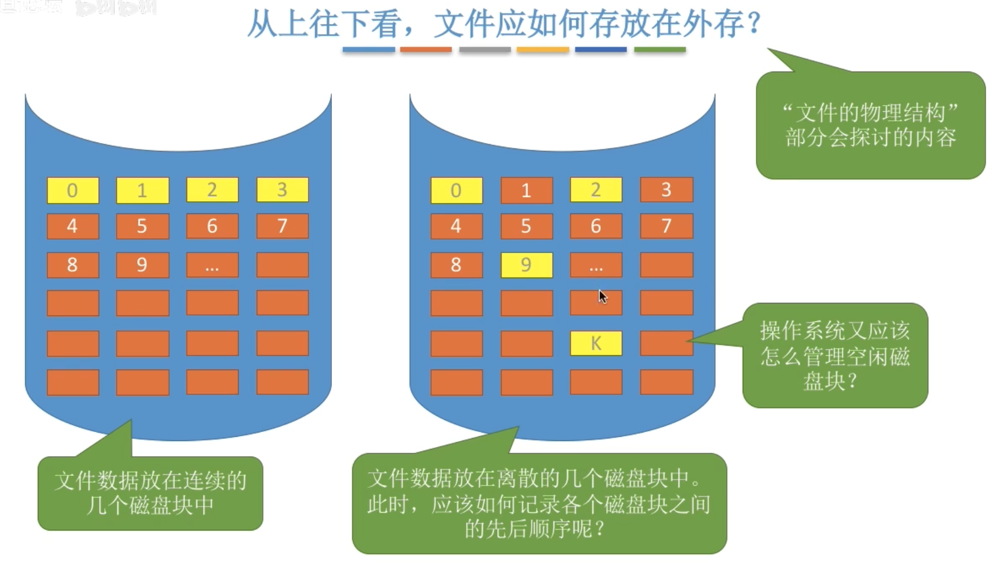

-------

其他需要由操作系统实现的文件管理功能

文件共享：多个用户共享使用一个文件

文件保护：不同用户对同一文件的不同权限


### 文件的逻辑结构


1. 无结构文件

2. 有结构文件（记录式文件）

   由一组相似的记录组成，每一个记录又由若干个数据项组成。

   一般，每一条记录都有一个数据项可以作为关键字

   根据每条记录的长度（占用的存储空间）是否相等，分为：

   1. 定长记录

      每条记录的长度相同，而每个数据项在记录中的位置相同、顺序相同

   2. 可变记录

#### 有结构文件的逻辑结构

##### 顺序文件

**文件中的记录一个接一个地顺序排列（逻辑上）**

> 可以定长，也可以变长

按照物理上的存储分类：

1. 顺序存储：逻辑上相邻物理上也相邻
2. 链式存储：物理上不相邻


按照记录之间的顺序是否与关键字有关：

1. 串结构

   记录之间的顺序与关键字无关

2. 顺序结构

   记录之间的顺序与关键字有关


**缺点：增/删一个记录比较困难（如果是串结构则相对简单）**

> 有的操作系统会维护一定的日志记录，每隔一定时间进行统一合并操作，这样可以减少一定的增删改带来的I/O开销

------

##### 索引文件

> 顺序文件的可变长记录时无法快速查找某关键字的记录

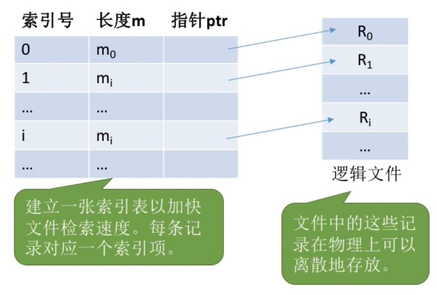

- 索引表本身是定长记录的顺序文件

  索引文件的检索速度很快，主要用于对信息处理的及时性要求比较高的场合

- 可将关键字作为索引号，若按照关键字的顺序排列索引表，则还支持按照关键字折半查找

- 每当增/删一个记录时，需要对索引表进行修改

- 可以用不同的数据项建立多个索引表

  sql就支持根据某个数据项建立索引表的功能

##### 索引顺序文件

> 索引表可能会很大。
>
> 比如：文件的每个记录平均只占8B，而每个索引表项占32个字节，那么索引表都要比文件内容本身大4倍，这样对存储空间的利用率就太低了。

索引顺序文件是索引文件和顺序文件思想的结合。索引顺序文件中，同样会为文件建立一张索引表，但不同的是：**并不是每个记录对应一个索引表项，而是一组记录对应一个索引表项**。


> 索引顺序文件的索引表是一个串结构的顺序文件


------


### 文件目录


#### 文件控制块

> 目录是一种特殊的有结构文件，由一条条的记录组成，每一条记录对一个一个目录下的文件。

文件控制块FCB（file control block）即一个文件目录项。其中包含了文件的基本信息（**文件名**、**物理地址**、逻辑结构、物理结构等）

> 目录即FCB的有序集合
>
> FCB最主要的功能是实现文件名——物理地址的映射，使用户实现按名存取


------

需要对目录进行的操作:

- 搜索：当用户要使用一个文件时，系统要根据文件名搜索目录，找到该文件对应的目录项
- 创建文件：创建一个新文件时，需要在其所属的目录中增加一个目录项
- 删除文件：当删除一个文件时，需要在目录中删除相应的目录项
- 显示目录：用户可以请求显示目录的内容，如显示该目录中的所有文件及相应属性
- 修改目录：某些文件属性保存在目录中，因此这些属性变化时需要修改相应的目录项（如：文件重命名）

#### 目录结构

------

单级目录表


整个系统一个目录表。

实现了“按名存取”，不允许文件重名。

在创建一个文件时，需要先检查目录表中有没有重名文件，确定不重名后才能允许建立文件，并将新文件对应的目录项插入目录表中。

显然，单级目录结构不适用于多用户操作系统。

------

两级目录结构

1. 主文件目录MFD
2. 用户文件目录UFD


------

多级目录结构


很多时候，用户会连续访问同一目录内的多个文件（比如：接连查看“2015-08”目录内的多个照片文件），显然，每次都从根目录开始查找，是很低效的。因此可以设置一个“当前目录”——**相对路径**。

> 引入当前目录后，有效的减少了I/O次数

优点：方便管理和保护，层次结构清晰

**缺点：不便于实现文件共享** -> 无环图目录结构

------

无环图目录结构


在树形目录的基础上增加一些指向同一节点的有向边，即用不同的文件名指向同一个文件，甚至可以指向同一个目录（共享同一目录下的所有内容），方便共享。

**为了方便删除，需要为每个共享结点设置一个共享计数器**，用于记录此时有多少个地方在共享该结点。**用户提出删除结点的请求时，只是删除该用户的FCB、并使共享计数器减1,并不会直接删除共享结点。只有共享计数器减为0时，才删除结点。**

> 注意：共享文件不同于复制文件。在共享文件中，由于各用户指向的是同一个文件，因此只要其中一个用户修改了文件数据，那么所有用户都可以看到文件数据的变化。

##### 索引节点（FCB的瘦身）

| FCB                                                          | 索引节点                                                     |
| ------------------------------------------------------------ | ------------------------------------------------------------ |
|  |  |
| 其实在查找各级目录的过程中只需要用到“文件名”这个信息，只有文件名匹配时，才需要读出文件的其他信息。因此可以考虑让目录表“瘦身”来提升效率。 | 除了文件名的所有信息放到索引节点中                           |
| 假设一个FCB是64B,磁盘块的大小为1KB,则每个盘块中只能存放16个FCB。若一个文件目录中共有640个目录项，则共需要占用640/16=40个盘块。因此按照某文件名检索该目录，平均需要查询320个目录项，平均需要启动磁盘20次（每次磁盘1/0读入一块）。 | 若使用索引结点机制，文件名占14B,索引结点指针站2B,则每个盘块可存放64个目录项，那么按文件名检索目录平均只需要读入320/64=5个磁盘块。显然，这将大大提升文件检索速度。 |

**当找到文件名对应的目录项时，才需要将索引结点调入内存**。索引结点中记录了文件的各种信息，包括文件在外存中的存放位置，根据“存放位置”即可找到文件。

存放在外存中的索引结点称为“**磁盘索引结点**”，当索引结点放入内存后称为“**内存索引结点**”。**相比之下内存索引结点中需要增加一些信息，比如：文件是否被修改、此时有几个进程正在访问该文件等。**

------

