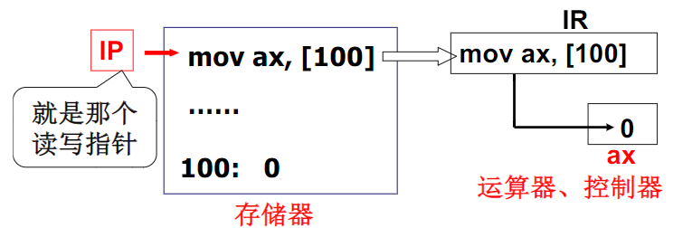
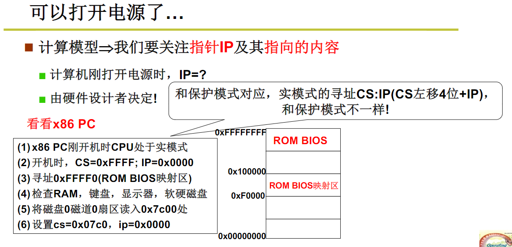
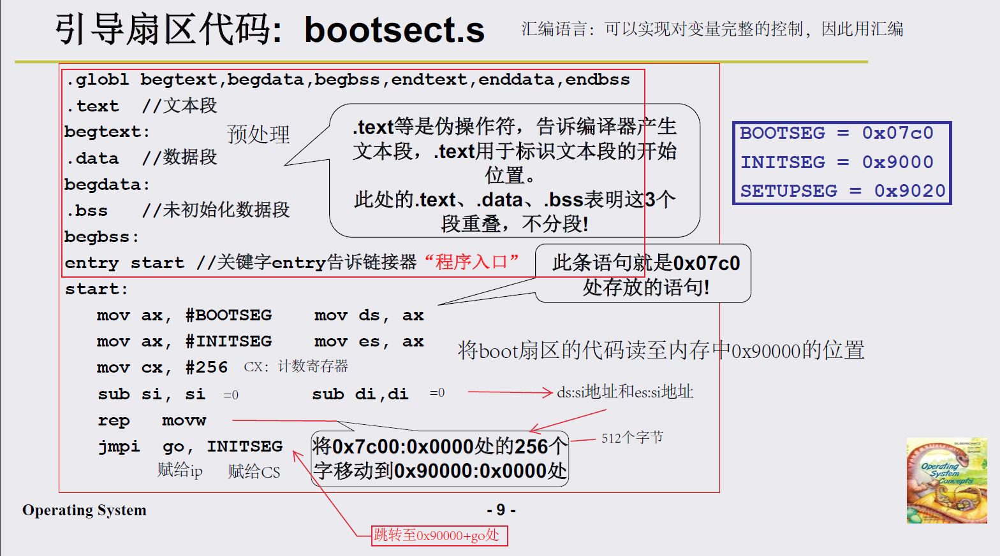
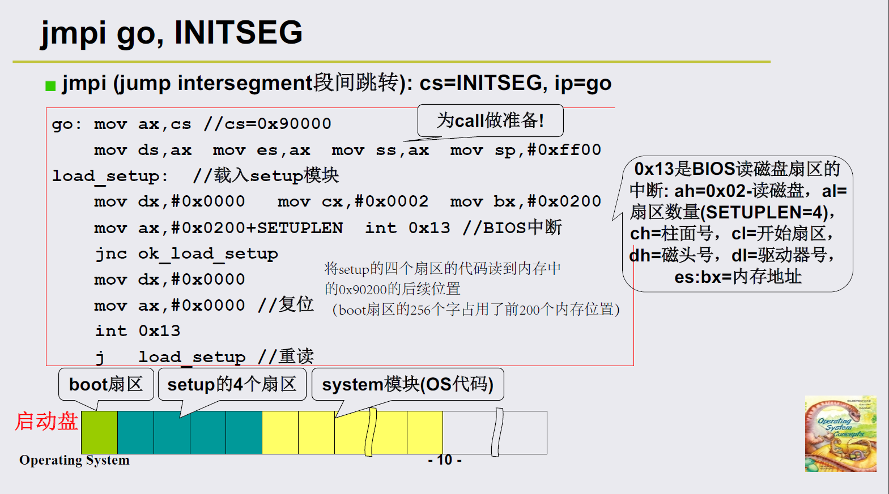
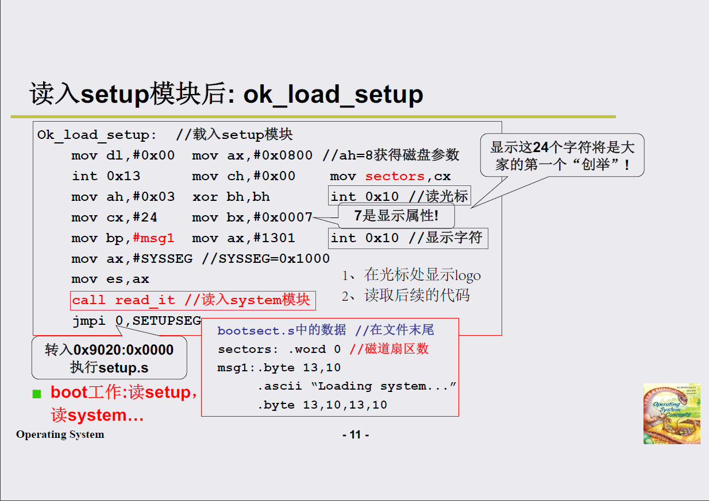
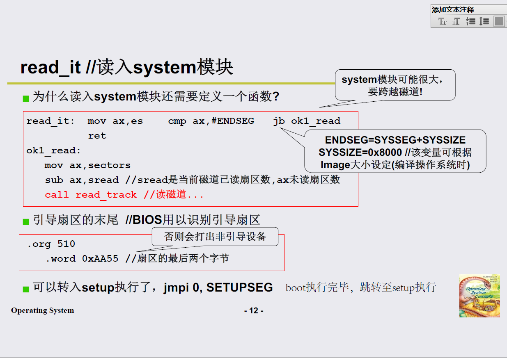

# 操作系统
 计算机硬件和应用之间的一层软件，方便和高效的使用硬件。

1. CPU管理
2. 内存管理
3. 终端管理
4. 磁盘管理
5. 文件管理
6. 网络管理
7. 电源管理
8. 多核管理

发展：

图灵机 -> 通用图灵机 -> 冯诺依曼存储程序思想

开机过程：

> CS：段地址*16（左移四位） + 偏移地址 =物理地址
>
> 0xFFFF0：ROM BIOS映射区
>
> 硬盘0磁道0扇区：引导扇区
>
> > 一个扇区512个字节

> 0x7c00/引导扇区处存放的代码即上述代码及后面的代码
>
> 由于`rep movw`将该扇区的代码移动至0x90000处，因此需要跳转至0x90000+偏移（go）处，继续顺序执行后续的代码

