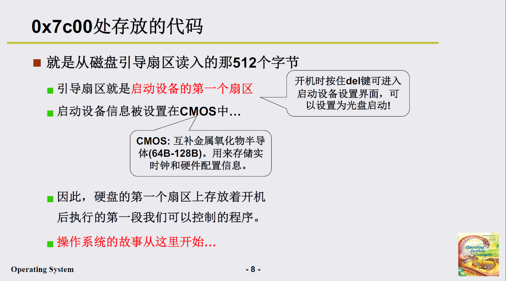

# 操作系统
 计算机硬件和应用之间的一层软件，方便和高效的使用硬件。

1. CPU管理
2. 内存管理
3. 终端管理
4. 磁盘管理
5. 文件管理
6. 网络管理
7. 电源管理
8. 多核管理

发展：

图灵机 -> 通用图灵机 -> 冯诺依曼存储程序思想

## 操作系统的启动过程

1. 将操作系统代码读至内存的0地址
2. 初始化一些数据结构，例如GDT、IDT、mem_map

> CS是cpu执行的当前指令的段地址，DS是数据开始的段地址。
>
> CS：段地址*16（左移四位） + 偏移地址 =物理地址
>
> 0xFFFF0：ROM BIOS映射区
>
> 硬盘0磁道0扇区：引导扇区
>
> > 一个扇区512个字节

### bootsect.s——加载操作系统

> 0x7c00/引导扇区处存放的代码即上述代码及后面的代码
>
> 由于`rep movw`将该扇区的代码移动至0x90000处，因此需要跳转至0x90000+偏移（go）处，继续顺序执行后续的代码

### setup.s

#### 1、读取硬件信息，将system模块移动至0地址处

#### 2、初始化gdt表和idt表

> 1. 全局描述符表GDT
>
>    用于寻址
>
> 2. 中断描述符表IDT
>
>    和GDT一样,中断描述符表在系统最多只能有一个,中断描述符表内可以存放256个描述符,分别对应256个中断.因为每个描述符占用8个字节,所以IDT的长度可达2K.中断描述符表中可以有任务门、中断门、陷阱门三个门描述符，其它的描述符在中断描述符表中无意义。

#### 3、进入保护模式

> 从实模式进入保护模式
>
> 在实模式下，寻址方式是段寻址，CS和IP寄存器是20位的，因此地址最高只有20位，寻址空间只有1M。
>
> 在保护模式下，改变寻址方式，CS和IP由20位提升至32位，寻址空间变为4G

> 读取gdt表中索引8的项，1+2+3构成了得到的基址：0x00000000

### system模块

> system模块的第一个模块为head.s

> mem_map：位图

## 操作系统接口

### 什么是系统调用

连接上层应用和操作系统

- 命令行：命令程序

  用户编写的程序经过编译后得到可执行程序，该可执行程序再被shell程序执行

- 图形界面：消息框架程序+消息处理程序

  消息队列 -> 消息循环 -> 消息处理

操作系统接口：接口表现为函数调用，又由系统提供，所以称为**==系统调用system call==**。

标准：POSIX，protable operating system interface of unix，IEEE制定的一个标准族

### 系统调用的实现

由于安全问题，不能随意访问内核。

**实现：保护环，区分用户态和内核态**

> 用户态对应的内存区域是用户段，内核态对应的内存区域是内核段

> DPL：目标特权级
>
> CPL：当前特权级，当前PC指令的特权级
>
> 在head.s初始化GDT时，由于GDT表对应操作系统的代码段和数据段，因此在其初始化时置DPL都为0

**==系统调用的实现：中断是调用内核代码的唯一方式==**

> 内嵌汇编的格式：
>
> 内嵌汇编共四个部分:汇编语句模板,输出部分,输入部分,破坏描述部分，各部分使用:格开,汇编语句模板必不可少,其他三部分可选，使用了后面的部分而前面部分为空,也需要用:格开,相应部分内容为空